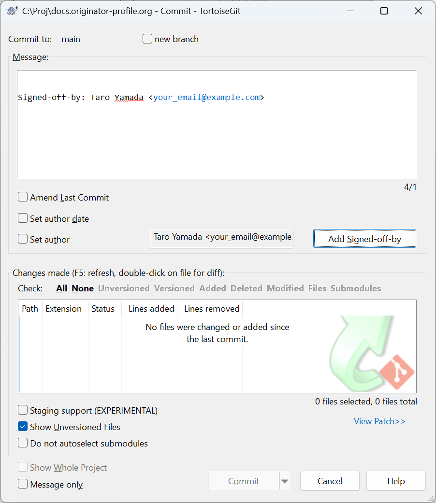

# 参加・貢献するには

オープンソースプロジェクトとして私たちは、Originator Profile のリポジトリへのコミュニティからの貢献を歓迎しています。DCO（Developer Certificate of Origin）への同意、または CLA（Contributor License Agreement）への署名により、あなたの貢献はコミュニティ全体で自由に利用できるようになります。

## 同意手続き

Originator Profile で開発する技術仕様やソフトウェアに貢献いただく際には、[DCO (Developer Certificate of Origin)](https://developercertificate.org/) に同意し、各 GitHub リポジトリへのプルリクエストで提出する全てのコミットにサインオフ (Signed-off-by 行) を付与していただくようお願いします。

貢献いただく内容・対象や規模によっては次の何れかの CLA (Contributor License Agreement) への同意をお願いすることがあります。

- [Corporate Contributor License Agreement](pathname:///cla/Corporate_Contributor_License_Agreement.pdf)
- [Individual Contributor License Agreement](pathname:///cla/Individual_Contributor_License_Agreement.pdf)

## [DCO (Developer Certificate of Origin)](https://developercertificate.org/)への同意方法

ターミナルウィンドウを開き、以下のコマンドを実行してこのリポジトリのバージョン管理された Git フックを有効化します（推奨）

```
$ git config core.hooksPath .githooks
```

Public リポジトリにある[.githooks/prepare-commit-msg](https://github.com/originator-profile/originator-profile/blob/main/.githooks/prepare-commit-msg) を、local にクローンしたリポジトリの .git/hooks/prepare-commit-msg に手動でコピーします。

## サインオフ(Signed-off-by 行)を付与する方法

各GitHub リポジトリへのコミット時のオプションで、「サインオフ(Signed-off-by 行) 」を指定することでコミットメッセージに署名を追加できます。

サインオフ(Signed-off-by 行)の例:

```
Signed-off-by: YOUR NAME <your_email@example.com>
```

### git コマンドの場合

コミットする際に -s または --signoff フラグを付けてください。

コマンドの例:

```
$ git commit -s
```

### [TortoiseGit](https://tortoisegit.org/)の場合

コミットする際に、`Add Signed-off-by` ボタンを押してください。

コミットウィンドウの例:



### [Sourcetree](https://www.sourcetreeapp.com/) の場合

コミットする際に、右側のcommit Options... で `Sign off` を指定してください。

コミットウィンドウの例:


