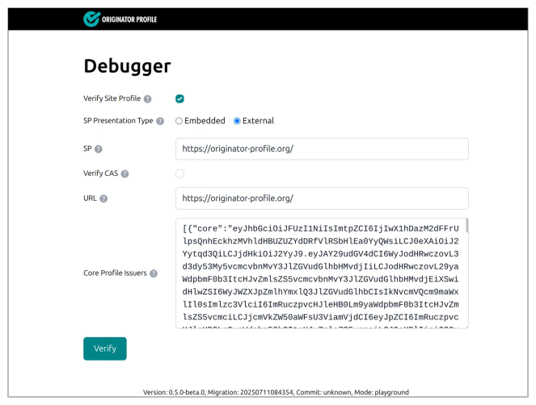
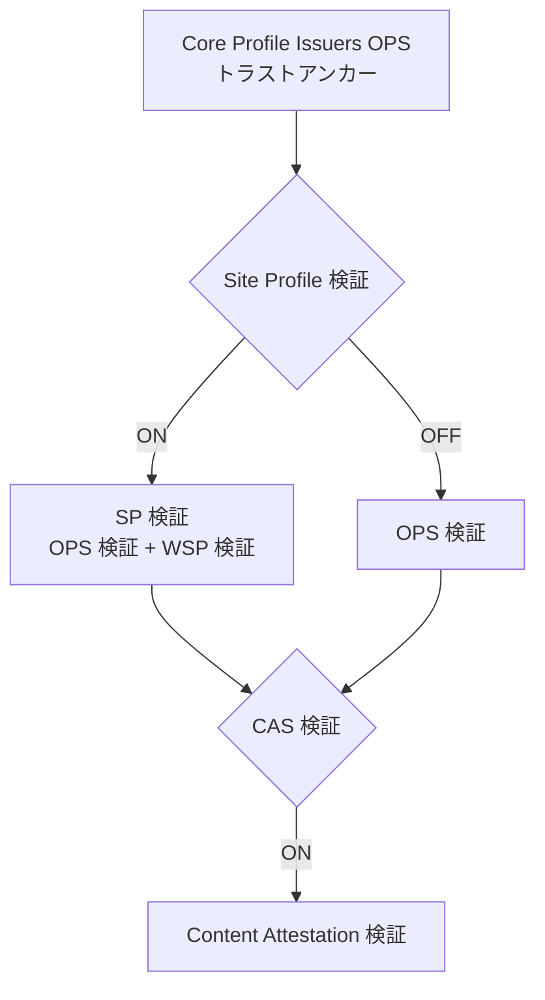

# Debugger

[Debugger](https://playground.originator-profile.org/app/debugger) は、Originator Profile のデバッグツールです。
[Content Attestation Set (CAS)](/opb/ca/) や [Site Profile (SP)](/opb/site-profile/) をテストでき、検証時のエラーを確認できます。

## Debugger の使い方

### 画面の説明

#### 入力フィールド

| フィールド               | 説明                                          | 表示条件                                     |
| ------------------------ | --------------------------------------------- | -------------------------------------------- |
| **Core Profile Issuers** | トラストチェーンの起点となる OPS (JSON)。     | 常時表示 (必須)                              |
| **URL**                  | 検証対象の Web サイト URL                     | Site Profile 検証または CAS 検証が ON の場合 |
| **Verify Site Profile**  | Site Profile 検証を有効化するチェックボックス | 常時表示                                     |
| **SP**                   | Site Profile データ                           | Site Profile 検証 ON の場合                  |
| **OPS**                  | OriginatorProfileSet データ                   | Site Profile 検証 OFF の場合                 |
| **Verify CAS**           | CAS 検証を有効化するチェックボックス          | 常時表示                                     |
| **CAS**                  | Content Attestation データ                    | CAS 検証 ON の場合                           |
| **HTML**                 | 検証対象の HTML コンテンツ                    | CAS 検証 ON の場合                           |

1. **URL** に検証対象の Web サイト URL を入力します。
2. 必要に応じて **Verify Site Profile** や **Verify CAS** を ON にし、各データを入力します。
3. **Verify** ボタンをクリックして検証を実行します。
4. 各ステップの結果が順次表示されます。失敗時、エラー種別と原因を確認できます。

#### パラメーターの形式

SP・OPS・CAS の各フィールドでは、データの提示形式 (Presentation Type) を選択できます。

- **Embedded**: JSON を直接入力します。
- **External**: 外部 URL を指定して取得します。External を選択した場合、サーバー側のプロキシ経由でデータを取得します。

HTML フィールドでは入力方式 (HTML Input Type) を選択できます。

- **Direct Input**: HTML を直接入力します。
- **Fetch from URL**: URL フィールドに指定した URL から HTML を取得します。

### Core Profile Issuers

トラストチェーンの起点となる公開鍵をデコードし確認します。このステップは常に実行されます。
失敗した場合は処理が中断されます。

### Site Profile 検証 (Verify Site Profile ON の場合)

[Site Profile の検証プロセス](/opb/site-profile.md#verification)に従い、SP の署名検証と Originator Profile の結合を確認します。

- SP データをフェッチまたはパースします。
- URL Origin を取得します。
- Core Profile Issuers OPS に SP の originators をマージし、[`SpVerifier`](https://github.com/originator-profile/originator-profile/blob/main/packages/verify/src/site-profile/verify-site-profile.ts) を実行します。

### OPS 検証 (Verify Site Profile OFF の場合)

Site Profile を使用せず、[Originator Profile Set (OPS)](/opb/originator-profile-set/) の署名を直接検証します。

- OPS データをフェッチまたはパースします。
- Core Profile Issuers OPS と対象 OPS をマージし、[`OpsVerifier`](https://github.com/originator-profile/originator-profile/blob/main/packages/verify/src/originator-profile-set/verify-ops.ts) を実行します。

### CAS 検証 (Verify CAS ON の場合)

[Content Attestation の検証プロセス](/opb/ca/#verification)に従い、コンテンツの整合性を検証します。

- HTML を取得またはパースし、[`DOMParser`](https://developer.mozilla.org/docs/Web/API/DOMParser) で解析します。
- CAS データをフェッチまたはパースします。
- [`verifyCas()`](https://github.com/originator-profile/originator-profile/blob/main/packages/verify/src/content-attestation-set/verify-cas.ts) で Content Attestation を検証します。

### URL によるフォーム状態の共有

フォームの入力値は URL のハッシュフラグメントに Base64url エンコードされた JSON として保存されます。これにより、ブックマークやリンク共有で検証設定を再現できます。

## 検証フロー

Debugger は以下の順序で検証を実行します。Site Profile 検証と CAS 検証はそれぞれ任意で有効化できます。

