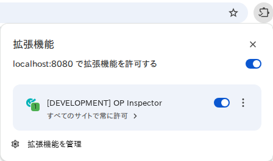
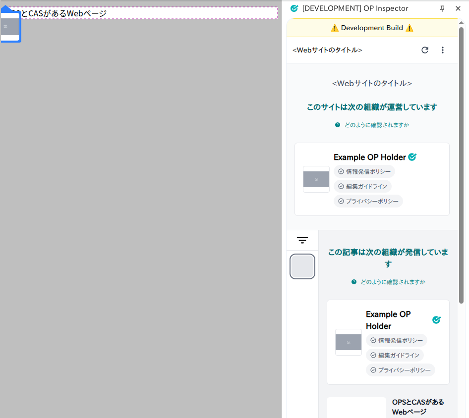

# リファレンス実装開発ガイド

本書はローカル環境で実行するための手順を説明します。

## はじめに

1. Linux, macOS または Windows ([WSL2](https://docs.microsoft.com/ja-jp/windows/wsl/install)) 環境を用意
   - Windows の場合: WSL2 Ubuntu LTS を推奨
     - 「[Linux GUI サポートが含まれる最新バージョンに更新](https://learn.microsoft.com/ja-jp/windows/wsl/tutorials/gui-apps#existing-wsl-install)」を参照
     - `sudo apt-get install -y fonts-noto-cjk` コマンドを実行して日本語フォントをインストール
2. [Node.js](https://nodejs.org/) のインストール
   - 「[Node.jsをダウンロードする](https://nodejs.org/ja/download)」または「[パッケージマネージャーを利用したNode.jsのインストール](https://nodejs.org/ja/download/package-manager/all)」を参照
   - Windows の場合: 「[Node.js を Linux 用 Windows サブシステム (WSL2) にインストールする](https://learn.microsoft.com/ja-jp/windows/dev-environment/javascript/nodejs-on-wsl)」を参照
3. [pnpm](https://pnpm.io/) のインストール
   - 「[pnpm インストール](https://pnpm.io/ja/installation)」を参照
   - Windows の場合: WSL2 環境にインストールするには、「[Using other package managers](https://pnpm.io/ja/installation#using-other-package-managers) 」を参照
   - WSL2 環境で `npm install -g pnpm@latest-11` 等のコマンドを実行してインストール
4. [Docker](https://www.docker.com/ja-jp/get-started/) と [Docker Compose](https://docs.docker.com/compose/) のインストール
   - 「[Docker Compose のインストール](https://docs.docker.com/compose/install/)」を参照
   - Windows の場合: 「[WSL2 での Docker リモート コンテナーの概要](https://learn.microsoft.com/ja-jp/windows/wsl/tutorials/wsl-containers)」を参照
5. 下記のコマンドをターミナルで実行

```sh
git clone -c core.symlinks=true https://github.com/originator-profile/originator-profile originator-profile
cd originator-profile
pnpm install
pnpm --filter @originator-profile/inspector exec playwright install --with-deps
pnpm build
# opvc CLI のインストール
npm i -g ./packages/opvc
# Google Chrome 137 以降で --load-extension フラグが削除されたため、
# Playwright に含まれる Chromium を使用する必要があります
export CHROME_PATH=$(pnpm --filter @originator-profile/inspector exec node -p 'require("playwright").chromium.executablePath()')
# 開発用サーバーの起動
pnpm dev
# => 開発用サーバーとWebブラウザーが起動します (<Ctrl-C>: 終了)
```

開発用サーバーと Web ブラウザーの拡張機能を起動後、実際に Web ページの検証を行うことができます。

- http://localhost:8080/examples/cas-1.html にアクセスする
  - ソースコード: [`apps/inspector/dev/src/pages/examples/cas-1.astro`](https://github.com/originator-profile/originator-profile/blob/main/apps/inspector/dev/src/pages/examples/cas-1.astro)
- 拡張機能を起動してコンテンツ情報の検証を行う

起動方法\


検証に成功したときの画面\


あとはそれぞれのソースコードを編集することで開発を行うことができます。自由にカスタマイズしましょう。

import DocCardList from "@theme/DocCardList";

<DocCardList />

## 全体構成

- apps/ … アプリケーションのソースコード
  - inspector … ブラウザ機能拡張のソースコード
- packages/ … アプリケーションの使用するモジュールのソースコード
  - model … システムのコアとなる静的構造のためのパッケージ
  - core … システムのコアとなる関数のためのパッケージ
  - (その他) … originator-profile リポジトリで開発しているパッケージ
- package.json … プロジェクトの付帯情報 ([package.json](https://docs.npmjs.com/files/package.json/))
- .github/workflows/ … GitHub Actions のワークフローの定義

## 便利なコマンド

テストやビルドの実行など開発に便利なコマンドを紹介します。

npm scripts の実行:

```
pnpm run
```

### npm scripts

dev
: 開発用サーバーと拡張機能つき Chromium を起動します

:::warning
Google Chrome (公式ビルド) 137 以降では `--load-extension` フラグが削除されたため、Playwright に含まれる Chromium を使用しています。環境変数 `CHROME_PATH` が設定されていることを確認してください。
:::

ブラウザ拡張機能は設定言語が日本語であれば日本語で、それ以外では英語で表示をします。日本語にする場合 OS により以下のような方法があります。

Linux 系 OS で:
環境変数 `LANG` または `LC_ALL` を ja_JP.utf-8 またはその他の ja に設定すると日本語、それ以外では英語で表示されます。

macOS で:
以下のいずれかで言語を日本語またはそれ以外に設定できます。設定言語が日本語であれば日本語で、それ以外では英語で表示をします。設定されていない場合は以下のいずれか一つを実行してください。
macOS のバージョンにより起動するブラウザが異なります。起動したブラウザの言語設定を実行してください。

Google Chrome の場合

1.  システム環境設定の「一般」 -> 「言語と地域」 -> 「アプリケーション」に Google Chrome を加え日本語（またはそれ以外）に設定する。Google Chrome にのみ影響します。
2.  `defaults write com.google.chrome AppleLanguages '(ja-JP)'` を実行する。ja-JP の部分は en などに変更してください。1 と同じ効果があります。
3.  システム環境設定の「言語と地域」で日本語(またはそれ以外)を優先する言語の最上位にする。システム全体に影響します。
4.  `defaults write -g AppleLanguages '(ja-JP)'`を実行する。ja-JP の部分は en などに変更してください。3 とほぼ同じ効果がありますが、他の言語の優先順位が消去されます。

Google Chrome for Testing の場合

1.  システム環境設定の「一般」 -> 「言語と地域」 -> 「アプリケーション」に Google Chrome for Testing を加え日本語（またはそれ以外）に設定する。Google Chrome for Testing にのみ影響します。

    「アプリケーション」の一覧に表示しない場合には、`open ~/Library/Caches/ms-playwright/chromium-1217/chrome-mac-arm64/Google\ Chrome\ for\ Testing.app/` を実行して起動中に設定してください。

2.  `defaults write com.google.chrome.for.testing AppleLanguages '(ja-JP)'` を実行する。ja-JP の部分は en などに変更してください。1 と同じ効果があります。
3.  システム環境設定の「言語と地域」で日本語(またはそれ以外)を優先する言語の最上位にする。システム全体に影響します。

lint
: すべてのパッケージの静的コード解析を行います。

test
: すべてのパッケージのテストを行います。

e2e
: 開発用サーバーを起動し E2E テストを行います。

wordpress:e2e
: 開発用サーバーを起動し WordPress プラグインの E2E テストを行います。

ただし、実行するにはあらかじめ Composer の依存関係を解決する必要があります。

Composer 依存関係の解決:

```
cd packages/wordpress
cp .env.development .env # 初回のみ
docker compose run --rm -w /var/www/html/wp-content/plugins/ca-manager wordpress composer install
```

build
: 拡張機能の生成などすべてのパッケージのビルドを行います。

format
: コードの整形を行います。

## GitHub Actions

GitHub リポジトリ上での変更は自動的にチェックされます。

### originator-profile/profile/test

パッケージの生成、コードの整形、静的コード解析、E2E テストを含むすべてのテストを実施します。

### E2E テストのレポート

GitHub Actions での E2E テストに失敗すると playwright によるレポートおよびスナップショット画像が artifacts としてアップロードされます。Zip ファイルを展開することで得られるレポートディレクトリ `playwright-report` を以下のように使用することで、失敗の原因を知ることができるかもしれません。

```
npx playwright@latest show-report path-to/playwright-report
```

本プロジェクトでは 'apps/inspector/playwright-report' にテストレポートが保存されるように設定されています。このディレクトリを引数にあたえることで、ローカル環境でテストレポートを確認することができます。
`pnpm e2e` 実行後にレポートが自動で開かない場合は以下のコマンドを実行してください。

コマンド例:

```
npx playwright show-report apps/inspector/playwright-report
```
