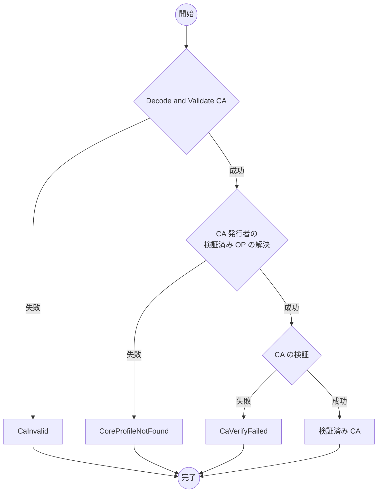

# Content Attestation Data Model

:::note

CAの検証対象として検討したのは、(1) ページロード完了時に利用者の能動的な確認操作などに起因する特定イベントベースでの検証、 (2) リアルタイムでの動的な DOM の読み込み・書き換え中の検証であるが、(2)のリアルタイム性の高いタイミングはCAの検証対象として想定外としている。

その理由は、CSS セレクターの対象要素の変更や [Visible Text Target](./target-guide/visible-text.md)のようにレンダリング済みのテキストを 署名対象とするアルゴリズムが DOM 書き換え中のリアルタイム検証とは相性が悪いこと、 ブラウザの性能/消費電力に対するインパクトがあるからである。

OPが想定する情報発信者の検証は、危険なサイトのページに埋め込まれたブロックとは異なり、読み込みすること自体を避けるセキュリティ上の必要性まではない。前述の通りレンダリング済みテキストを対象とする署名検証アルゴリズムを含めており検証タイミングの制約があるし、読み込み/レンダリングはブロックせず読み込み後に検証した上で、 検証が通らない場合には対象コンテンツを一旦隠し警告を表示するなど、読込のブロック以外のブラウザの振る舞いも考え得る。以上より、CAの検証タイミングとしては現状、読込時点やレンダリング処理中などリアルタイム性の高いタイミングは想定外としている。

:::

## 用語

本文書に説明のない用語については、[用語](./terminology.md)を参照してください。

- Originator Profile (OP)
- Originator Profile Identifier (OP ID)
- Content Attestation (CA)
- Target Integrity

## Content Attestation (CA) のデータモデル

Content Attestation は OP VC DM 準拠文書でなければなりません (MUST)。他に以下のプロパティを含みます。

### プロパティ

#### `@context`

[OP VC Data Model](./op-vc-data-model.md#context) に従ってください (MUST)。

#### `type`

REQUIRED. 必ず `["VerifiableCredential", "ContentAttestation"]` にしてください (MUST)。

#### `credentialSubject.id`

REQUIRED. CA ID でなければなりません (MUST)。 CA ID は [UUIDv4](https://www.rfc-editor.org/rfc/rfc9562.html#name-uuid-version-4) の URN 形式の文字列です。コンテンツと CA ID は一対一対応します。

#### `allowedUrl`

REQUIRED. この CA によって表明される情報の対象となる URL です。
必ず [URL Pattern string](https://urlpattern.spec.whatwg.org/#pattern-strings) またはその配列でなければなりません (MUST)。
空配列にしてはなりません (MUST NOT)。
このプロパティで CA が正当な URL の Web ページに設置されているかどうかを[検証](#allowed-url-validation)することができます。

具体例:

✅ 有効:

- `https://example.com/article/*` (ワイルドカードパターン)
- `https://*.example.com/article/*` (サブドメインワイルドカード)
- `["https://a.example.com/*", "https://b.example.com/*"]` (複数パターンの配列)

❌ 無効:

- `/article/*` (ベースURLが含まれていない)
- `example.com/*` (`https://` が指定されていない)
- `https://example.com/article/(` (構文エラー)
- `[]` (空配列)

:::note

Webコンテンツ以外のURLを持たないコンテンツ (例: プライベートな非公開コンテンツ) を検証対象とする仕様拡張については今後の課題として検討中です。

:::

#### `target`

REQUIRED. Target Integrity でなければなりません (MUST)。

Target Integrity はコンテンツの一部の完全性を保証するための仕組みです。このプロパティで CA と対応するコンテンツ内の特定の情報が改ざんされていないかを[検証](#target-integrity-の検証)することができます。
[Target Integrity Registry](./target-guide/index.mdx)に登録されているものを使用できます。

## 例

_このセクションは非規範的です。_

CA の具体例を示します。この CA は https://media.example.com/articles/2024-06-30 で公開されているコンテンツに紐づいています。

```json
{
  "@context": [
    "https://www.w3.org/ns/credentials/v2",
    "https://originator-profile.org/ns/credentials/v1",
    "https://originator-profile.org/ns/cip/v1",
    { "@language": "ja" }
  ],
  "type": ["VerifiableCredential", "ContentAttestation"],
  "issuer": "dns:example.com",
  "credentialSubject": {
    "id": "urn:uuid:78550fa7-f846-4e0f-ad5c-8d34461cb95b",
    "type": "Article",
    "headline": "<記事のタイトル>",
    "image": {
      "id": "https://media.example.com/image.png",
      "digestSRI": "sha256-OYP9B9EPFBi1vs0dUqOhSbHmtP+ZSTsUv2/OjSzWK0w="
    },
    "description": "<Webページの説明>",
    "author": ["山田花子"],
    "editor": ["山田太郎"],
    "datePublished": "2023-07-04T19:14:00Z",
    "dateModified": "2023-07-04T19:14:00Z",
    "genre": "Arts & Entertainment"
  },
  "allowedUrl": ["https://media.example.com/articles/2024-06-30"],
  "target": [
    {
      "type": "VisibleTextTargetIntegrity",
      "cssSelector": "<CSS セレクター>",
      "integrity": "sha256-GYC9PqfIw0qWahU6OlReQfuurCI5VLJplslVdF7M95U="
    },
    {
      "type": "ExternalResourceTargetIntegrity",
      "integrity": "sha256-+M3dMZXeSIwAP8BsIAwxn5ofFWUtaoSoDfB+/J8uXMo="
    }
  ]
}
```

この CA は https://ad.example.com 配下の Web ページに掲載されている広告コンテンツに紐づいています。

```json
{
  "@context": [
    "https://www.w3.org/ns/credentials/v2",
    "https://originator-profile.org/ns/credentials/v1",
    "https://originator-profile.org/ns/cip/v1",
    { "@language": "ja" }
  ],
  "type": ["VerifiableCredential", "ContentAttestation"],
  "issuer": "dns:example.com",
  "credentialSubject": {
    "id": "urn:uuid:78550fa7-f846-4e0f-ad5c-8d34461cb95b",
    "type": "OnlineAd",
    "name": "<広告のタイトル>",
    "description": "<広告の説明>",
    "image": {
      "id": "https://ad.example.com/image.png",
      "digestSRI": "sha256-5uQVtkoRdTFbimAz3Wz5GQcuBRLt7tDMD5JRtGFo9/M="
    },
    "landingPageUrl": "https://advertiser.example.com"
  },
  "allowedUrl": ["https://ad.example.com/*"],
  "target": {
    "type": "ExternalResourceTargetIntegrity",
    "integrity": "sha256-rLDPDYArkNcCvnq0h4IgR7MVfJIOCCrx4z+w+uywc64="
  }
}
```

:::note

例には本文書に未定義のプロパティも含んでいます。未定義のプロパティを追加する方法については[拡張性](#extensibility)を参照してください。

:::

## 拡張性 {#extensibility}

発行者は [OP VC Data Model](./op-vc-data-model.md) および本文書に未定義のプロパティを Content Attestation に追加してはなりません (MUST NOT) 。

発行者は [OP VC Data Model](./op-vc-data-model.md) および本文書に未定義のプロパティを追加してもよいです (MAY) が、その場合は [Verifiable Credentials Data Model 2.0 セクション 5.2](https://www.w3.org/TR/vc-data-model-2.0/#extensibility)に従って拡張してください (RECOMMENDED)。

:::info

Originator Profile 技術研究組合が開発するアプリケーションで使用されるプロパティについては、次の Originator Profile Blueprint (OPB) 文書を参照してください。

- [Article Data Model](./ca-guide/article.md)
- [Online Ad Data Model](./ca-guide/online-ad.md)

:::

### Target Integrity の拡張性

[Target Integrity](./target-guide/index.mdx) を参照してください。

## 検証プロセス {#verification}

CA の検証者は次のことを検証することができます。

1. [OP VC Data Model に準拠した VC の検証](./op-vc-data-model.md#verification)
2. `allowedUrl` の検証 (OPTIONAL)
3. Target Integrity の検証

### `allowedUrl` の検証 {#allowed-url-validation}

検証者は次の手順に従って `allowedUrl` プロパティを検証できます (OPTIONAL)。

1. CA が提示された Web ページの URL を取得します。
2. `allowedUrl` プロパティの文字列と 1. で得た URL が一致するか確認します。アルゴリズムは[URL Pattern の `test(input, baseURL)`メソッド](https://urlpattern.spec.whatwg.org/#dom-urlpattern-test)を使います。

:::note

パーセントエンコードは[RFC 3986 Section 2.1](https://www.rfc-editor.org/rfc/rfc3986#section-2.1)に沿って大文字に正規化してから比較を行います

:::

### Target Integrity の検証

検証者は `target` プロパティの Target Integrity について、Target Integrity のそれぞれの type で定めてある検証プロセスが実施可能である限り、検証すべきです (SHOULD)。

:::note

Target Integrity のタイプによっては、検証者の環境では検証が不可能な場合があります。たとえば、ブラウザによる描画が実行できない環境では、ブラウザによる描画結果が検証時必要な Target Integrity は検証が不可能です。

:::

検証者は Target Integrity のタイプごとに定義される検証方法で検証しなければならず (MUST)、検証に失敗した場合にはその Target Integrity の検証が失敗したことを閲覧者に提示してください (RECOMMENDED)。Target Integrity の検証失敗を、 CA の検証失敗と同じまたはより高い深刻度 (Severity) でユーザーに表示することは避けてください (RECOMMENDED)。

### 検証結果の報告

_このセクションは非規範的です。_

検証実行後、その結果を適切にユーザーに伝える必要があります。以下は推奨される検証結果の報告方法です。

- CA の検証に成功した場合、検証済みの CA としてユーザーに表示
- CA の検証に失敗した場合、その種類と原因について簡潔な説明をユーザーに通知

「[OP 拡張機能](https://github.com/originator-profile/profile-share/tree/main/apps/web-ext)」では、CA の検証時、次のエラーを返却することがあります。

- [CaInvalid](https://reference.originator-profile.org/ts/classes/_originator-profile_verify.CaInvalid)
- [CoreProfileNotFound](https://reference.originator-profile.org/ts/classes/_originator-profile_verify.CoreProfileNotFound)
- [CaVerifyFailed](https://reference.originator-profile.org/ts/classes/_originator-profile_verify.CaVerifyFailed)
  - "Content Attestation verify failed" … OP VC Data Model に準拠した VC の検証失敗
  - "URL not allowed" … `allowedUrl` の検証失敗 (OPTIONAL)
  - "Target integrity verification failed" … [Target Integrity](./target-guide/index.mdx) の検証失敗

その他のデータの構造については次のリファレンスをご確認ください。

- [検証済み Content Attestation (CA)](https://reference.originator-profile.org/ts/types/_originator-profile_verify.VerifiedCa)

入力:

- Content Attestation (CA)
- CA を提示した Web ページの URL (OPTIONAL)
- [検証済み Originator Profile (OP)](https://reference.originator-profile.org/ts/types/_originator-profile_verify.VerifiedOp)


