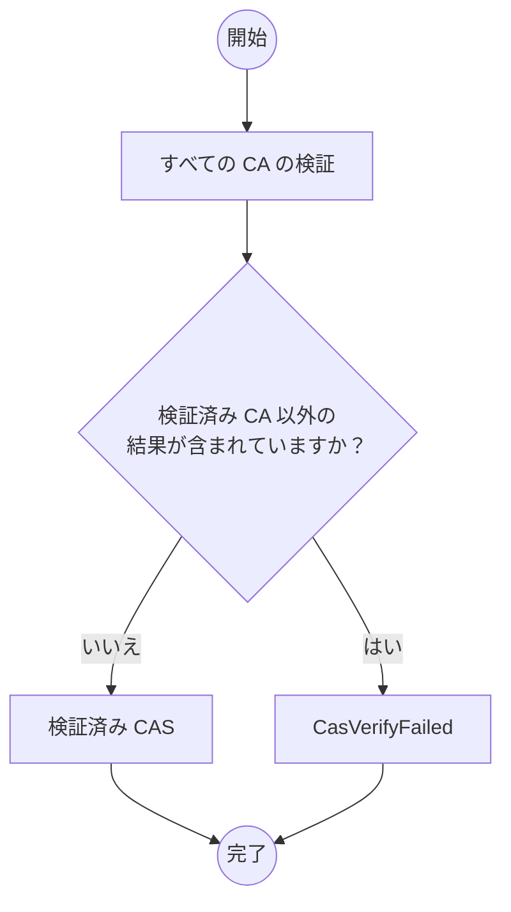

# Content Attestation Set

## 用語

本文書に説明のない用語については、[用語](./terminology.md)を参照してください。

- Content Attestation (CA)
- Content Attestation Set (CAS)

## Content Attestation Set (CAS) データモデル

データモデルを JSON で表記します。

CAS は次のプロパティを持つ JSON Object の配列です。

- `attestation`: REQUIRED. Content Attestation です。
- `main`: OPTIONAL. Content Attestation がメインコンテンツに対するものである場合は `true`、そうでない場合は `false` です。デフォルト値は `false` です。

## JSON Serialization

上記のデータモデルを次のように変換します。メディアタイプは `application/cas+json` です。

```js
cas.map((e) =>
  e.main ? { attestation: e.attestation, main: true } : e.attestation,
);
```

次は変換後の非規範的な例です。

```json
["eyJ...", "eyJ...", { "attestation": "eyJ...", "main": true }, "eyJ..."]
```

## 検証プロセス

CAS の検証者は次のことを検証することができます。

- [CA の検証](./ca.md#verification)

### 検証結果の報告

_このセクションは非規範的です。_

検証実行後、その結果を適切にユーザーに伝える必要があります。以下は推奨される検証結果の報告方法です。

- CAS に含まれる CA の検証結果をユーザーに通知
  - CA の検証に成功した場合、検証済みの CA としてユーザーに表示
  - CA の検証に失敗した場合、その種類と原因について簡潔な説明をユーザーに通知

「[OP 拡張機能](https://github.com/originator-profile/profile-share/tree/main/apps/web-ext)」では、CA の検証時、次のエラーを返却することがあります。

- CasVerifyFailed
  - CaInvalid
  - CoreProfileNotFound
  - CaVerifyFailed
- 検証済み CAS

詳細は「[CA の検証](./ca.md#verification)」と OP 拡張機能のソースコードのご確認ください。

入力:

- Content Attestation Set (CAS)
- CAS を提示した Web ページの URL
- 検証済み Originator Profile Set (OPS)


