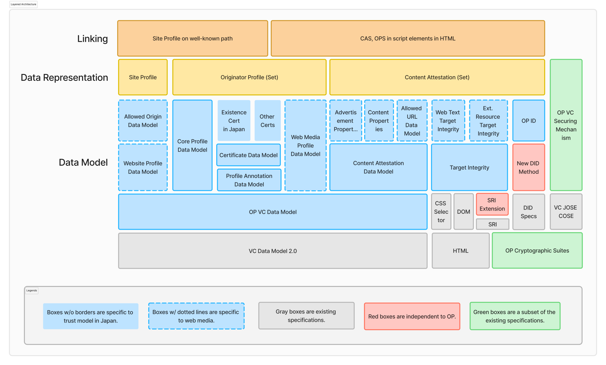

# Originator Profile Blueprint

_この文書は非規範的です。_

Originator Profile (OP) の技術仕様の文書化を目指します。

これらの文書では、Originator Profile の技術的側面について説明しています。
Originator Profile 技術は、特定のコンテンツの善悪の価値判断を提供するものではなく、暗号的に検証可能な手段を提供することで、誰もが信頼性を評価できるようになることを目指しています。

:::note
古い技術仕様文書はアーカイブされました。\
過去の仕様:

- https://v0.docs.originator-profile.org/spec/

:::

:::note
これらの文書はすべて<ruby>草案<rt>draft</rt></ruby>です。
:::

:::note
「Originator Profile RFC (OP RFC)」と呼称していたOriginator Profile の技術仕様に関する文書について、IETF や W3C といった標準化団体の標準化プロセスとは異なるプロセスで運用していることを明確にするため、「Originator Profile Blueprint (OPB)」に名称変更しました。
:::

## 全体像

OP の仕様は Verifiable Credentials (VCs) とその配布方法を定義します。
仕様全体で共通の用語の定義が[用語](./terminology.md)にあります。

OP は VCs 共通の仕様として次の仕様を定めます。

- [OP VC Data Model](./op-vc-data-model.md): OP で定める VCs が準拠するデータモデル
- [Securing Mechanism](./securing-mechanism.md): OP で定める VCs の Securing Mechanism

組織が発信者であることの検証ができる鍵を示すための VCs のデータモデルを次の文書で定めます。

- [Core Profile (CP)](./cp.md)

発信者に対して、適切な主体が検証した追加の情報を示すための VCs のデータモデルを次の文書で定めます。

- [Profile Annotation (PA)](./pa.md)

PA の発行ポリシーを示すためのデータモデルを次の文書で定めます。

- [Profile Annotation Policy](./pa-model/pa-policy.md)

様々なユースケースに応じた PA のデータモデルを次の文書で定めます。

- [組織実在証 PA](./pa-model/existence.md)
- [広告認証 PA](./pa-model/advertising-certification.md)
- [報道機関登録証 PA](./pa-model/news-media-registration.md)
- [自治体認証 PA](./pa-model/municipality-certificate.md)
- [Profile Annotator 登録証 PA](./pa-model/profile-annotator-registration.md)

発信者が発信するコンテンツを示すための VCs のデータモデルを次の文書で定めます。

- [Content Attestation (CA)](./ca.md)
  - [Allowed URL](./ca.md#allowed-url-validation): CA が正当な URL の Web サイトに設置されているかの検証

様々なユースケースに応じた CA のデータモデルを次の文書で定めます。

- [Article Data Model](./ca-model/article.md): インターネット上の記事に紐づく CA のデータモデル。
- [Online Ad Data Model](./ca-model/online-ad.md): インターネット広告に紐づく CA のデータモデル。
- [記事広告](./ca-model/advertorial.md): インターネット上の記事広告に紐づく CA のデータモデル。

また、CA で示されたコンテンツの改ざんを防ぐ仕組みである Content Integrity Descriptor の仕様を次の文書で定めます。

- [Content Integrity Type Registry](./content-integrity-descriptor/index.mdx): Content Integrity Descriptor のレジストリ
- [HTML Target](./content-integrity-descriptor/html.md): 対象 DOM 要素の HTML 文字列としての完全性検証
- [Text Target](./content-integrity-descriptor/text.md): 対象 DOM 要素に含まれるテキストコンテンツの完全性検証
- [Visible Text Target](./content-integrity-descriptor/visible-text.md): 対象要素のレンダリングされているテキストの完全性検証
- [External Resource Target](./content-integrity-descriptor/external-resource.md): 外部リソースの完全性検証

発信者がウェブメディアとして表明する名称等を示すための VCs のデータモデルを次の文書で定めます。

- [Web Media Profile (WMP)](./web-media-profile.md)

発信者が運営するウェブサイトを示すための VCs のデータモデルを次の文書で定めます。

- [Website Profile (WSP)](./website-profile.md)
  - [Allowed Origin](./website-profile.md#allowed-origin-validation): WSP が正当な Origin の Web サイトに設置されているかの検証

OP で定める VCs をまとめて配布する際のデータ形式として次のものを定義します。

- [Originator Profile Set](./originator-profile-set.md): CP, PA, Web Media Profile の配布形式
- [Content Attestation Set](./content-attestation-set.md): CA の配布形式
- [Site Profile](./site-profile.md): Website Profile の配布形式
- [Linking](./link-to-html.md): CAS, OPS を HTML ページに紐づける方法

組織の ID として Originator Profile Identifier (OP ID) を定義し、各 VC で利用します。

- [Originator Profile Identifier (OP ID)](./op-id.md): 組織の ID
- [DNS URI OP ID](./dns-uri-op-id.md): ドメイン名を利用した OP ID

VCs 全体で使われる JSON-LD のコンテキストは次の文書に記載しています。

- [JSON-LD Context](./context.md)

OP の枠組み全体のセキュリティを担保する文書として次のものがあります。

- [暗号アルゴリズム](./algorithm.md): OP で推奨される暗号アルゴリズム

## モデルの分類

[Architectural Overview](pathname:///aov/) で定義されるモデルに属するデータモデルは、次のリンクから参照してください。

- [Base Model](/tags/base-model/)
- [Jurisdiction Specific Model](/tags/jurisdiction-specific-model/)
- [Web Media Specific Model](/tags/web-media-specific-model/)
