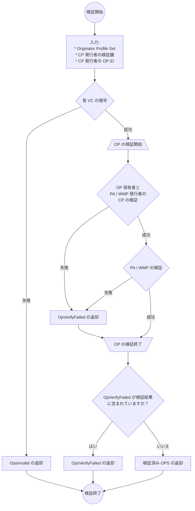

# Originator Profile Set

## 概要

本文書では組織に関する VC をまとめて配布するのに使えるデータ形式を定義します。

## 用語

本文書に説明のない用語については、[用語](./terminology.md)を参照してください。

- Core Profile (CP)
- Profile Annotation (PA)
- Web Media Profile (WMP)
- Originator Profile (OP)
- Originator Profile Set (OPS)

## Originator Profile Set (OPS) のデータモデル

OPS のデータモデルを JSON で示します。

OPS は JSON オブジェクトの配列でなければなりません (MUST)。

各 JSON オブジェクトには以下のプロパティが定義されます:

- `core`: Core Profile (REQUIRED)
- `annotations`: Profile Annotation の配列 (OPTIONAL)
- `media`: Web Media Profile (OPTIONAL)

### `core`

REQUIRED. Core Profile です。

### `annotations`

OPTIONAL. Profile Annotation の配列です。このプロパティを含める場合、各要素は `core` の Core Profile と `credentialSubject.id` が等しくなければなりません (MUST)。 `credentialSubject.id` の OP ID 保有組織の信頼性に OPS の受信者が関心がある場合、このプロパティを含めるべきです (SHOULD)。

### `media`

OPTIONAL. Web Media Profile です。このプロパティを含める場合、 `core` の Core Profile と `credentialSubject.id` が等しくなければなりません (MUST)。

## OPS の JSON Serialization

データモデルの JSON がそのまま OPS の JSON 表現になります。メディアタイプは `application/ops+json` です。

### 例

_このセクションは非規範的です。_

単一の組織の VC のみを含む OPS の具体例を次に示します。

```json
[
  {
    "core": "eyJ...",
    "annotations": ["eyJ..."],
    "media": "eyJ..."
  }
]
```

複数の組織の VC を含む OPS の具体例を次に示します。

```json
[
  {
    "core": "eyJ...",
    "annotations": ["eyJ...", "eyJ..."],
    "media": "eyJ..."
  },
  {
    "core": "eyJ...",
    "annotations": ["eyJ..."],
    "media": "eyJ..."
  }
]
```

## 検証プロセス

_このセクションは非規範的です。_

[@originator-profile/verify](https://github.com/originator-profile/profile-share/tree/main/packages/verify) において実装されている検証処理は次のプロセスでおこなわれます。

検証プロセスで扱うデータの構造については次のリファレンスを確認してください。

- [OpsInvalid](https://reference.originator-profile.org/ts/classes/_originator-profile_verify.OpsInvalid)
- [OpVerifyFailed](https://reference.originator-profile.org/ts/classes/_originator-profile_verify.OpVerifyFailed)
- [OpsVerifyFailed](https://reference.originator-profile.org/ts/classes/_originator-profile_verify.OpsVerifyFailed)
- [検証済み OPS](https://reference.originator-profile.org/ts/types/_originator-profile_verify.VerifiedOps)

CP / PA / WMP の検証プロセスの詳細は [OP VC Data Model に準拠した VC の検証](./op-vc-data-model.md#verification) に準じます。ただし、CP 検証ではあらかじめ認めた CP 発行者の検証鍵と CP 発行者の OP ID で検証をおこない、OPS から検証鍵の取得はおこないません。


