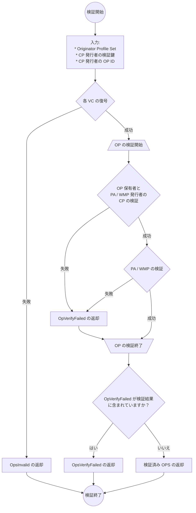

# Originator Profile Set

## 概要

本文書では組織に関する VC をまとめて配布するのに使えるデータ形式を定義します。

## 用語

本文書に説明のない用語については、[用語](./terminology.md)を参照してください。

- Core Profile (CP)
- Profile Annotation (PA)
- Web Media Profile (WMP)
- Originator Profile (OP)
- Originator Profile Set (OPS)

## Originator Profile Set (OPS) のデータモデル

OPS のデータモデルを JSON で示します。

OPS は JSON オブジェクトの配列でなければなりません (MUST)。

各 JSON オブジェクトには以下のプロパティが定義されます:

| Name          | Type       | Description                                                                                                                                                                                                                                                                                                     |
| ------------- | ---------- | --------------------------------------------------------------------------------------------------------------------------------------------------------------------------------------------------------------------------------------------------------------------------------------------------------------- |
| `core`        | `string`   | **REQUIRED.** Core Profile です。                                                                                                                                                                                                                                                                               |
| `annotations` | `string[]` | **OPTIONAL.** Profile Annotation の配列です。このプロパティを含める場合、各要素は `core` の Core Profile と `credentialSubject.id` が等しくなければなりません (MUST)。 `credentialSubject.id` の [OP ID](./op-id.md) 保有組織の信頼性に OPS の受信者が関心がある場合、このプロパティを含めるべきです (SHOULD)。 |
| `media`       | `string[]` | **OPTIONAL.** Web Media Profile の配列です。このプロパティを含める場合、各要素について、その `credentialSubject.id` は `core` の Core Profile の `credentialSubject.id` と等しくなければなりません (MUST)。                                                                                                     |

## OPS の JSON Serialization

データモデルの JSON がそのまま OPS の JSON 表現になります。メディアタイプは `application/ops+json` です。

### 例

_このセクションは非規範的です。_

単一の組織の VC のみを含む OPS の具体例を次に示します。

```json
[
  {
    "core": "eyJ...",
    "annotations": ["eyJ..."],
    "media": ["eyJ..."]
  }
]
```

複数の組織の VC を含む OPS の具体例を次に示します。

```json
[
  {
    "core": "eyJ...",
    "annotations": ["eyJ...", "eyJ..."],
    "media": ["eyJ..."]
  },
  {
    "core": "eyJ...",
    "annotations": ["eyJ..."],
    "media": ["eyJ..."]
  }
]
```

## 国際化 {#internationalization}

Originator Profile Set 配布者は、アプリケーションがロケールに応じて VCs を抽出できるように、`annotations` プロパティと `media` プロパティのそれぞれに異なる言語が指定された 2 つ以上の VCs を含めて配布することができます (MAY)。

VCs への言語の指定方法は [OP VC Data Model の国際化](/opb/op-vc-data-model.md#internationalization)に準じます。

## 検証プロセス {#verification}

_このセクションは非規範的です。_

@originator-profile/verify において実装されている検証処理は次のプロセスで行われます。

検証プロセスで扱うデータの構造については次のリファレンスを確認してください。

- OpsInvalid
- OpVerifyFailed
- OpsVerifyFailed
- 検証済み OPS

CP / PA / WMP の検証プロセスの詳細は [OP VC Data Model に準拠した VC の検証](./op-vc-data-model.md#verification) に準じます。ただし、CP 検証ではあらかじめ認めた CP 発行者の検証鍵と CP 発行者の OP ID で検証を行い、OPS から検証鍵の取得は行いません。


```mermaid
flowchart TD
    Start((検証開始)) --> Input[入力:<br>* Originator Profile Set<br>* CP 発行者の検証鍵<br>* CP 発行者の OP ID]
    Input --> Decode{各 VC の復号}
    Decode -- 失敗 --> OpsInvalid[OpsInvalid の返却]
    OpsInvalid --> End((検証終了))
    Decode -- 成功 --> VerifyEachOp[/OP の検証開始\]
    VerifyEachOp --> VerifyCp{OP 保有者と<br>PA / WMP 発行者の<br>CP の検証}
    VerifyCp -- 失敗 --> OpVerifyFailed[OpVerifyFailed の返却]
    OpVerifyFailed --> VerifyEachOpEnd[\OP の検証終了/]
    VerifyCp -- 成功 --> VerifyVc{PA / WMP の検証}
    VerifyVc -- 失敗 --> OpVerifyFailed
    VerifyVc -- 成功 --> VerifyEachOpEnd
    VerifyEachOpEnd --> IfOpVerifyFailedExists{OpVerifyFailed が検証結果に含まれていますか？}
    IfOpVerifyFailedExists -- いいえ --> VerifiedOps[検証済み OPS の返却]
    IfOpVerifyFailedExists -- はい --> OpsVerifyFailed[OpsVerifyFailed の返却]
    OpsVerifyFailed --> End
    VerifiedOps --> End
```

:::note

OPS の検証では、各 VC の復号時に、`annotations` および `media` の各要素の `credentialSubject.id` が `core` の Core Profile の `credentialSubject.id` と完全に一致することを確認します。
この `credentialSubject.id` は、現在 OP で採用している Securing Mechanism である [VC-JOSE-COSE](./securing-mechanism.md) では JWT の `sub` クレームに対応します。
一致しない要素を含む場合は、その OPS について `OpsInvalid` が返されます。

これは「Originator Profile Set (OPS) のデータモデル」の表で `annotations` と `media` の各要素に課されている MUST 要件を、検証処理として強制するものです。
これにより、ある組織の Core Profile に、別の組織を主体とする Profile Annotation や Web Media Profile が同一の OP として束ねられることを防ぎます。

:::

:::note[セキュリティの考慮事項]

OPS 検証のトラストアンカーは Core Profile の発行者です。
Core Profile は、あらかじめ認めた CP 発行者（レジストリの発行者）の検証鍵と OP ID で検証されます。
PA / WMP の発行者についても、その発行者自身の Core Profile が同じトラストアンカーで検証されます。

一方で、レジストリにアンカーされた Core Profile を持つ主体であれば、任意の主体（originator）に関する PA / WMP を原理的には発行できます。
発行者の適格性が重要となる用途では、[Profile Annotation Issuer 登録証 PA](./pa-model/profile-annotation-issuer-registration.md) による発行者の認可を併せて検証してください。

:::
