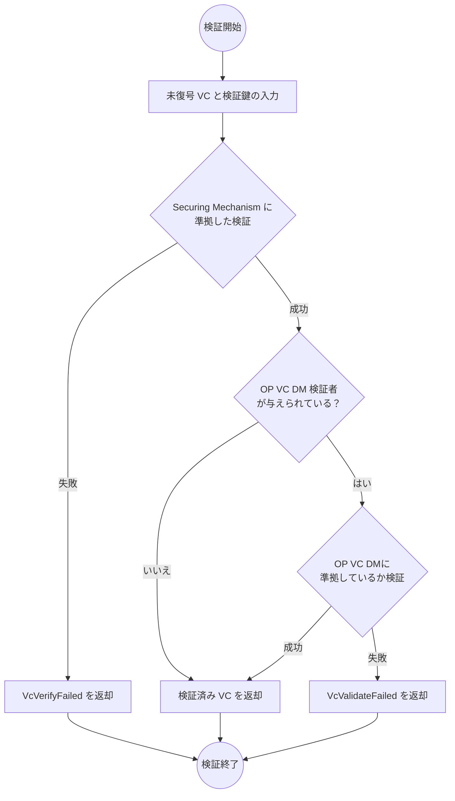

# OP VC Securing Mechanism

本文書は [Securing Verifiable Credentials using JOSE and COSE](https://www.w3.org/TR/vc-jose-cose/) に準拠した OP VC の各クレーム、プロパティの値を具体的に指定する文書です。

:::note

現在 OP VC の Securing Mechanism を [Securing Verifiable Credentials using JOSE and COSE](https://www.w3.org/TR/vc-jose-cose/) のみに限定しています。今後他の方式を採用する可能性があります。
なお、VC-JOSE-COSE は JOSE と COSE の両方の方式を規定していますが、現在多くのユースケースおよび Originator Profile 技術研究組合 (OP-CIP) の開発するツールチェインは JOSE のみサポートしています。

:::

## Securing VC with JOSE

### ヘッダー

- `typ` ヘッダーパラメーターは `vc+jwt` でなければなりません (MUST)。
- `kid` ヘッダーパラメーターは、署名に用いた鍵の [Key Identifier](#kid) でなければなりません (MUST)。
- `cty` ヘッダーパラメーターは `vc` でなければなりません (MUST)。

#### `kid` {#kid}

`kid` ヘッダーパラメーターの値は Key Identifier です。Key Identifier は、署名の検証に用いる公開鍵から次の手順で求めます。

1. 公開鍵を [RFC 5280](https://www.rfc-editor.org/rfc/rfc5280.html#section-4.1.2.7) の SubjectPublicKeyInfo (SPKI) として DER で符号化します。SPKI は鍵の種類ごとに標準化された形式でなければなりません (MUST)。楕円曲線の鍵では [RFC 5480](https://www.rfc-editor.org/rfc/rfc5480.html) の `id-ecPublicKey` と `namedCurve` のパラメーター、非圧縮の点の形式、RSA の鍵では [RFC 3279](https://www.rfc-editor.org/rfc/rfc3279.html) の `rsaEncryption` です。
2. 1 のバイト列の SHA-256 ダイジェストを計算します。
3. 2 のダイジェスト (32 バイト) を [RFC 4648 セクション 5](https://www.rfc-editor.org/rfc/rfc4648.html#section-5) の base64url で符号化し、末尾のパディング文字 `=` を除きます。結果は 43 文字の文字列です。

Key Identifier にはダイジェストのアルゴリズムを示す接頭辞などを付けません。

公開鍵を JWK として保持している場合も、JWK を SPKI に変換してから Key Identifier を求めなければなりません (MUST)。[JWK Thumbprint](https://www.rfc-editor.org/rfc/rfc7638.html) を Key Identifier として用いてはなりません (MUST NOT)。

OP の `jwks` に含める JWK の `kid` メンバーは、その鍵の Key Identifier でなければなりません (MUST)。ただし[移行](#kid-migration)の間は除きます。

:::note

Key Identifier は鍵だけから決まり、鍵をどの形式で表しても同じ値になります。X.509 証明書に含まれる公開鍵からも、同じ手順で同じ値が得られます。

:::

##### 例 {#kid-example}

_このセクションは非規範的です。_

Web Crypto API の `CryptoKey` (公開鍵) から Key Identifier を求める例を次に示します。

```ts
const spki = await crypto.subtle.exportKey("spki", key);
const kid = new Uint8Array(
  await crypto.subtle.digest("SHA-256", spki),
).toBase64({ alphabet: "base64url", omitPadding: true });
```

#### `kid` の移行 {#kid-migration}

本仕様の以前の版は、`kid` ヘッダーパラメーターを JWK Thumbprint と定めていました。Key Identifier への移行は次のとおりおこないます。

- OP の発行者は、OP の `jwks` に同じ公開鍵を 2 つの JWK として含めても構いません (MAY)。一方の `kid` メンバーは Key Identifier、他方は JWK Thumbprint とします。2 つの JWK は、`kid` メンバー以外のメンバーを同じにしなければなりません (MUST)。
- その鍵を `jwks` に含めている間、JWK Thumbprint を `kid` ヘッダーパラメーターとして署名された VC が有効期間内にあれば、JWK Thumbprint を `kid` メンバーとする JWK だけを `jwks` から除くべきではありません (SHOULD NOT)。そうした VC が無くなった後も、JWK Thumbprint を `kid` メンバーとする JWK は、その鍵を失効するまで、または鍵が危殆化するまで含めても構いません (MAY)。
- `kid` ヘッダーパラメーターを Key Identifier に切り替えた後に署名する VC では、`kid` ヘッダーパラメーターは Key Identifier でなければなりません (MUST)。それより前に JWK Thumbprint を `kid` ヘッダーパラメーターとして署名された VC は、OP の `jwks` に JWK Thumbprint を `kid` メンバーとする JWK が含まれている間、検証できます。

:::note

検証者は `kid` ヘッダーパラメーターの値の形式を解釈せず、OP の `jwks` に含まれる JWK の `kid` メンバーとの文字列の一致によって検証鍵を選びます。そのため、上の方法による移行では検証者の変更は必要ありません。`jwks` の各 JWK から Key Identifier を計算して `kid` ヘッダーパラメーターと比べる方法で検証鍵を選ぶと、移行の間、JWK Thumbprint を `kid` ヘッダーパラメーターとする VC の検証鍵が見つからないことに注意してください。

:::

### ペイロード

次の表に基づき、データモデルのプロパティと JWT クレームは一対一対応します。仕様策定者はそうなるようにデータモデルを定義する必要があります (MUST)。

JWT ペイロードにデータモデルのプロパティと JWT クレームの両方を含めても構いません (MAY)。ただし、その場合にはデータモデルのプロパティと JWT クレームの値は競合してはなりません (MUST NOT)。

:::note

Originator Profile 技術研究組合 (OP-CIP) の開発するアプリケーションでは、JWT ペイロードにデータモデルのプロパティと JWT クレームの両方を含めて署名します。

:::

|     データモデル     | JWT |
| :------------------: | :-: |
|   issuer (文字列)    | iss |
|      issuer.id       | iss |
| credentialSubject.id | sub |
|   （署名した日時）   | iat |
|   （署名失効日時）   | exp |

### 追加の JWT クレーム

#### `iat`, `exp` {#iat-exp}

REQUIRED. [JWT (RFC 7519)](https://www.rfc-editor.org/rfc/rfc7519.html) の仕様に従います。

#### 例

##### Core Profile

ヘッダー:

```json
{
  "typ": "vc+jwt",
  "cty": "vc",
  "kid": "...",
  "alg": "ES256"
}
```

ペイロード:

```json
{
  "iss": "dns:example.org",
  "sub": "dns:example.jp",
  "@context": [
    "https://www.w3.org/ns/credentials/v2",
    "https://originator-profile.org/ns/credentials/v1"
  ],
  "type": ["VerifiableCredential", "CoreProfile"],
  "issuer": "dns:example.org",
  "credentialSubject": {
    "id": "dns:example.jp",
    "type": "Core",
    "jwks": {
      "keys": [
        {
          "x": "ypAlUjo5O5soUNHk3mlRyfw6ujxqjfD_HMQt7XH-rSg",
          "y": "1cmv9lmZvL0XAERNxvrT2kZkC4Uwu5i1Or1O-4ixJuE",
          "crv": "P-256",
          "kid": "Tty_QC0BP0mBl9J4Dt1RKw8DxfrdCSwri_AriBTuSvw",
          "kty": "EC"
        }
      ]
    }
  },
  "iat": 1688623395,
  "exp": 1720245795
}
```

##### Content Attestation

ヘッダー:

```json
{
  "typ": "vc+jwt",
  "cty": "vc",
  "kid": "...",
  "alg": "ES256"
}
```

ペイロード

```json
{
  "iss": "dns:example.com",
  "sub": "urn:uuid:78550fa7-f846-4e0f-ad5c-8d34461cb95b",
  "@context": [
    "https://www.w3.org/ns/credentials/v2",
    "https://originator-profile.org/ns/credentials/v1",
    "https://originator-profile.org/ns/cip/v1",
    { "@language": "ja" }
  ],
  "type": ["VerifiableCredential", "ContentAttestation"],
  "issuer": "dns:example.com",
  "credentialSubject": {
    "id": "urn:uuid:78550fa7-f846-4e0f-ad5c-8d34461cb95b",
    "type": "Article",
    "headline": "<Webページのタイトル>",
    "image": {
      "id": "https://media.example.com/image.png",
      "digestSRI": "sha256-2ntYAX8nslHxMv5h7Wdv5QDaWxHq6dIOVAdwB9VztrY="
    },
    "description": "<Webページの説明>",
    "author": ["山田花子"],
    "editor": ["山田太郎"],
    "datePublished": "2023-07-04T19:14:00Z",
    "dateModified": "2023-07-04T19:14:00Z",
    "genre": "Arts & Entertainment"
  },
  "allowedUrl": ["https://media.example.com/articles/2024-06-30"],
  "target": [
    {
      "type": "VisibleTextTargetIntegrity",
      "cssSelector": "<CSS セレクター>",
      "integrity": "sha256-GYC9PqfIw0qWahU6OlReQfuurCI5VLJplslVdF7M95U="
    },
    {
      "type": "ExternalResourceTargetIntegrity",
      "integrity": "sha256-+M3dMZXeSIwAP8BsIAwxn5ofFWUtaoSoDfB+/J8uXMo="
    }
  ],
  "iat": 1688623395,
  "exp": 1720245795
}
```

##### Profile Annotation

ヘッダー:

```json
{
  "typ": "vc+jwt",
  "cty": "vc",
  "kid": "...",
  "alg": "ES256"
}
```

ペイロード:

```json
{
  "iss": "dns:profile-annotation-issuer.example.org",
  "sub": "dns:pa-holder.example.jp",
  "@context": [
    "https://www.w3.org/ns/credentials/v2",
    "https://originator-profile.org/ns/credentials/v1",
    "https://originator-profile.org/ns/cip/v1",
    { "@language": "ja" }
  ],
  "type": ["VerifiableCredential", "ProfileAnnotation"],
  "issuer": "dns:profile-annotation-issuer.example.org",
  "credentialSubject": {
    "id": "dns:pa-holder.example.jp",
    "type": "JP-OrganizationExistenceCertificate",
    "addressCountry": "JP",
    "corporateName": "○○新聞社 (※開発用サンプル)",
    "corporateNumber": "0000000000000",
    "postalCode": "000-0000",
    "addressRegion": "東京都",
    "addressLocality": "千代田区",
    "streetAddress": "○○○",
    "annotation": {
      "id": "urn:uuid:def09cbd-6e8e-4c73-856d-5e00dffde643",
      "type": "ProfileAnnotationPolicy",
      "name": "架空組織実在性検証局 実在証明",
      "description": "この組織は、法人登記の照会等により組織が実在していることが確認できました。",
      "ref": "https://ovac.exp.originator-profile.org/"
    }
  },
  "iat": 1688623395,
  "exp": 1720245795
}
```

## 暗号アルゴリズム {#cryptographic-algorithm}

暗号アルゴリズムは「[暗号アルゴリズム](./algorithm.md)」に従います。

## 検証プロセス {#verification}

VC の検証者は [VC DM 2.0 に準拠した検証の実装](https://www.w3.org/TR/vc-data-model-2.0/#verification)を用いて検証することができます。

:::note

将来、各検証の失敗に対応する [ProblemDetails オブジェクト](https://www.w3.org/TR/vc-data-model-2.0/#problem-details) を定義する可能性があります。

:::

@originator-profile/securing-mechanism において実装されている検証処理は次のプロセスでおこなわれます。

検証プロセスで扱うデータの構造については次のリファレンスを確認してください。

- 未復号 VC
- VcVerifyFailed
- VcValidateFailed
- OP VC DM 検証者
- 検証済み VC



## セキュリティ {#security}

_このセクションは非規範的です。_

[Verifiable Credentials Data Model 2.0 セクション 9](https://www.w3.org/TR/vc-data-model-2.0/#security-considerations)に記載のあるセキュリティの考慮事項も参考にしてください。

### 失効

Originator Profile では失効リスト (CRL: Certificate Revocation List) 相当の機構を採用しません。VC の [proof](https://www.w3.org/TR/vc-data-model-2.0/#proofs-signatures) の検証において、検証者がリアルタイムに有効性を確認する対象は署名鍵のみです。

したがって OP VC は有効期間の延長の仕組みを持ちません。有効性を維持するには、有効期間内に再発行および再設置を繰り返す必要があります。

### 署名鍵の保護

署名鍵の保護要件については [暗号鍵の保護および保証要件](./algorithm.md#暗号鍵の保護および保証要件) を参照してください。
