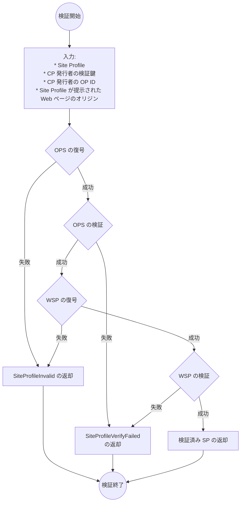

# Site Profile

Site Profile は Website Profile を特定のドメインに紐づけるために利用するデータです。

## 用語

本文書に説明のない用語については、[用語](./terminology.md)を参照してください。

- Originator Profile Set (OPS)
- Core Profile (CP)
- Profile Annotation (PA)
- Web Media Profile (WMP)
- Website Profile (WSP)
- Site Profile (SP)

## Site Profile

Site Profile は OPS と WSP をまとめた次のような JSON です。

- `originators`: REQUIRED. OPS です。
- `credential`: REQUIRED. WSP です。

非規範的な例を示します。

```json
{
  "originators": [
    {
      "core": "eyJ...",
      "annotations": ["eyJ...", "eyJ..."],
      "media": "eyJ..."
    },
    {
      "core": "eyJ...",
      "annotations": ["eyJ..."],
      "media": "eyJ..."
    }
  ],
  "credential": "eyJ..."
}
```

## 方法

クライアントがオリジンの `/.well-known/sp.json` にアクセスすると Site Profile が得られるようにしてください。

### リクエスト

あるドメインの WSP を得たいときは、そのドメインの `/.well-known/sp.json` に HTTP GET リクエストを送ります。

次の例は example.com の Site Profile を得るリクエストです。

```http
GET /.well-known/sp.json HTTP/1.1
Host: example.com
```

次の例はそのレスポンスです。

```http
HTTP/1.1 200 OK
Content-Type: application/json
...: ...

...
```

:::note

実装者は `Accept-Language` リクエストヘッダーがユーザーにとってプライベートな性質があると考える情報が明らかになる (ユーザーがどの民族に属しているかなど) ことを加味してプライバシーに配慮した実装をしなければなりません。 具体的には、ログとして収集する範囲に `Accept-Language` を含めない、ログを保持する期間を定める、プライバシーポリシーによって `Accept-Language` の取扱いを明示するなどです。

:::

### レスポンス

Site Profile の　well-known パスへの GET リクエストに対して Site Profile を返す場合、ステータスコードは200で、ボディーを Site Profile にしてください (MUST)。
サーバーはリクエストに `Accept-Language` ヘッダーが含まれる場合、 [RFC 4647 セクション 3](https://www.rfc-editor.org/rfc/rfc4647.html#section-3) に従って WSP および OPS の言語を選択しなければなりません (MUST)。

## 検証プロセス

_このセクションは非規範的です。_

[@originator-profile/verify](https://github.com/originator-profile/profile-share/tree/main/packages/verify) において実装されている検証処理は次のプロセスでおこなわれます。

検証プロセスで扱うデータの構造については次のリファレンスを確認してください。

- [SiteProfileInvalid](https://reference.originator-profile.org/ts/classes/_originator-profile_verify.SiteProfileInvalid)
- [SiteProfileVerifyFailed](https://reference.originator-profile.org/ts/classes/_originator-profile_verify.SiteProfileVerifyFailed)
- [検証済み SP](https://reference.originator-profile.org/ts/types/_originator-profile_verify.VerifiedSp)

OPS の検証プロセスの詳細は [OPS の検証](./originator-profile-set.md#verification) に準じます。また、WSP の検証プロセスの詳細は [WSP の検証](./website-profile.md#verification) に準じます。


