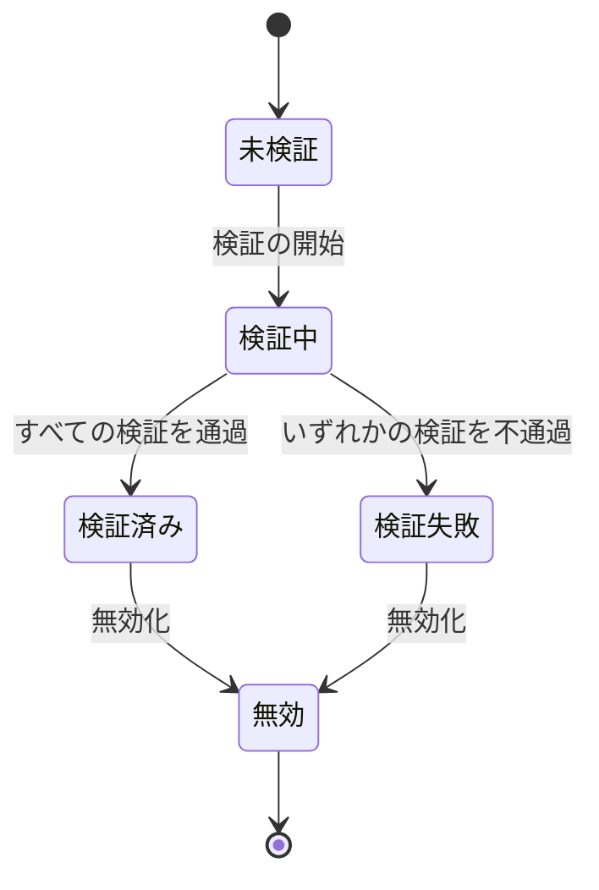

# Verifier Processing Model

## 適用範囲

各文書では検証手順を定めていますが、いずれにおいても検証をいつ開始するのか、結果がいつまで有効か、結果をどう提示するかを定めていません。

本文書では次を定めます。

- 検証がどの段階で構成されるか
- 各段階の入力が何であり、その同一性をどう扱うか
- 検証結果が何を含み、どの状態を取りうるか
- 結果がいつまで有効であり、いつ再利用してよいか
- 結果を提示するときにどのような制約をおくべきか

本文書は特定のデータ形式に依存しません。HTML文書における具体的な検証処理は、次の文書が定めます。

- [Site Profile Verifier Processing in HTML Documents](./site-profile.mdx)
- [Content Attestation Set and Originator Profile Set Verifier Processing in HTML Documents](./credentials.mdx)

### 本文書で扱う検証の意味的範囲 {/* #semantic-scope */}

OPB における検証は、次のすべてを含みます。

- 署名の検証 (検証鍵による署名済みデータの完全性の確認)
- 条件の充足確認 ([`allowedUrl` の検証](../ca.md#allowed-url-validation)など)
- コンテンツの完全性の確認 ([Content Integrity Descriptor](../content-integrity-descriptor/index.mdx) の検証など)

:::note

Architectural Overview (以下 AOV) は Verify を署名による完全性の確認に限定し、Validate を実態や信頼できる情報源を参照した真正性の評価として定義しています。OPB の「検証」はこれらより広い意味をもちます。AOV は日本語において Verify と Validate がいずれも「検証」と訳されうることを用語課題として挙げており、将来の文書統合時に整合が図られる予定です。本文書は OPB の既存の用法にしたがい、検証の意味的範囲を上記の通り明示します。

:::

## 適合対象

本文書の要件は、明示のない限り検証者に課されます。提示の要件は、検証結果を利用者に提示する検証者に課されます。すべての検証者が結果を提示するとは限りません。例えば、コマンドラインの検証ツールや配信経路での検証器は結果を提示しないため、提示の要件の対象外です。

検証者処理文書は、配布者など、検証者以外にも要件を課すことがあります。その場合、検証者処理文書は要件の対象を明示します。

利用者には、本文書のいかなる要件も課されません。

本文書におけるコンテンツとは、利用者が閲覧その他の方法で利用しているものを指し、検証対象とは区別されます。両者は一致するとは限りません。たとえば、Site Profile の検証対象は当該オリジンの Site Profile ですが、利用者が利用しているコンテンツは当該オリジンの文書です。

## 検証段階 {/* #verification-stages */}

検証は、次の5つの段階で構成されます。

1. 探索: 検証対象を見つける
2. 解決: 検証に必要な材料を用意する
3. 検証: 対象と材料に対して、検証を適用する
4. 保持: 検証結果を保ち、有効性を追跡する
5. 提示: 検証結果を利用者に提示する

段階は依存関係を持ちますが、検証対象ごとに独立して進行します。1つの検証対象が検証の段階にあるとき、別の検証対象が探索の段階にあってもかまいません (MAY)。

## 検証入力 {/* #verification-input */}

検証入力: 検証に用いる材料の総体。対象そのものと、解決の段階で揃えた材料を含みます。

### 入力同一性 {/* #input-identity */}

検証入力は可変になりえます。対象が時間とともに変化する場合、検証はある時点の状態に対しておこなわれます。

入力スナップショット: 可変な検証入力の、ある時点における状態

1つの検証結果の検証入力は、単一の入力スナップショットでなければなりません (MUST)。複数の時点にまたがる入力から、1つの結果を導いてはなりません (MUST NOT)。

入力同一性: ある2つの検証入力が同一とみなせるかの判定。

検証者は、入力同一性を判定する手段を保持しなければなりません (MUST)。検証入力そのものを保持することは要求されません。

### 入力範囲 {/* #input-scope */}

入力範囲: 検証に用いてよい材料の範囲。

検証者は、入力範囲の外にある材料を検証に用いてはなりません (MUST NOT)。具体的な範囲は、それぞれの検証者処理文書が定めます。

入力範囲は、検証結果に記録されなければなりません (MUST)。同じ対象であっても、利用する材料が異なれば結果の意味が異なるためです。

### 入力の由来

同一の成果物であっても、取得経路によって扱いが異なりえます。ある経路で得た材料が、別の経路で得た材料と同等に扱えるとは限りません。

検証者処理文書は、その扱う成果物の取得経路を明示し、経路ごとに入力範囲と入力同一性の判定方法を定めなければなりません (MUST)。

## 検証結果 {/* #verification-outcome */}

検証結果: 検証の出力。

### 結果が含む内容

検証結果は、少なくとも次を含めなければなりません (MUST)。

- 検証対象の識別: 検証対象を一意に識別するための情報
- [検証範囲](#verification-scope): どの検証を適用したかの情報
- [入力の範囲](#input-scope): どの材料を検証に用いたかの情報
- [結果状態](#outcome-state): 検証結果がとりうる状態の情報
- [入力同一性](#input-identity)の判定手段: どのように入力同一性を判定したかの情報
- [検証時刻](#verification-time): 検証を開始した時刻
- [時刻の境界](#verification-time): 検証結果が時刻の経過によって有効性を失う時刻 (ある場合)

検証範囲と検証時刻は、検証を開始した時点で定まります。結果状態が未検証の間、検証結果はこれらの値をもちません。時刻の境界は、結果状態が検証済みまたは検証失敗に遷移した時点で定まります。

検証入力そのものを含むことは要求されません (NOT REQUIRED)。

### 結果状態 {/* #outcome-state */}

結果状態: 検証結果がとりうる状態。

結果状態は、次のいずれかをとります。

- 未検証: 検証を開始していない
- 検証中: 検証を開始したが結果が確定していない
- 検証済み: 検証範囲に含まれるすべての検証を通過した
- 検証失敗: 検証範囲に含まれるいずれかの検証を通過しなかった
- 無効: いったん確定した結果が、検証入力の変化または時刻の経過によって、現在の検証対象に対して有効でなくなった

:::note

これらの名称は仕様の記述のためのものであって、利用者に提示する表現ではありません。

:::

### 状態遷移 {/* #state-transition */}

- 未検証から検証中への遷移は、検証の開始を契機とする
- 検証中から検証済みまたは検証失敗への遷移は、検証範囲に含まれるすべての検証の完了を契機とする
- 検証済みまたは検証失敗から無効への遷移は、[無効化](#invalidation)の条件を契機とする
- 検証失敗から検証済みへの直接の遷移は存在しない (MUST NOT)。検証を通過しなかった対象について再び検証を行う場合、それは新たな検証結果である
- 無効から他の状態への遷移は存在しない。無効になった結果について再び検証を行う場合、それは新たな検証結果である

### 検証範囲 {/* #verification-scope */}

検証範囲: 検証結果を導くために適用した検証の集合。個々の検証は、検証の種類と、それを適用した検証対象の部分によって識別されます。

適用しうる検証: 検証対象に適用しうる検証の集合。検証者処理文書が定めます。

どの検証を適用するかは、検証者のポリシーによって決まります。検証範囲は、適用しうる検証のうち、検証者が実際に適用したものを記録します。

検証範囲は、検証を開始する時点で定まり、その検証結果において変わりません (MUST)。検証範囲に含まれる検証を完了できない場合、その検証を通過しなかったものとして扱います。

検証範囲が適用しうる検証のすべてを含む場合と、その一部のみを含む場合では、結果の意味は異なります。検証者は、両者を区別できる形で検証範囲を記録しなければなりません (MUST)。検証範囲が適用しうる検証の一部のみを含む場合、検証済みは、適用しうるすべての検証を通過したことを意味しません。

:::note

たとえば、署名の検証は VC ごとに、Content Integrity Descriptor の検証は Content Attestation の `target` ごとに、それぞれ一つの検証として識別されます。

:::

## 結果の有効性 {/* #outcome-effectiveness */}

有効性: 検証結果が、ある時点で成り立っていること。

:::note

Verifiable Credential の有効期間 (Validity Period) とは別の概念です。VC の有効期間は検証対象であって、本セクションの有効性は検証結果の性質を表します。

:::

### 検証時刻 {/* #verification-time */}

検証時刻: 検証を開始した時刻。検証範囲に含まれる検証のうち時刻に依存するもの (VC の[有効期間](../../tech/validity-period.mdx)の検証など) は、検証時刻において評価されます。

時刻の境界: 次のうち、検証時刻より後で最も早い時刻。

- 検証範囲に含まれる時刻に依存する検証が参照する時刻。VC の署名の有効期間の開始と終了 (`iat`、`exp`) や、VC が含む情報の有効期間の開始と終了 (`validFrom`、`validUntil`) がこれにあたります
- 検証入力に含まれる材料に定められた鮮度の期限。どの材料に鮮度の期限が定められるかは、検証者処理文書が定めます

検証結果は、時刻の境界に達するまで有効です。時刻の境界がない場合、検証結果は時刻の経過によって有効性を失いません。

時刻に依存する検証において、検証者が時計のずれを見込んだ猶予を設ける場合 (たとえば [RFC 7519 4.1.4 節](https://www.rfc-editor.org/rfc/rfc7519.html#section-4.1.4)が認める `exp` の猶予)、時刻の境界は、その猶予を反映した時刻とします。どの程度の猶予を設けるかは、検証者のポリシーによって決まります。

### 無効化 {/* #invalidation */}

無効化: 検証範囲は変わらないまま検証結果が有効性を失い、結果状態が無効に遷移すること。

無効は検証失敗ではありません。無効は現在の対象について確認できないのであって、検証失敗が示すところの検証を通過しなかったことを意味しません。両者を同一に扱ってはなりません (MUST NOT)。

検証結果は、次のいずれかが生じた時点で無効化します (MUST)。

- 検証入力が変化した。何を検証入力の変化とみなすかは、それぞれの検証者処理文書が定めます
- 現在の時刻が[時刻の境界](#verification-time)に達した

検証済みの結果だけでなく、検証失敗の結果も無効化します。検証失敗の結果を残したまま入力が変化すると、現在の対象について検証を通過しなかったと誤って示し続けることになるためです。

### 再利用 {/* #reuse */}

検証者は、次のすべてが満たされる場合に限り、検証結果を再利用してかまいません (MAY)。

- [検証範囲](#verification-scope)が同一であること
- [入力同一性](#input-identity)が保たれていること
- 現在の時刻が[時刻の境界](#verification-time)より前であること

いずれかが満たされない場合、再利用してはなりません (MUST NOT)。具体的な同一性の判定方法は検証者処理文書が定めます。

## 提示 {/* #presentation */}

本セクションの要件は、検証結果を利用者に提示する検証者に課せられます。

- 未検証および検証中の状態を、検証済みとして提示してはなりません (MUST NOT)
- 検証済みまたは検証失敗から無効への遷移は、提示に反映しなければなりません (MUST)
- 無効を検証失敗と同一の表現で提示してはなりません (MUST NOT)
- 検証範囲が適用しうる検証の一部のみを含む場合、[検証の意味的範囲](#semantic-scope)の分類のうち、検証範囲に含まれない検証がある分類を、利用者が識別できる形で提示しなければなりません (MUST)
- コンテンツの一部のみが検証対象に対応する場合、検証済みの提示がコンテンツ全体に及ぶものと誤解されない形で提示しなければなりません (MUST)

## 非ブロッキング {/* #non-blocking */}

検証処理は、利用者が利用するコンテンツの取得、処理、および利用者への提示を妨げてはなりません (MUST NOT)。

## 検証者処理文書 {/* #verifier-processing-document */}

本文書を具体化する検証者処理文書は、次のすべてを定めなければなりません (MUST)。

- 探索: 対象の識別方法、探索の契機
- 解決: [検証入力](#verification-input)の取得経路、[入力範囲](#input-scope)
- 検証: [適用しうる検証](#verification-scope)とそれを識別する単位、検証処理の順序、検証を開始する時点
- 保持: [入力同一性](#input-identity)の判定方法、[無効化](#invalidation)の判定方法、鮮度の期限が定められた材料がある場合はその材料、再利用条件の具体化
- 提示: 固有の制約がある場合はその内容

加えて、検証者処理文書は、各段階の検証処理が発生させるネットワークアクセスと、それによって生じる[開示](#privacy-considerations)の範囲を、独立したセクションで定めなければなりません (MUST)。

## セキュリティに関する考慮事項 {/* #security-considerations */}

### 無効化の無視

検証結果が無効化されているにもかかわらず提示が更新されない場合、攻撃者は、検証済みであると誤認させることができます。たとえば、正当なコンテンツとその検証結果を提示した後に、コンテンツを差し替えることによってです。[無効化](#invalidation)と[提示](#presentation)の要件は、このような攻撃を防ぐために定められています。

### 検証範囲の誤認

検証範囲が適用しうる検証の一部のみを含む場合に、そのことが提示されなければ、利用者は実際よりも多くの検証を通過したと誤認する可能性があります。たとえば、署名と `allowedUrl` の検証を通過したものの、Content Integrity Descriptor の検証を適用していない Content Attestation の検証結果を、検証済みとだけ提示したとします。このとき、利用者は、改ざんされたコンテンツを、改ざんされていないことが確認されたものと誤認する可能性があります。[提示](#presentation)の要件は、このような誤認を防ぐために定められています。

### コンテンツと検証対象の対応の誤認

コンテンツの一部のみが検証対象に対応する場合に、その対応が提示されなければ、利用者は検証対象に対応しない部分まで検証済みであると誤認する可能性があります。たとえば、ページの本文に対応する Content Attestation が設置されているが、同じページのコメント欄や関連リンクには設置されていないとします。このとき、発信者を示す表示がページ単位でおこなわれると、利用者はページ全体が検証済みで、その発信者のコンテンツであると誤認する可能性があります。[提示](#presentation)の要件は、このような誤認を防ぐために定められています。

### 入力の混入

入力範囲が適切に限定されない場合、攻撃者は自らが制御する材料を検証入力に混入させ、本来検証失敗となるべき検証を通過しえます。また逆に、他者が制御する材料が検証入力に混入することで、正当なコンテンツが検証失敗となりえます。[入力範囲](#input-scope)の要件は、このような混入を防ぐために定められています。

## プライバシーに関する考慮事項 {/* #privacy-considerations */}

### 検証処理が発生させる開示

検証処理は、利用者が利用するコンテンツの取得に加えて、追加のネットワークアクセスを発生させる場合があります。このアクセスは、利用者がそのコンテンツを利用していることを、アクセス先のオリジンに開示することになります。開示は、解決の段階では Verifiable Credentials の取得において、検証および提示の段階では Verifiable Credentials が参照する外部リソースの取得において生じえます。

### コンテンツの利用が確定する前の検証

利用者がそのコンテンツを利用することを決定する前に検証処理が開始される場合、利用者が結果的に利用しなかったコンテンツについても開示が発生します。検証者処理文書は、[開示の範囲](#verifier-processing-document)を定めるにあたり、検証を開始する時点と、その時点で生じる開示を考慮すべきです (SHOULD)。
