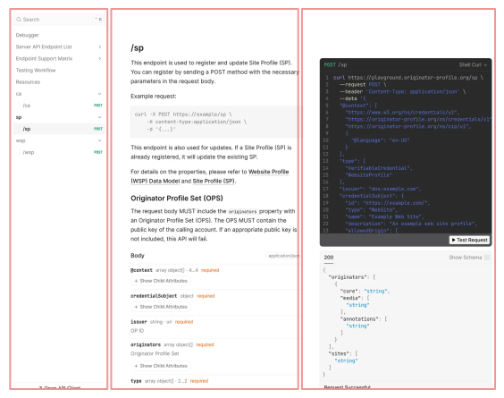

# Content Attestation Server Playground

[Content Attestation Server Playground](https://playground.originator-profile.org/) は、Content Attestation の発行から OP Inspector での検証までのワークフローをテストできる環境です。

:::warning
Playground はテスト専用の環境です。Playground で発行した Content Attestation や Site Profile は本番環境では使用できません。
:::

:::note
Playground での発行の他に CP、PA、WMP 等の発行を試せるコマンドラインツールである OPVC CLI を提供しています。  
[OPVC CLI](./opvc-cli.md) を参照してください。
:::

## Playground の使い方

### 画面の説明



画面は「左」「中央」「右」の3つのペイン (列) で構成されています。

- **左ペイン: ナビゲーション (Sidebar)**:
  APIエンドポイントの目次です。目的のエンドポイントを検索・選択できます。
- **中央ペイン: ドキュメント (Documentation)**:
  左ペインで選択されたAPIの詳細な仕様が表示されます。エンドポイントのURL、機能の概要文、必須および任意のパラメータ (Query、Path、Headers)、リクエストボディのデータ構造 (Schema) が記載されています。
- **右ペイン: APIクライアント (API Client)**:
  ドキュメント上で直接APIリクエストを実行できるテスト環境です。各種プログラミング言語 (Node.js、Pythonなど) やコマンドラインツール (cURL) に対応した実装用のコードスニペットが自動生成され、コピーして開発に活用できます。

APIの動作確認を行う方法は以下の通りです。

1. **APIの選択**:
   画面上部の検索バーを利用するか、左ペインのナビゲーションから、確認したいAPIエンドポイントを選択します。
2. **パラメーターの入力**:
   中央ペインで仕様を確認しながら、右ペイン (または中央ペイン下部) の「Test Request」ボタンをクリックし、必要なパラメーターを入力できます。リクエストボディに必要なJSON形式でデータを入力することが可能です。
3. **リクエストの送信**:
   「Send」ボタンをクリックし、対象のサーバーへAPIリクエストを送信します。
4. **レスポンスの確認**:
   リクエスト送信後、画面上にレスポンスのステータスコード (例: `200 OK`) や、サーバーから返却されたデータ (JSON形式など) が表示されます。想定通りの結果が得られているかを確認できます。

### Site Profile の発行 {#issue-site-profile}

Playground の [`/sp`](https://playground.originator-profile.org/#tag/sp) エンドポイントに POST リクエストを送信します。

```sh
curl -X POST https://playground.originator-profile.org/sp \
  -H content-Type:application/json \
  -u Basic認証ユーザー名:Basic認証パスワード \
  -d '{ ... }'
```

リクエストボディの各プロパティの詳細は [Website Profile (WSP) データモデル](/opb/website-profile/) および [Site Profile (SP)](/opb/site-profile/) をご確認ください。

### 検証方法

OP Inspector をインストールした状態で、Site Profile を配置したウェブサイトにアクセスすることで検証を行えます。
検証するにはテストビルド版の OP Inspector が必要です。

:::warning
テストビルド版の OP Inspector は Playground 環境専用です。本番環境の Content Attestation を検証できません。また、Playground で発行した Content Attestation や Site Profile は通常ビルド版の OP Inspector で検証できません。
:::

[GitHub Releases (canary)](https://github.com/originator-profile/originator-profile/releases/tag/canary) から OP Inspector (テストビルド) をダウンロードし、インストールできます。

| ブラウザ | ファイル名                                                            |
| -------- | --------------------------------------------------------------------- |
| Chrome   | [`_testing_op_inspector-chromium-canary.zip`][chrome]                 |
| Firefox  | [`_testing_op_inspector-firefox-desktop-canary.zip`][firefox-desktop] |

[chrome]: https://github.com/originator-profile/originator-profile/releases/download/canary/_testing_op_inspector-chromium-canary.zip
[firefox-desktop]: https://github.com/originator-profile/originator-profile/releases/download/canary/_testing_op_inspector-firefox-desktop-canary.zip

### WordPress プラグイン (CA Manager) を使用して CA を自動発行する方法について {#use-wordpress-plugin}

WordPress を利用している場合は、WordPress プラグイン (CA Manager) を使用して CA の自動発行をテストすることができます。  
[WordPress プラグイン (CA Manager) ガイド](/site-cases/wordpress/)の「[1. プラグインのインストール](/site-cases/wordpress/#plugin-installation)」セクションを実施後、以下の手順に従って設定してください。

1. Playground で Site Profile を発行する  
   Site Profile の発行方法については 「[Site Profile の発行](#issue-site-profile)」を参照してください。
2. 発行した Site Profile をサイトに設置する  
   配置方法は [`/.well-known/sp.json` の配置](/site-cases/wordpress/#well-known-sp-json)を参照してください。
3. CA Manager の設定を Playground の情報に合わせて行う  
   設定方法は[プラグインの設定](/site-cases/wordpress/#plugin-settings)を参照してください。
   [Playground](https://playground.originator-profile.org/) の値を参考に設定してください。
4. 設定完了後、新規投稿の作成または既存投稿の更新（再保存）を行う  
   これにより CA の自動発行処理が実行されます。
5. [確認方法](/site-cases/wordpress/#how-to-check)を参考に CA が正しく発行されているか確認する  
   デベロッパーツールまたは OP Inspector、debugger を使用して確認できます。
