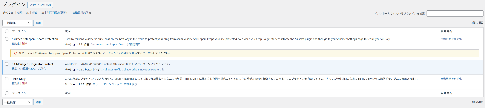
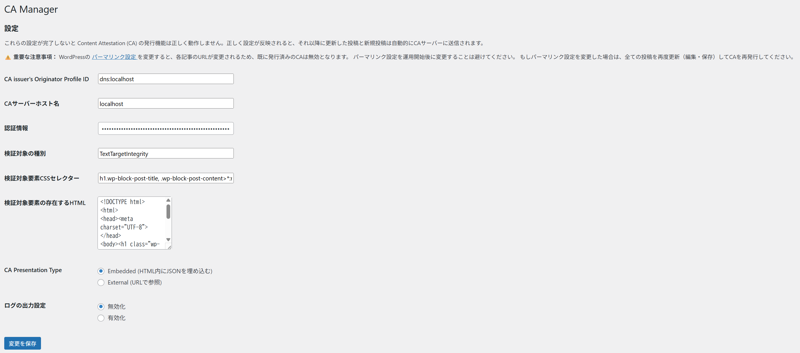
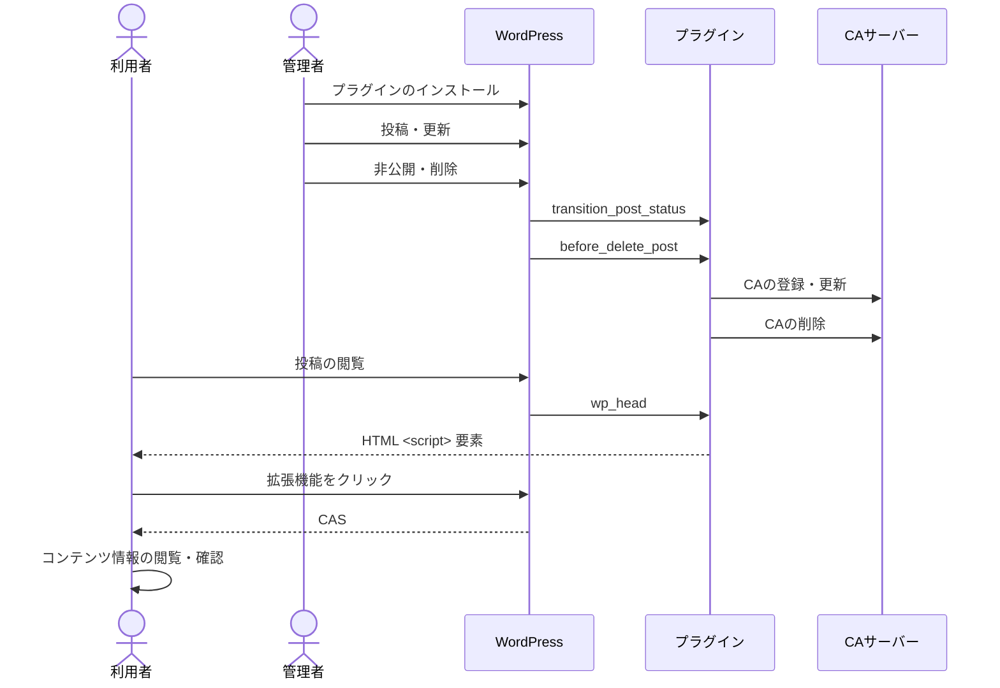

# WordPress プラグイン (CA Manager)

## 目的

WordPress サイトに CA Manager を導入し、 CA を自動発行できる状態にする。

## 前提条件

- WordPress 管理者権限がある

## 手順

### 1. プラグインのインストール {#plugin-installation}



1. プラグインのダウンロード:
   「[Releases](https://github.com/originator-profile/originator-profile/releases)」にアクセスし、Assets セクションから WordPress プラグイン（wordpress-ca-manager.zip）を取得
2. プラグインのアップロード:
   WordPress 公式サイト「[プラグイン新規追加画面](https://ja.wordpress.org/support/article/plugins-add-new-screen/)」にある「プラグインをアップロード」の節を参照
3. プラグインの有効化
4. プラグインの設定:
   WordPress 管理者画面の「設定 > CA Manager」にアクセスし、次節「プラグインの設定」必要項目を入力

### 2. プラグインの設定 {#plugin-settings}



プラグイン有効化後、以下の必須項目を入力を行い設定する必要があります。
設定は WordPress 管理画面の「設定 > CA Manager」から行います。

**[CA issuer's Originator Profile ID]: 自身の Originator Profile ID を指定**

例:

```
dns:media.example.com
```

**[CA サーバーホスト名]: 利用する CA サーバーのホスト名を指定**

例:

```
dprexpt.originator-profile.org
```

**[認証情報]: CA サーバーへのアクセスに必要な情報を指定**

例:

```
cfbff0d1-9375-5685-968c-48ce8b15ae17:GVWoXikZIqzdxzB3CieDHL-FefBT31IfpjdbtAJtBcU
```

**検証対象の種別**

例:

```
TextTargetIntegrity
```

**検証対象要素 CSS セレクター**

例:

```
h1.wp-block-post-title, .wp-block-post-content>*:not(.post-nav-links)
```

**検証対象要素の存在する HTML**

例:

```html
<!DOCTYPE html>
<html>
  <head>
    <meta charset="UTF-8" />
  </head>
  <body>
    <h1 class="wp-block-post-title">%TITLE%</h1>
    <div class="wp-block-post-content">%CONTENT%</div>
  </body>
</html>
```

`%TITLE%` は投稿タイトルに、`%CONTENT%` は `apply_filters()` 適用後の WordPress 投稿内容に置換され、リクエストコンテンツ `target[0].content` プロパティとして CA サーバーに送信されます。

**[CA Presentation Type]: CAS を埋め込み形式かリンク形式か指定**

デフォルトは Embedded となっています。

- Embedded: CAS を埋め込み形式（Embedded）にして記事を投稿します。

Embedded を選択したとき出力されるHTMLの一部の例:

```html
<script type="application/cas+json">
  ["eyJ..."]
</script>
```

- External: CAS を静的ファイルとして生成し、リンク形式（External）にして記事を投稿します。生成されるファイルについては「[CA Presentation Type をリンク形式にしたときのファイル生成について](#ca-presentation-type-external)」を参照してください。

**ログの出力設定**

デフォルトは無効となっています。

有効にすると CA Manager プラグインに関するログが出力され、ログファイルをダウンロードすることができます。生成されるログファイルについては「[ログファイルの生成について](#log-output)」を参照してください。

これらの設定が完了しないと Content Attestation の発行機能は正しく動作しません。
正しく設定が反映されると、それ以降に更新した投稿と新規投稿は自動的に CA サーバーに送信されます。

## 確認方法 {#how-to-check}

設定が完了したら、新規投稿の作成または既存投稿の更新（再保存）を行ってください。
CA が正しく発行されているかどうかは、次の 2 つの方法で確認できます。

- デベロッパーツールで確認する  
  ブラウザのデベロッパーツールを開き、ページ内に `cas+json` タイプの `<script>` タグが埋め込まれているかを確認します。  
  以下のような要素が存在していれば、CA の発行および設定は正常に行われています。

例:

```html
<script type="application/cas+json">
  ["eyJ..."]
</script>
```

※ この方法では検証結果までは確認できません。発行されているかどうかの一時確認としてご利用ください。

- [OP Inspector](/inspector) または [Debugger](/debugger) で確認する  
  より詳細に確認したい場合は、 OP Inspector または Debugger を使用します。
  - 対象ページに付与された CA が存在するか
  - CA の検証が成功しているか

  これらを確認できます。  
  それぞれ、使い方は [OP Inspector](/inspector) のドキュメント、[Debugger](/debugger) のドキュメントを参照してください。

**CA が存在しない場合**

- プラグインの設定値が誤っている可能性があります。
- ログ出力設定を有効にし、ページを保存してログを確認してください。ログの出力設定は[プラグインの設定](#plugin-settings)を参照してください。

**検証に失敗している場合**

- エラーコードに応じて原因が異なります。
- 詳細は[エラーコード一覧](/error-reference/)を参照してください。

## 機能及び参考情報

### 機能

このプラグインの主な機能は以下の通りです。

1. WordPress での投稿・更新時の投稿内容の処理
   - WordPress での投稿または更新をトリガーとします
   - このトリガーにより投稿内容を処理し、CA サーバーの CA 登録・更新エンドポイントに送信します
2. WordPress の投稿ページでの CAS 配信

### 処理の流れ

WordPress 連携用プラグインでの処理の流れは以下の通りです。
ここでの利用者は Web ブラウザと拡張機能を利用していることを想定しています。



[Hooks](https://developer.wordpress.org/plugins/hooks/) に応じた処理を実行します。

- `transition_post_status` : 投稿・更新のタイミングでトリガーされ、そのコンテンツの内容を変換し、CA サーバーの登録・更新エンドポイントに送信します  
  また、公開から非公開や下書きなど公開以外の状態になったタイミングでトリガーされ、対象コンテンツの CA ID を利用して CA サーバーの削除エンドポイントに送信します
- `before_delete_post` : 投稿が削除されるタイミングでトリガーされ、対象コンテンツの CA ID を利用して CA サーバーの削除エンドポイントに送信します
- `wp_head` : 投稿の閲覧のタイミングでトリガーされ、埋め込まれた `<script>` 要素を介して利用者は CAS を取得します

以上の処理により、投稿したコンテンツは自動的に管理され、利用者はその真正性を確認できます。

### ファイル構成

#### config.php

`includes` ディレクトリの中に置かれている `config.php` ファイルには、このプラグインの設定値が含まれています。

| 設定値                                    | 説明                                                                                                                                                                                                          |
| ----------------------------------------- | ------------------------------------------------------------------------------------------------------------------------------------------------------------------------------------------------------------- |
| PROFILE_DEFAULT_CA_SERVER_HOSTNAME        | Content Attestation サーバーのホスト名の設定の初期値です。このホスト名のエンドポイントを介して Content Attestation の登録・更新・取得を行います。もし設定画面から設定を変更した場合、この値は参照されません。 |
| PROFILE_DEFAULT_CA_SERVER_REQUEST_TIMEOUT | Content Attestation サーバーのリクエストアウト (秒) の初期値です。                                                                                                                                            |
| PROFILE_DEFAULT_CA_TARGET_TYPE            | 検証対象の種別の初期値です。                                                                                                                                                                                  |
| PROFILE_DEFAULT_CA_TARGET_CSS_SELECTOR    | 検証対象要素 CSS セレクターの初期値です。デフォルトでは記事タイトル (`h1.wp-block-post-title`) と記事本文の直下子要素 (`.wp-block-post-content>*:not(.post-nav-links)`) の両方を対象とします。                |
| PROFILE_DEFAULT_CA_TARGET_HTML            | 検証対象要素の存在する HTML の初期値です。`%TITLE%` は投稿タイトルに、`%CONTENT%` は `apply_filters()` 適用後の投稿本文に置換されます。                                                                       |

### CA サーバーの API 認証

CA サーバー API の Basic 認証をサポートしています。
Basic 認証以外の認証方式 (例: OAuth、JWT、API キー) を利用する場合、カスタマイズが必要です。
カスタマイズの方法については、[includes/issue.php](https://github.com/originator-profile/originator-profile/blob/main/packages/wordpress/includes/issue.php) `issue_ca()` の実装をご確認ください。

### OP 対応

#### `/.well-known/sp.json` の配置 {#well-known-sp-json}

配置場所:

ドキュメントルートが /var/www/html の場合、以下のパスに配置します。

```
/var/www/html/.well-known/sp.json
```

Web サーバーの設定によっては `.well-known` ディレクトリへのアクセスが制限されている場合があります。以下のように `.well-known` へのアクセスを許可します。

Apache:

```.htaccess
<Directory "/var/www/html/.well-known">
  AllowOverride None
  Require all granted
</Directory>
```

確認方法:

```
$ curl -sSf https://example.com/.well-known/sp.json
```

OP の含まれる SP が正しく取得できれば設定は完了です。

#### 別の方法: OPの埋め込み

HTML 中に script 要素を用いて OP を埋め込むことが可能です。

具体例:

```html
<script type="application/ops+json">
  [
    {
      "core": "eyJ...",
      "annotations": ["eyJ..."],
      "media": ["eyJ..."]
    }
  ]
</script>
```

詳細は「[サイトの OP 対応](https://docs.originator-profile.org/tutorial/sp-setup-guide/)」または「[Linking Content Attestation Set and Originator Profile Set to A HTML Document](https://docs.originator-profile.org/opb/link-to-html/)」をご確認ください。

### CA Presentation Type をリンク形式にしたときのファイル生成について {#ca-presentation-type-external}

CA Presentation Type が External 時、静的ファイルを生成するディレクトリとして下記のように定義されています。

```
const PROFILE_DEFAULT_CA_EXTERNAL_DIR = 'cas';
```

ドキュメントルートが /var/www/html の場合、以下のパスに静的ファイルが配置されます。

```
/var/www/html/cas/<ポストid>_cas.json
```

External を選択したとき出力されるHTMLの一部の例:

```html
<script
  src="https://example.com/cas/1_cas.json"
  type="application/cas+json"
></script>
```

ドキュメントルート配下に cas ディレクトリが存在しない場合、 cas ディレクトリが作成されます。
また、ポストidが同一の場合、静的ファイルは上書きされます。

確認方法:

```
$ curl -sSf https://example.com/cas/1_cas.json
```

### ログファイルの生成について {#log-output}

ログファイルを生成するディレクトリとして下記のように定義されています。

```
const PROFILE_DEFAULT_CA_LOG_DIR = 'ca-manager-log';
```

ドキュメントルートが /var/www/html の場合、以下のパスにログが出力されます。
ログファイルが存在しない場合、新たに生成されます。

```
/var/www/html/wp-content/uploads/ca-manager-log/ca-manager-debug.log
```

また、CA Manager プラグイン有効化時、以下のパスに以下の内容でアクセス制御を行うファイルを自動生成します。

```
/var/www/html/wp-content/uploads/ca-manager-log/.htaccess
/var/www/html/wp-content/uploads/ca-manager-log/index.php
```

Apache:

```.htaccess
<FilesMatch "\.(log|txt)$">
  Require all denied
</FilesMatch>
```

Apache 以外のアクセス制御を行うファイルは自動生成されませんので、適宜アクセス制御を行うようにしてください（推奨）。

無効にするとログ出力が無効になり、ログファイルが削除されます。

### デモ

プラグインインストール済みの試験用環境を用意しています。

- https://op.cms.am/ (最新のメイン試験環境)

デモサイトの編集権限が必要な方は開発チームに相談してください。

### Playground とあわせた使用方法

OP 登録が行えない場合は、Playground を利用して CA の自動発行をテストすることができます。  
詳しくは [Playground のガイド](/playground/#use-wordpress-plugin) を参照してください。

## 既知の問題

### パーマリンク設定の変更による影響

WordPress のパーマリンク設定を変更すると、各記事の URL が変更されるため、既に発行済みの Content Attestation（CA）は `allowedUrl` の不一致により無効となります。

**影響する操作**:

- 設定 > パーマリンク設定
  - 設定変更
  - カスタム構造の変更

パーマリンク設定を変更した場合、影響を受ける全ての投稿を再度更新（編集・保存）することで、新しい URL に対応した CA が再発行されます。

### プラグイン・フィルター・テーマによる HTML の変形

WordPress では、投稿本文に `<!--nextpage-->` を挿入することでページ分割が可能です。ただし、プラグインやテーマ、あるいはフィルターフックの影響により、これが `<p><!--nextpage--></p>` のように不適切なマークアップで出力される場合があります。このような出力は、意図しない改行や空行の原因となります。

**回避策**: 次のように置換処理を行うことで不適切なマークアップを修正できます。

```php
// includes/issue.php

/**
 * 未署名 Content Attestation の一覧の作成
 *
 * @param \WP_Post $post Post object.
 * @param string   $issuer_id CA 発行者 ID
 * @return list<Uca> 未署名 Content Attestation の一覧
 */
function create_uca_list( \WP_Post $post, string $issuer_id ): array {
	// ... 省略 ...

	// 置換処理を追加
	$post->post_content = str_replace('<p><!--nextpage--></p>', '<!--nextpage-->', $post->post_content);

	$postdata = \generate_postdata( $post );

	// ... 省略 ...
}
```

### Autoptimize プラグインとの競合

[Autoptimize](https://ja.wordpress.org/plugins/autoptimize/)（[Pro版](https://autoptimize.com/pro/)を含む）は、HTML や画像の最適化（minify）を行うプラグインです。これにより、以下のような問題が発生する可能性があります。

#### 署名対象 HTML との不整合

Autoptimize による minify 前の HTML が CA Server に送信される場合、実際に表示される HTML と一致せず、署名検証が失敗する可能性があります。

**対応方針**: Autoptimize の minify 処理後の HTML を調整し、それを CA Server に送信

#### Pro 版 CDN による画像 URL の変換

Pro 版では、画像が CDN 経由で変換され、URL が変化する場合があります。これにより署名対象の HTML と実際の表示内容に差異が生じます。

**対応方針**: CDN 変換後の画像 URL を取得し、それを反映した HTML を CA Server に送信

### CA サーバー側でのデータ削除

メタデータ `_profile_post_cas` に CAS が保存されている状態で、 CA サーバー側のデータが手動で削除された場合、記事更新時に UUID を指定した新規登録が試みられます。これはサーバー側でエラーとなる可能性があります。

**回避策**： 一度記事を非公開にすることで、メタデータがクリアされます。その後再度公開することで UUID を指定しない新規登録となり、正常に登録されます。
