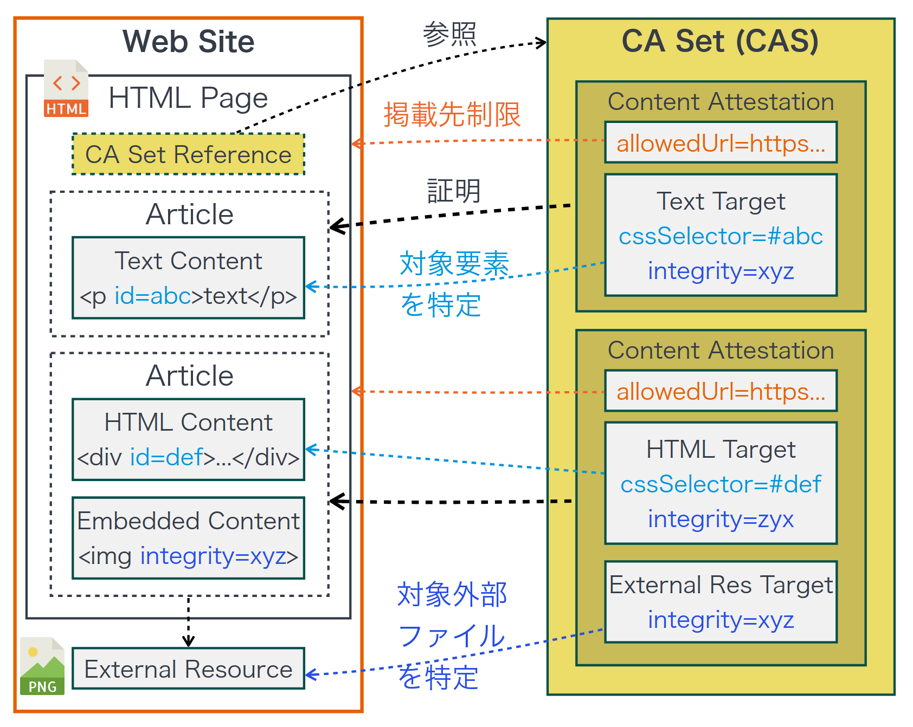
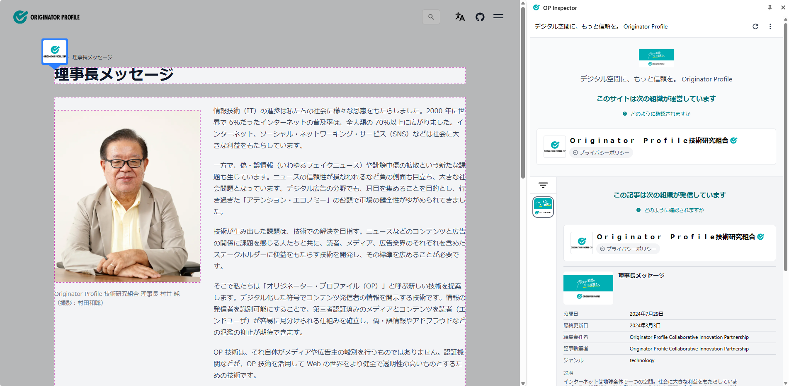
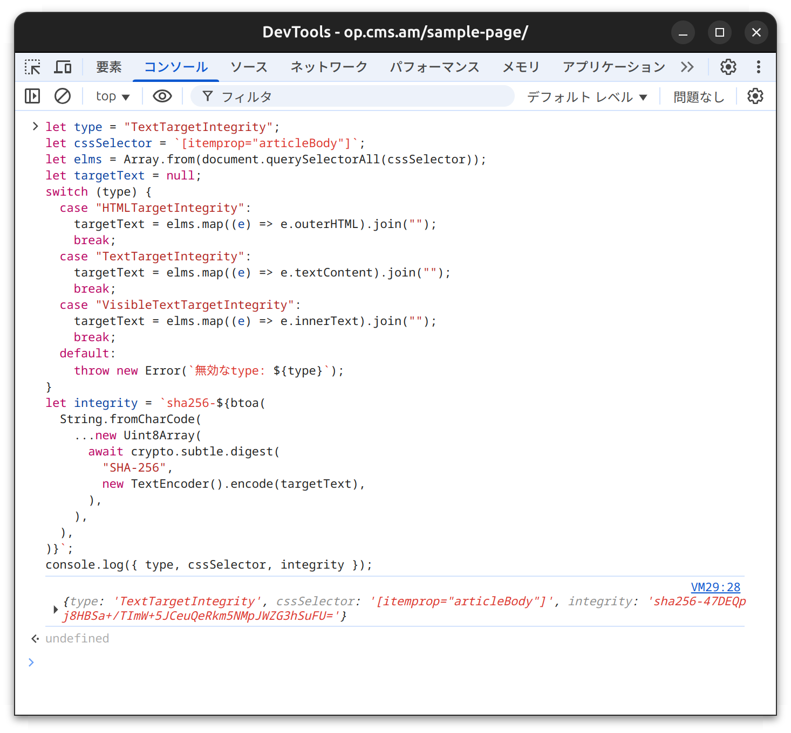
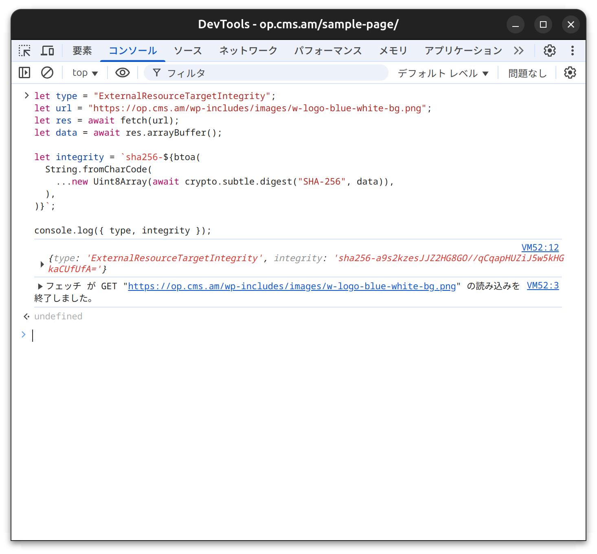

# 検証対象のコンテンツ・HTML 要素について

検証対象のコンテンツ・HTML 要素について具体的な事例を交えて解説します。

Content Attestation (CA) にはその検証対象のコンテンツの<ruby>完全性<rt>integrity</rt></ruby>を保証する [Content Integrity Descriptor](/opb/content-integrity-descriptor/) (`target` プロパティ) が含まれます。
Content Integrity Descriptor には Subresource Integrity (SRI) を基盤とする対象の異なる以下の種別 (`type` プロパティ) が定義されています:

- [HTML Target](/opb/content-integrity-descriptor/html/) (`HTMLTargetIntegrity`): HTML 文書の一部
- [Text Target](/opb/content-integrity-descriptor/text/) (`TextTargetIntegrity`): DOM テキスト
- [Visible Text Target](/opb/content-integrity-descriptor/visible-text/) (`VisibleTextTargetIntegrity`): レンダリング時のテキスト
- [External Resource Target](/opb/content-integrity-descriptor/external-resource/) (`ExternalResourceTargetIntegrity`): `img`、`audio`、`video` 要素など内部または外部参照されるメディアリソース

これらを組み合わせた CA、あるいは CA の集合 (CA Set) によって、対象のコンテンツの完全性が検証可能となります。



### 具体例

https://originator-profile.org/ja-JP/chief-director/ の例:

```html
<script
  type="application/cas+json"
  src="/cas/ja-JP.chief-director.cas.json"
></script>
```

HTML 文書内に script タグ (`<script type="application/cas+json">`) を記述することによって CA Set を提示します ([Linking](/opb/link-to-html/))。
script タグ内には、CA の配列 ([CAS](/opb/content-attestation-set/)) を記述するか、`src` 属性でその CAS を参照することが可能です。

https://originator-profile.org/cas/ja-JP.chief-director.cas.json

```json
[
  "eyJhbGciOiJFUzI1NiIsImtpZCI6IjBvQWJmZUdvMkE5N3RQYlNBWEVKMkRhLTNyLXNva1RHa3dFbnhKdm1la2siLCJ0eXAiOiJ2Yytqd3QiLCJjdHkiOiJ2YyJ9.eyJAY29udGV4dCI6WyJodHRwczovL3d3dy53My5vcmcvbnMvY3JlZGVudGlhbHMvdjIiLCJodHRwczovL29yaWdpbmF0b3ItcHJvZmlsZS5vcmcvbnMvY3JlZGVudGlhbHMvdjEiLCJodHRwczovL29yaWdpbmF0b3ItcHJvZmlsZS5vcmcvbnMvY2lwL3YxIix7IkBsYW5ndWFnZSI6ImphIn1dLCJ0eXBlIjpbIlZlcmlmaWFibGVDcmVkZW50aWFsIiwiQ29udGVudEF0dGVzdGF0aW9uIl0sImlzc3VlciI6ImRuczp0ZWNoZGV2Lm9yaWdpbmF0b3ItcHJvZmlsZS5vcmciLCJjcmVkZW50aWFsU3ViamVjdCI6eyJ0eXBlIjoiQXJ0aWNsZSIsImhlYWRsaW5lIjoi55CG5LqL6ZW344Oh44OD44K744O844K4IiwiaW1hZ2UiOnsiaWQiOiJodHRwczovL29yaWdpbmF0b3ItcHJvZmlsZS5vcmcvb2dwLWphLnBuZyIsImRpZ2VzdFNSSSI6InNoYTI1Ni16d2lNYUt4dmp5U3dWSmpsNjZCQWx1R0RQRkp3c1NXUll1WmMrcUFmY29NPSJ9LCJkZXNjcmlwdGlvbiI6IuOCpOODs-OCv-ODvOODjeODg-ODiOOBr-WcsOeQg-WFqOS9k-OBp-S4gOOBpOOBruepuumWk-OAguekvuS8muOBq-Wkp-OBjeOBquWIqeebiuOCkuOCguOBn-OCieOBl-OBpuOBhOOBvuOBmeOBjOOAgeWBveODu-iqpOaDheWgseOChOiqueisl-S4reWCt-aLoeaVo-OBqOOBhOOBhuaWsOOBn-OBquiqsumhjOOCgueUn-OBmOOBpuOBhOOBvuOBmeOAguOBneOBruino-axuuaKgOihk-OBqOOBl-OBpk9Q44KS5o-Q5qGI44GX44G-44GZIiwiYXV0aG9yIjpbIk9yaWdpbmF0b3IgUHJvZmlsZSBDb2xsYWJvcmF0aXZlIElubm92YXRpb24gUGFydG5lcnNoaXAiXSwiZWRpdG9yIjpbIk9yaWdpbmF0b3IgUHJvZmlsZSBDb2xsYWJvcmF0aXZlIElubm92YXRpb24gUGFydG5lcnNoaXAiXSwiZGF0ZVB1Ymxpc2hlZCI6IjIwMjQtMDctMjlaIiwiZGF0ZU1vZGlmaWVkIjoiMjAyNC0wMy0wM1oiLCJnZW5yZSI6InRlY2hub2xvZ3kiLCJpZCI6InVybjp1dWlkOjlkOGY0NDYxLTQ1MDMtNDA4Yi1iYzcxLWE2ZWJhYjBkZmIzNSJ9LCJhbGxvd2VkVXJsIjpbImh0dHBzOi8vb3JpZ2luYXRvci1wcm9maWxlLm9yZy9qYS1KUC9jaGllZi1kaXJlY3RvcigvPykiLCJodHRwOi8vbG9jYWxob3N0OjQzMjEvamEtSlAvY2hpZWYtZGlyZWN0b3IoLz8pIl0sInRhcmdldCI6W3sidHlwZSI6IlRleHRUYXJnZXRJbnRlZ3JpdHkiLCJjc3NTZWxlY3RvciI6ImFydGljbGUgW2l0ZW1wcm9wPSdoZWFkbGluZSddLCBhcnRpY2xlIFtpdGVtcHJvcD0nYXJ0aWNsZUJvZHknXSIsImludGVncml0eSI6InNoYTI1Ni1JZTBRRW1nd1lNT0I0ZVg2R0l0QllraVVlU0kyVDJQQmlVVDZMNFg5NFFzPSJ9LHsidHlwZSI6IkV4dGVybmFsUmVzb3VyY2VUYXJnZXRJbnRlZ3JpdHkiLCJpbnRlZ3JpdHkiOiJzaGEyNTYtY2lhWDV0T1BNaEppR1BtTGovK0p0SlVoQ2tIc1hOTDQ1YmVQdjNnM2d1TT0ifV0sImlzcyI6ImRuczp0ZWNoZGV2Lm9yaWdpbmF0b3ItcHJvZmlsZS5vcmciLCJzdWIiOiJ1cm46dXVpZDo5ZDhmNDQ2MS00NTAzLTQwOGItYmM3MS1hNmViYWIwZGZiMzUiLCJpYXQiOjE3ODI4Njc4ODQsImV4cCI6MTgxNDQwMzg4NH0.bO1-J2M3O4kK9qMENmlicE8aOjvsl37tcC82fBkcxWlS9sl8Uk-GYtpKKTnNxgFLxrN4aMvl_4kjF8jj4rl3Yg"
]
```

CA は具体的にはこのような "eyJ" から始まる文字列 (JWT) です。

```
eyJhbGciOiJFUzI1NiIsImtpZCI6IjBvQWJmZUdvMkE5N3RQYlNBWEVKMkRhLTNyLXNva1RHa3dFbnhKdm1la2siLCJ0eXAiOiJ2Yytqd3QiLCJjdHkiOiJ2YyJ9.eyJAY29udGV4dCI6WyJodHRwczovL3d3dy53My5vcmcvbnMvY3JlZGVudGlhbHMvdjIiLCJodHRwczovL29yaWdpbmF0b3ItcHJvZmlsZS5vcmcvbnMvY3JlZGVudGlhbHMvdjEiLCJodHRwczovL29yaWdpbmF0b3ItcHJvZmlsZS5vcmcvbnMvY2lwL3YxIix7IkBsYW5ndWFnZSI6ImphIn1dLCJ0eXBlIjpbIlZlcmlmaWFibGVDcmVkZW50aWFsIiwiQ29udGVudEF0dGVzdGF0aW9uIl0sImlzc3VlciI6ImRuczp0ZWNoZGV2Lm9yaWdpbmF0b3ItcHJvZmlsZS5vcmciLCJjcmVkZW50aWFsU3ViamVjdCI6eyJ0eXBlIjoiQXJ0aWNsZSIsImhlYWRsaW5lIjoi55CG5LqL6ZW344Oh44OD44K744O844K4IiwiaW1hZ2UiOnsiaWQiOiJodHRwczovL29yaWdpbmF0b3ItcHJvZmlsZS5vcmcvb2dwLWphLnBuZyIsImRpZ2VzdFNSSSI6InNoYTI1Ni16d2lNYUt4dmp5U3dWSmpsNjZCQWx1R0RQRkp3c1NXUll1WmMrcUFmY29NPSJ9LCJkZXNjcmlwdGlvbiI6IuOCpOODs-OCv-ODvOODjeODg-ODiOOBr-WcsOeQg-WFqOS9k-OBp-S4gOOBpOOBruepuumWk-OAguekvuS8muOBq-Wkp-OBjeOBquWIqeebiuOCkuOCguOBn-OCieOBl-OBpuOBhOOBvuOBmeOBjOOAgeWBveODu-iqpOaDheWgseOChOiqueisl-S4reWCt-aLoeaVo-OBqOOBhOOBhuaWsOOBn-OBquiqsumhjOOCgueUn-OBmOOBpuOBhOOBvuOBmeOAguOBneOBruino-axuuaKgOihk-OBqOOBl-OBpk9Q44KS5o-Q5qGI44GX44G-44GZIiwiYXV0aG9yIjpbIk9yaWdpbmF0b3IgUHJvZmlsZSBDb2xsYWJvcmF0aXZlIElubm92YXRpb24gUGFydG5lcnNoaXAiXSwiZWRpdG9yIjpbIk9yaWdpbmF0b3IgUHJvZmlsZSBDb2xsYWJvcmF0aXZlIElubm92YXRpb24gUGFydG5lcnNoaXAiXSwiZGF0ZVB1Ymxpc2hlZCI6IjIwMjQtMDctMjlaIiwiZGF0ZU1vZGlmaWVkIjoiMjAyNC0wMy0wM1oiLCJnZW5yZSI6InRlY2hub2xvZ3kiLCJpZCI6InVybjp1dWlkOjlkOGY0NDYxLTQ1MDMtNDA4Yi1iYzcxLWE2ZWJhYjBkZmIzNSJ9LCJhbGxvd2VkVXJsIjpbImh0dHBzOi8vb3JpZ2luYXRvci1wcm9maWxlLm9yZy9qYS1KUC9jaGllZi1kaXJlY3RvcigvPykiLCJodHRwOi8vbG9jYWxob3N0OjQzMjEvamEtSlAvY2hpZWYtZGlyZWN0b3IoLz8pIl0sInRhcmdldCI6W3sidHlwZSI6IlRleHRUYXJnZXRJbnRlZ3JpdHkiLCJjc3NTZWxlY3RvciI6ImFydGljbGUgW2l0ZW1wcm9wPSdoZWFkbGluZSddLCBhcnRpY2xlIFtpdGVtcHJvcD0nYXJ0aWNsZUJvZHknXSIsImludGVncml0eSI6InNoYTI1Ni1JZTBRRW1nd1lNT0I0ZVg2R0l0QllraVVlU0kyVDJQQmlVVDZMNFg5NFFzPSJ9LHsidHlwZSI6IkV4dGVybmFsUmVzb3VyY2VUYXJnZXRJbnRlZ3JpdHkiLCJpbnRlZ3JpdHkiOiJzaGEyNTYtY2lhWDV0T1BNaEppR1BtTGovK0p0SlVoQ2tIc1hOTDQ1YmVQdjNnM2d1TT0ifV0sImlzcyI6ImRuczp0ZWNoZGV2Lm9yaWdpbmF0b3ItcHJvZmlsZS5vcmciLCJzdWIiOiJ1cm46dXVpZDo5ZDhmNDQ2MS00NTAzLTQwOGItYmM3MS1hNmViYWIwZGZiMzUiLCJpYXQiOjE3ODI4Njc4ODQsImV4cCI6MTgxNDQwMzg4NH0.bO1-J2M3O4kK9qMENmlicE8aOjvsl37tcC82fBkcxWlS9sl8Uk-GYtpKKTnNxgFLxrN4aMvl_4kjF8jj4rl3Yg
```

JWT はデコードすることで JSON に変換できます。

[](https://jwt.io/#debugger-io?token=eyJhbGciOiJFUzI1NiIsImtpZCI6IjBvQWJmZUdvMkE5N3RQYlNBWEVKMkRhLTNyLXNva1RHa3dFbnhKdm1la2siLCJ0eXAiOiJ2Yytqd3QiLCJjdHkiOiJ2YyJ9.eyJAY29udGV4dCI6WyJodHRwczovL3d3dy53My5vcmcvbnMvY3JlZGVudGlhbHMvdjIiLCJodHRwczovL29yaWdpbmF0b3ItcHJvZmlsZS5vcmcvbnMvY3JlZGVudGlhbHMvdjEiLCJodHRwczovL29yaWdpbmF0b3ItcHJvZmlsZS5vcmcvbnMvY2lwL3YxIix7IkBsYW5ndWFnZSI6ImphIn1dLCJ0eXBlIjpbIlZlcmlmaWFibGVDcmVkZW50aWFsIiwiQ29udGVudEF0dGVzdGF0aW9uIl0sImlzc3VlciI6ImRuczp0ZWNoZGV2Lm9yaWdpbmF0b3ItcHJvZmlsZS5vcmciLCJjcmVkZW50aWFsU3ViamVjdCI6eyJ0eXBlIjoiQXJ0aWNsZSIsImhlYWRsaW5lIjoi55CG5LqL6ZW344Oh44OD44K744O844K4IiwiaW1hZ2UiOnsiaWQiOiJodHRwczovL29yaWdpbmF0b3ItcHJvZmlsZS5vcmcvb2dwLWphLnBuZyIsImRpZ2VzdFNSSSI6InNoYTI1Ni16d2lNYUt4dmp5U3dWSmpsNjZCQWx1R0RQRkp3c1NXUll1WmMrcUFmY29NPSJ9LCJkZXNjcmlwdGlvbiI6IuOCpOODs-OCv-ODvOODjeODg-ODiOOBr-WcsOeQg-WFqOS9k-OBp-S4gOOBpOOBruepuumWk-OAguekvuS8muOBq-Wkp-OBjeOBquWIqeebiuOCkuOCguOBn-OCieOBl-OBpuOBhOOBvuOBmeOBjOOAgeWBveODu-iqpOaDheWgseOChOiqueisl-S4reWCt-aLoeaVo-OBqOOBhOOBhuaWsOOBn-OBquiqsumhjOOCgueUn-OBmOOBpuOBhOOBvuOBmeOAguOBneOBruino-axuuaKgOihk-OBqOOBl-OBpk9Q44KS5o-Q5qGI44GX44G-44GZIiwiYXV0aG9yIjpbIk9yaWdpbmF0b3IgUHJvZmlsZSBDb2xsYWJvcmF0aXZlIElubm92YXRpb24gUGFydG5lcnNoaXAiXSwiZWRpdG9yIjpbIk9yaWdpbmF0b3IgUHJvZmlsZSBDb2xsYWJvcmF0aXZlIElubm92YXRpb24gUGFydG5lcnNoaXAiXSwiZGF0ZVB1Ymxpc2hlZCI6IjIwMjQtMDctMjlaIiwiZGF0ZU1vZGlmaWVkIjoiMjAyNC0wMy0wM1oiLCJnZW5yZSI6InRlY2hub2xvZ3kiLCJpZCI6InVybjp1dWlkOjlkOGY0NDYxLTQ1MDMtNDA4Yi1iYzcxLWE2ZWJhYjBkZmIzNSJ9LCJhbGxvd2VkVXJsIjpbImh0dHBzOi8vb3JpZ2luYXRvci1wcm9maWxlLm9yZy9qYS1KUC9jaGllZi1kaXJlY3RvcigvPykiLCJodHRwOi8vbG9jYWxob3N0OjQzMjEvamEtSlAvY2hpZWYtZGlyZWN0b3IoLz8pIl0sInRhcmdldCI6W3sidHlwZSI6IlRleHRUYXJnZXRJbnRlZ3JpdHkiLCJjc3NTZWxlY3RvciI6ImFydGljbGUgW2l0ZW1wcm9wPSdoZWFkbGluZSddLCBhcnRpY2xlIFtpdGVtcHJvcD0nYXJ0aWNsZUJvZHknXSIsImludGVncml0eSI6InNoYTI1Ni1JZTBRRW1nd1lNT0I0ZVg2R0l0QllraVVlU0kyVDJQQmlVVDZMNFg5NFFzPSJ9LHsidHlwZSI6IkV4dGVybmFsUmVzb3VyY2VUYXJnZXRJbnRlZ3JpdHkiLCJpbnRlZ3JpdHkiOiJzaGEyNTYtY2lhWDV0T1BNaEppR1BtTGovK0p0SlVoQ2tIc1hOTDQ1YmVQdjNnM2d1TT0ifV0sImlzcyI6ImRuczp0ZWNoZGV2Lm9yaWdpbmF0b3ItcHJvZmlsZS5vcmciLCJzdWIiOiJ1cm46dXVpZDo5ZDhmNDQ2MS00NTAzLTQwOGItYmM3MS1hNmViYWIwZGZiMzUiLCJpYXQiOjE3ODI4Njc4ODQsImV4cCI6MTgxNDQwMzg4NH0.bO1-J2M3O4kK9qMENmlicE8aOjvsl37tcC82fBkcxWlS9sl8Uk-GYtpKKTnNxgFLxrN4aMvl_4kjF8jj4rl3Yg)

```json
{
  "@context": [
    "https://www.w3.org/ns/credentials/v2",
    "https://originator-profile.org/ns/credentials/v1",
    "https://originator-profile.org/ns/cip/v1",
    {
      "@language": "ja"
    }
  ],
  "type": ["VerifiableCredential", "ContentAttestation"],
  "issuer": "dns:techdev.originator-profile.org",
  "credentialSubject": {
    "type": "Article",
    "headline": "理事長メッセージ",
    "image": {
      "id": "https://originator-profile.org/ogp-ja.png",
      "digestSRI": "sha256-zwiMaKxvjySwVJjl66BAluGDPFJwsSWRYuZc+qAfcoM="
    },
    "description": "インターネットは地球全体で一つの空間。社会に大きな利益をもたらしていますが、偽・誤情報や誹謗中傷拡散という新たな課題も生じています。その解決技術としてOPを提案します",
    "author": ["Originator Profile Collaborative Innovation Partnership"],
    "editor": ["Originator Profile Collaborative Innovation Partnership"],
    "datePublished": "2024-07-29Z",
    "dateModified": "2024-03-03Z",
    "genre": "technology",
    "id": "urn:uuid:9d8f4461-4503-408b-bc71-a6ebab0dfb35"
  },
  "allowedUrl": [
    "https://originator-profile.org/ja-JP/chief-director(/?)",
    "http://localhost:4321/ja-JP/chief-director(/?)"
  ],
  "target": [
    {
      "type": "TextTargetIntegrity",
      "cssSelector": "article [itemprop='headline'], article [itemprop='articleBody']",
      "integrity": "sha256-Ie0QEmgwYMOB4eX6GItBYkiUeSI2T2PBiUT6L4X94Qs="
    },
    {
      "type": "ExternalResourceTargetIntegrity",
      "integrity": "sha256-ciaX5tOPMhJiGPmLj/+JtJUhCkHsXNL45bePv3g3guM="
    }
  ],
  "iss": "dns:techdev.originator-profile.org",
  "sub": "urn:uuid:9d8f4461-4503-408b-bc71-a6ebab0dfb35",
  "iat": 1782867884,
  "exp": 1814403884
}
```

代表的なプロパティ:

- [`credentialSubject`](/opb/ca-model/article/#credential-subject-properties): Verifiable Credentials (VC) の概念において、証明書 (クレデンシャル) が対象とする主体を指すプロパティ
  - `headline`: コンテンツのタイトル
  - `description`: コンテンツの説明（文字列）
- [`allowedUrl`](/opb/ca-model/article/#article-properties): URL Pattern [`test(input, baseURL)`](https://urlpattern.spec.whatwg.org/#dom-urlpattern-test) アルゴリズムによって許可する範囲
- [`target`](/opb/ca-model/article/#article-properties): Content Integrity Descriptor (配列)
  - `type`
    - [`HTMLTargetIntegrity`](/opb/content-integrity-descriptor/html/): HTML 文書の一部
    - [`TextTargetIntegrity`](/opb/content-integrity-descriptor/text/): DOM テキスト
    - [`VisibleTextTargetIntegrity`](/opb/content-integrity-descriptor/visible-text/): レンダリング時のテキスト
    - [`ExternalResourceTargetIntegrity`](/opb/content-integrity-descriptor/external-resource/): `img`、`audio`、`video` 要素など内部または外部参照されるメディアリソース

表示例:



## 記事 (表示内容を含む静的なHTML要素) の場合

推奨される Content Integrity Descriptor:

- `HTMLTargetIntegrity`
- `TextTargetIntegrity` … WordPress プラグイン (CA Manager) の既定の種別
- `VisibleTextTargetIntegrity`

記事の本文を対象とする CSS セレクター (`cssSelector` プロパティ) を指定します。
このとき、アクセスするタイミングやユーザー・環境に応じて動的に書き換わる (例: 広告やタイムスタンプなど) 要素は完全性の保証が困難なため避けなければなりません。

### CSS セレクターについて

CSS セレクターによる要素の選択はブラウザーが使用する `document.querySelectorAll()` アルゴリズムと同じです。

- [ID セレクター](https://developer.mozilla.org/ja/docs/Web/CSS/ID_selectors)
- [クラスセレクター](https://developer.mozilla.org/ja/docs/Web/CSS/Class_selectors)
- [要素型セレクター](https://developer.mozilla.org/ja/docs/Web/CSS/Type_selectors)

いずれの Content Integrity Descriptor でもセレクターに一致する要素が2つ以上存在する場合はすべて結合し、完全性 (`integrity` プロパティ) を計算します。

### 「完全性」について

`integrity` プロパティを使用し完全性をチェックします。結合して得られるテキストの UTF-8 バイト列がその対象となります。

具体例:

```
sha256-47DEQpj8HBSa+/TImW+5JCeuQeRkm5NMpJWZG3hSuFU=
```

開発者ツールのコンソールを使うことで対象の HTML・テキストの UTF-8 バイト列のハッシュ値を確認することが可能です。

:::note

開発者ツールの起動

- 右クリック > [検証] を選択
- [その他のツール] > [デベロッパー ツール] を選択
- Windows/Linux の場合: `Ctrl`+`Shift`+`I`
- macOS の場合: `⌘ (Command)`+`⌥ (Option)`+`I`

:::

コンソールに以下のコードを入力します:

```js
// 注意: 開発目的のコードです。潜在的なリスクを理解した上で実行してください。

// 検証対象のコンテンツの種別 (例: TextTargetIntegrity)
let type = "TextTargetIntegrity";

// 検証対象のコンテンツの CSS セレクター
let cssSelector = `[itemprop="articleBody"]`;

let elms = Array.from(document.querySelectorAll(cssSelector));
let targetText = null;
switch (type) {
  case "HTMLTargetIntegrity":
    targetText = elms.map((e) => e.outerHTML).join("");
    break;
  case "TextTargetIntegrity":
    targetText = elms.map((e) => e.textContent).join("");
    break;
  case "VisibleTextTargetIntegrity":
    targetText = elms.map((e) => e.innerText).join("");
    break;
  default:
    throw new Error(`無効なtype: ${type}`);
}
let integrity = `sha256-${btoa(
  String.fromCharCode(
    ...new Uint8Array(
      await crypto.subtle.digest(
        "SHA-256",
        new TextEncoder().encode(targetText),
      ),
    ),
  ),
)}`;
console.log({ type, cssSelector, integrity });
```

実行例:



## 画像 (インタラクションを伴わない静的な `img` 要素) の場合

推奨される Content Integrity Descriptor:

- `ExternalResourceTargetIntegrity`

`img` 要素の場合、`integrity` 属性と `src` 属性で指定した画像のメディアリソースの完全性をチェックします。
このとき、アクセスするタイミングやユーザー・環境に応じて動的に書き換わるメディアリソースは完全性の保証が困難なため避けなければなりません。

### 「完全性」について

`integrity` プロパティを使用し完全性をチェックします。
`ExternalResourceTargetIntegrity` の場合はメディアリソースのバイト列がその対象となります。

開発者ツールのコンソールを使うことで対象のメディアリソースのバイト列のハッシュ値を確認することが可能です。

コンソールに以下のコードを入力します:

```js
// 注意: 開発目的のコードです。潜在的なリスクを理解した上で実行してください。

// 検証対象のコンテンツの種別
let type = "ExternalResourceTargetIntegrity";

// 対象のメディアリソースのURL
let url = "https://op.cms.am/wp-includes/images/w-logo-blue-white-bg.png";

let res = await fetch(url);
let data = await res.arrayBuffer();

let integrity = `sha256-${btoa(
  String.fromCharCode(
    ...new Uint8Array(await crypto.subtle.digest("SHA-256", data)),
  ),
)}`;

console.log({ type, integrity });
```

実行例:


