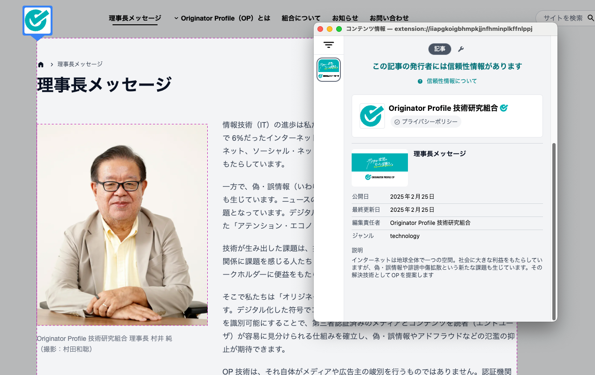
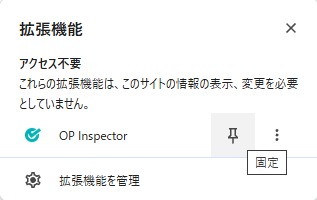
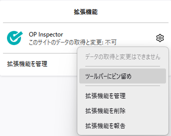
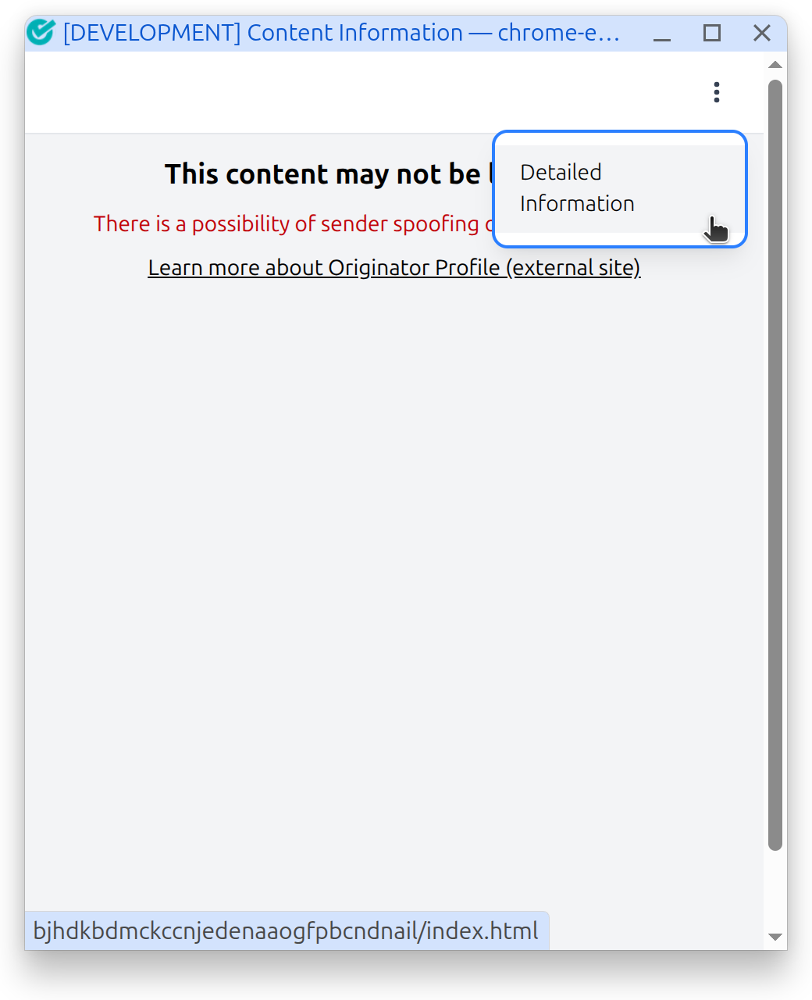
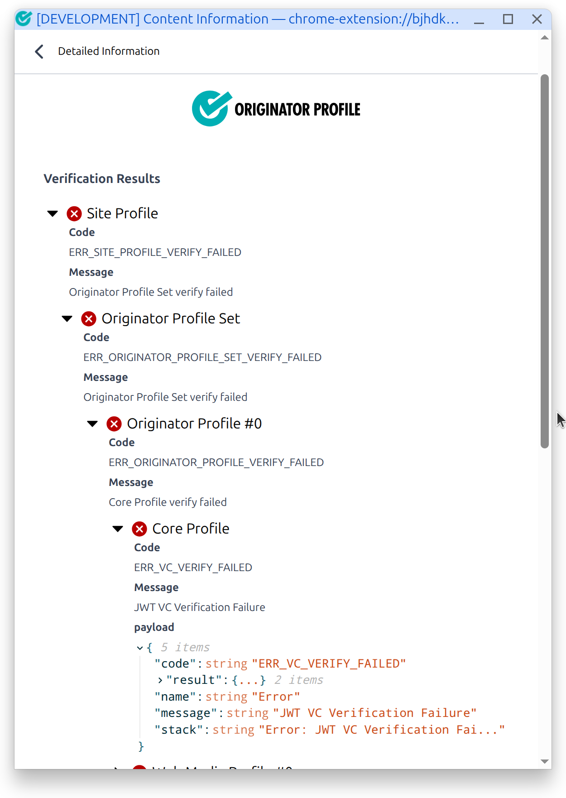
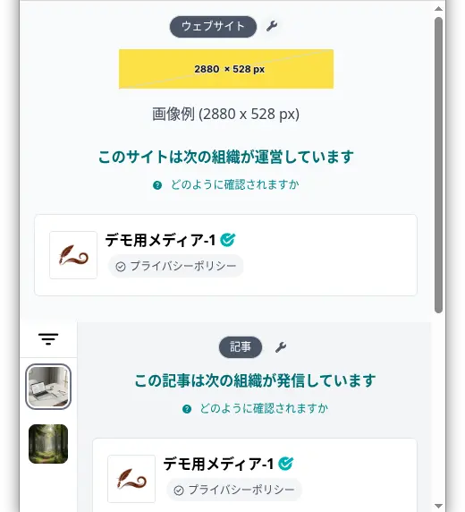

# 拡張機能

Originator Profile (OP) 拡張機能は、Web ブラウザー上で Originator Profile と Content Attestation の閲覧・検証を行うブラウザー拡張機能です。

対応している Web サイトにアクセスすると、コンテンツの発信者情報やその検証結果を確認できます。

## ダウンロード

[GitHub Releases](https://github.com/originator-profile/originator-profile/releases/latest) から最新版の拡張機能の ZIP ファイルをダウンロードします。

| ブラウザー      | ファイル名                                     |
| --------------- | ---------------------------------------------- |
| Google Chrome   | `profile_web_extension-chromium-v*.zip`        |
| Mozilla Firefox | `profile_web_extension-firefox-desktop-v*.zip` |

## インストール

### Google Chrome

1. ダウンロードした ZIP ファイルを展開します。
2. ブラウザーのアドレスバーに `chrome://extensions` と入力し、拡張機能管理画面を開きます。
   - または、右上の三点メニューボタン > 「拡張機能」 > 「拡張機能を管理」からもアクセスできます。
3. 画面右上の「デベロッパーモード」を有効にします。
4. 画面左上の「パッケージ化されていない拡張機能を読み込む」ボタンをクリックします。
5. ZIP ファイルを展開したディレクトリ（`manifest.json` を含むフォルダー）を選択します。

参考: [パッケージ化されていない拡張機能を読み込む (Chrome for Developers)](https://developer.chrome.com/docs/extensions/get-started/tutorial/hello-world?hl=ja#load-unpacked)

### Firefox

1. アドレスバーに `about:debugging` と入力します。
2. 「この Firefox」 > 「一時的なアドオンを読み込む…」を選択します。
3. ダウンロードした ZIP ファイルを選択します。

:::warning
Firefox で一時的にインストールしたアドオンは、Firefox を再起動すると無効になります。
:::

### ツールバーへの固定

拡張機能をすぐに使えるよう、ツールバーに固定しておくと便利です。

**Google Chrome**

1. ブラウザー右上にある「拡張機能」ボタン（🧩 パズルピースのアイコン）をクリックします。
2. Originator Profile 拡張機能 (Profile Web Extension) の横にある「固定」ボタン（📌 ピンのアイコン）をクリックします。

参考: [拡張機能を固定する (Chrome for Developers)](https://developer.chrome.com/docs/extensions/get-started/tutorial/hello-world?hl=ja#pin_the_extension)

**Firefox**

1. ブラウザー右上にある「拡張機能」ボタン（🧩 パズルピースのアイコン）をクリックします。
2. Profile Web Extension の横にある「設定」ボタン（⚙ 歯車のアイコン）をクリックします。
3. 「ツールバーにピン留め」を選択します。

## 検証方法

### 基本的な使い方

1. 拡張機能をインストールした状態で、Originator Profile に対応した Web サイトにアクセスします。
   - 例: [Originator Profile 技術研究組合 (OP-CIP) 公式サイト](https://originator-profile.org/)
2. ツールバーにある拡張機能のアイコンをクリックします。
3. コンテンツの発信者情報と検証結果が表示されます。

:::note
拡張機能はインストール前に読み込み済みのタブでは動作しません。インストール後に新しくタブを開くか、ページを再読み込みしてください。
:::

### 検証結果の見方

検証に成功した場合、発信者の情報（名称や画像など）が表示されます。

検証に失敗した場合、拡張機能のアイコンをクリックし、ケバブメニュー（︙ 縦三点アイコン）から「詳細情報」を選択すると、検証結果の詳細を確認できます。

#### 詳細情報画面

#### 検証結果

検証エラーが発生した場合、「検証結果」ツリーを展開すると、エラーコードとメッセージを確認できます。

- 「▶」をクリックしてツリーを展開します。
- **Code**: エラーコードが表示されます。エラーコードの意味は[エラーリファレンス](error-reference/)を参照してください。
- **payload**: 検証結果データが JSON 形式で表示されます。

ツリーはネスト構造になっており、展開するとより詳細なエラー情報を確認できます。

#### 詳細情報

「詳細情報」ツリーには、検証で使用された生データが表示されます。

- **Site Profile**: Web サイトに関する発信者情報
- **Originator Profile Set**: 発信者プロファイルの集合
- **Content Attestation Set**: コンテンツの証明データ

#### JSON データのコピー

ツリーに表示される JSON データは、ノードにマウスオーバーすると表示されるクリップボードアイコン（📋）をクリックすることでコピーできます。

- ルートノードのアイコンをクリックすると、JSON 全体がコピーされます。
- 特定のノードのアイコンをクリックすると、そのノード配下の JSON のみがコピーされます。

コピーしたデータは、[Debugger](/debugger/) に貼り付けて詳細な検証を行ったり、問題の報告時に添付したりするのに役立ちます。

## 拡張機能の更新

新しいバージョンがリリースされた場合、以下の手順で拡張機能を更新できます。

### Google Chrome

1. [GitHub Releases](https://github.com/originator-profile/originator-profile/releases/latest) から最新版をダウンロードし、展開します。
2. 以前の ZIP ファイルの展開先を最新版に差し替えます。
3. `chrome://extensions` を開き、Profile Web Extension の更新アイコン（オン/オフの切り替えボタンの左横）をクリックします。

参考: [拡張機能を再読み込み (Chrome for Developers)](https://developer.chrome.com/docs/extensions/get-started/tutorial/hello-world?hl=ja#reload)

### Firefox

1. [GitHub Releases](https://github.com/originator-profile/originator-profile/releases/latest) から最新版をダウンロードします。
2. `about:debugging` にアクセスします。
3. 「この Firefox」 > 「一時的なアドオンを読み込む…」を選択し、最新版の ZIP ファイルを指定します。

更新後、対象のページを既に開いている場合は再読み込みするか、新しくタブを開き直してください。

## 画像の表示

### Content Attestation の画像

Content Attestation に含まれる画像は、幅 120px × 高さ 80px の表示領域にアスペクト比を保持して表示されます。

- 表示領域より小さい画像は、等倍で中央に配置されます。
- 表示領域より大きい画像は、アスペクト比を保持して縮小されます。
- 画像が指定されていない場合は、プレースホルダー画像が表示されます。

左側のアイコン領域（幅 44px × 高さ 44px）では、画像がアスペクト比を保持して表示領域全体を覆うようにリサイズされ、収まらない部分は切り取られます。

### Website Profile の画像

Website Profile の画像は、幅 240px × 高さ 44px の表示領域にアスペクト比を保持して表示されます。

### 画像が表示されない場合

画像を正しく表示するには、画像への外部からのアクセスを許可する必要があります。詳しくは「[画像が表示されない](/troubleshooting/image-access-error/)」を参照してください。

## 既知の制限事項

- 拡張機能はインストール前に読み込み済みのタブでは動作しません。インストール後に新しくタブを開くか、ページを再読み込みしてください。
- 画像を表示するには、画像サーバーが CORS (`Access-Control-Allow-Origin: *`) を許可している必要があります。
- Firefox では一時的にインストールしたアドオンは、ブラウザーの再起動時に無効になります。

## 関連

- [Debugger](/debugger/) - Originator Profile のデバッグツール
- [Content Attestation Server Playground](/playground/) - Content Attestation の発行・検証テスト環境
- [トラブルシューティング](/troubleshooting/image-access-error/) - 画像が表示されない場合の対処法
- [エラーリファレンス](/error-reference/) - エラーコードの詳細
