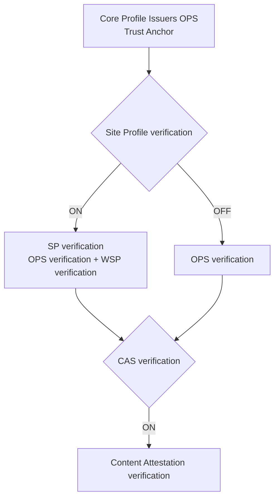

# Debugger

[Debugger](https://playground.originator-profile.org/app/debugger) is a debugging tool for Originator Profile.
It allows you to test [Content Attestation Set (CAS)](/opb/ca/) and [Site Profile (SP)](/opb/site-profile/) and check for errors during verification.

## How to use Debugger

### Screen description

#### Input field

| Field                    | description                                          | Display conditions          |
| ------------------------ | ---------------------------------------------------- | --------------------------- |
| **Core Profile Issuers** | OPS (JSON) is the starting point of the trust chain. | Always display (required)   |
| **URL**                  | Website URL to be verified                           | Always display              |
| **SP**                   | Site Profile data                                    | Verify SP tab               |
| **OPS**                  | OriginatorProfileSet data                            | Verify OPS tab              |
| **Verify CAS**           | Check box to enable CAS verification                 | Always display              |
| **CAS**                  | Content Attestation data                             | When CAS verification is ON |
| **HTML**                 | HTML content to be verified                          | When CAS verification is ON |

1. Select the verification mode from **Verify SP** / **Verify OPS**.
1. Enter the URL of the website you want to verify in the **URL** field.
1. Turn on **Verify CAS** as needed and enter the data.
1. Click the **Verify** button to perform the verification.
1. The results of each step will be displayed sequentially. In case of failure, you can check the error type and cause.

#### Parameter format

For each of SP, OPS, and CAS fields, you can select the data presentation format (Presentation Type).

- **Embedded**: Enter JSON directly.
- **External**: You can retrieve data by specifying an external URL. If you select "External," the data will be retrieved via a server-side proxy.

In HTML fields, you can select the input method (HTML Input Type).

- **Direct Input**: Enter the HTML directly.
- **Fetch from URL**: This retrieves HTML from the URL specified in the URL field.

### Core Profile Issuers

The public key that serves as the starting point of the trust chain is decoded and verified. This step is always performed.
If it fails, the process is aborted.

### Site Profile Verification (When Verify Site Profile is ON)

Follow [Site Profile Verification Process](/opb/site-profile.md#verification) to verify the SP's signature and the Originator Profile's integration.

- Fetch or parse SP data.
- Get the URL origin.
- Merge SP originators into Core Profile Issuers OPS and run [`SpVerifier`](https://github.com/originator-profile/originator-profile/blob/main/packages/verify/src/site-profile/verify-site-profile.ts).

### OPS Verification (when Verify Site Profile is OFF)

This directly verifies the signature of the [Originator Profile Set (OPS)](/opb/originator-profile-set/) without using a Site Profile.

- Fetch or parse OPS data.
- Merge the Core Profile Issuers OPS and the target OPS, and run [`OpsVerifier`](https://github.com/originator-profile/originator-profile/blob/main/packages/verify/src/originator-profile-set/verify-ops.ts).

### CAS verification (when Verify CAS is ON)

The content integrity will be verified according to the [Content Attestation verification process](/opb/ca/#verification).

- Get or parse the HTML and then parse it with [`DOMParser`](https://developer.mozilla.org/docs/Web/API/DOMParser).
- Fetch or parse CAS data.
- Content Attestation is verified using [`verifyCas()`](https://github.com/originator-profile/originator-profile/blob/main/packages/verify/src/content-attestation-set/verify-cas.ts).

### Sharing form state via URL

Form input values are saved as Base64url-encoded JSON in the URL hash fragment. This allows verification settings to be reproduced when bookmarking or sharing links.

## Verification flow

Debugger performs verification in the following order. Site Profile verification and CAS verification can be enabled optionally.

