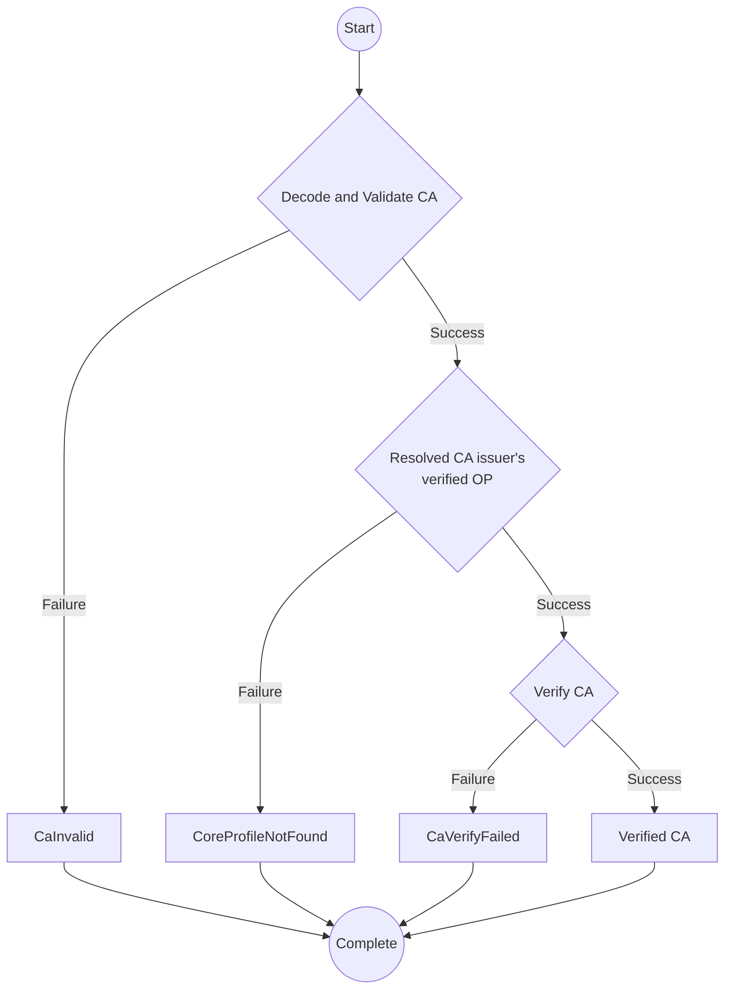

# Content Attestation

:::note

The subjects of CA verification were (1) verification based on specific events caused by active confirmation operations by users when a page load is completed, and (2) verification during dynamic loading and rewriting of DOM in real time, but (2) highly real-time timing is not expected as a target of CA verification.

The reason is that algorithms that target rendered text as the signature target, such as changing the target element of a CSS selector or [Visible Text Target](/opb/content-integrity-descriptor/visible-text.md), are not compatible with real-time verification during DOM rewriting, and there is an impact on browser performance/power consumption.

The verification of information senders assumed by OP is different from the blocks embedded in the pages of dangerous sites, and there is no security need to avoid loading itself. As mentioned above, it includes a signature verification algorithm that targets rendered text, so there are restrictions on the verification timing, and browser behavior other than blocking loading is also possible, such as not blocking loading/rendering but verifying after loading, and if the verification does not pass, hiding the target content and displaying a warning. For the above reasons, CA verification is currently not anticipated to take place at times that require real-time processing, such as at the time of loading or during rendering processing.

:::

## Terminology

For terms not explained in this document, please see [Terminology](./terminology.md).

- Originator Profile (OP)
- Originator Profile Identifier (OP ID)
- Content Attestation (CA)
- Content Integrity Descriptor

## Content Attestation (CA) Data Model

Content Attestation MUST be an OP VC DM compliant document and contain the following properties:

### Property

#### `@context`

It MUST conform to the [OP VC Data Model](./op-vc-data-model.md#context).

#### `type`

REQUIRED. It MUST be `["VerifiableCredential", "ContentAttestation"]`.

#### `credentialSubject.id`

REQUIRED. MUST be a CA ID. CA ID is a [UUIDv4](https://www.rfc-editor.org/rfc/rfc9562.html#name-uuid-version-4) URN format string. There is a one-to-one correspondence between content and CA IDs.

#### `allowedUrl`

REQUIRED. The URL for which information is asserted by this CA.
It MUST be a [URL Pattern string](https://urlpattern.spec.whatwg.org/#pattern-strings) or an array of such strings.
It MUST NOT be an empty array.
This property allows you to [verify](#allowed-url-validation) whether the CA is located on a web page with a valid URL.

Examples:

✅ Valid:

- `https://example.com/article/*` (wildcard pattern)
- `https://*.example.com/article/*` (subdomain wildcard)
- `["https://a.example.com/*", "https://b.example.com/*"]` (array of multiple patterns)

❌ Invalid:

- `/article/*` (no base URL included)
- `example.com/*` (no `https://` specified)
- `https://example.com/article/(` (syntax error)
- `[]` (empty array)

:::note

Extensions for specifying content that does not have a URL outside of web content (e.g., private non-public content) as verification targets are under consideration for future work.

:::

#### `target`

REQUIRED. It MUST be an array of Content Integrity Descriptor.

Content Integrity Descriptor is a mechanism for ensuring the integrity of parts of content. This property allows you to [verify](#target-integrity-validation) that specific information in the content that corresponds to the CA has not been tampered with.
You can use the ones registered in the [Content Integrity Type Registry](./content-integrity-descriptor/index.mdx).

## Examples

_This section is non-normative._

Here is an example CA that is tied to content published at https://media.example.com/articles/2024-06-30:

```json
{
  "@context": [
    "https://www.w3.org/ns/credentials/v2",
    "https://originator-profile.org/ns/credentials/v1",
    "https://originator-profile.org/ns/cip/v1",
    { "@language": "en" }
  ],
  "type": ["VerifiableCredential", "ContentAttestation"],
  "issuer": "dns:example.com",
  "credentialSubject": {
    "id": "urn:uuid:78550fa7-f846-4e0f-ad5c-8d34461cb95b",
    "type": "Article",
    "headline": "<Article Title>",
    "image": {
      "id": "https://media.example.com/image.png",
      "digestSRI": "sha256-OYP9B9EPFBi1vs0dUqOhSbHmtP+ZSTsUv2/OjSzWK0w="
    },
    "description": "<Web page description>",
    "author": ["Jane Smith"],
    "editor": ["John Smith"],
    "datePublished": "2023-07-04T19:14:00Z",
    "dateModified": "2023-07-04T19:14:00Z",
    "genre": "Arts & Entertainment"
  },
  "allowedUrl": ["https://media.example.com/articles/2024-06-30"],
  "target": [
    {
      "type": "VisibleTextTargetIntegrity",
      "cssSelector": "<CSS Selector>",
      "integrity": "sha256-GYC9PqfIw0qWahU6OlReQfuurCI5VLJplslVdF7M95U="
    },
    {
      "type": "ExternalResourceTargetIntegrity",
      "integrity": "sha256-+M3dMZXeSIwAP8BsIAwxn5ofFWUtaoSoDfB+/J8uXMo="
    }
  ]
}
```

This CA is tied to advertising content served on web pages under https://ad.example.com.

```json
{
  "@context": [
    "https://www.w3.org/ns/credentials/v2",
    "https://originator-profile.org/ns/credentials/v1",
    "https://originator-profile.org/ns/cip/v1",
    { "@language": "en" }
  ],
  "type": ["VerifiableCredential", "ContentAttestation"],
  "issuer": "dns:example.com",
  "credentialSubject": {
    "id": "urn:uuid:78550fa7-f846-4e0f-ad5c-8d34461cb95b",
    "type": "OnlineAd",
    "name": "<Ad title>",
    "description": "<Ad Description>",
    "image": {
      "id": "https://ad.example.com/image.png",
      "digestSRI": "sha256-5uQVtkoRdTFbimAz3Wz5GQcuBRLt7tDMD5JRtGFo9/M="
    },
    "landingPageUrl": "https://advertiser.example.com",
    "adReportContact": {
      "id": "https://ad.example.com/contact",
      "name": "Contact point for reporting ads"
    },
    "adReviewGuidelines": {
      "id": "https://ad.example.com/guidelines",
      "name": "Ad Review Guidelines"
    },
    "targetingPolicy": {
      "id": "https://ad.example.com/targeting",
      "name": "Targeted Advertising Policy"
    },
    "adDataHandlingPolicy": {
      "id": "https://ad.example.com/datahandling",
      "name": "Explanation of how we handle information about ad distribution"
    },
    "adDisplayRationale": {
      "page": {
        "id": "https://ad.example.com/rationale",
        "name": "An explanation of why the ad is being displayed"
      },
      "description": "Because it's relevant to the content you're currently viewing."
    }
  },
  "allowedUrl": ["https://ad.example.com/*"],
  "target": {
    "type": "ExternalResourceTargetIntegrity",
    "integrity": "sha256-rLDPDYArkNcCvnq0h4IgR7MVfJIOCCrx4z+w+uywc64="
  }
}
```

:::note

The example includes properties not defined in this document, see [Extensibility](#extensibility) for information on how to add undefined properties.

:::

## Extensibility {#extensibility}

Issuers MUST NOT add properties to a Content Attestation that are not defined in the [OP VC Data Model](./op-vc-data-model.md) and this document.

Issuers MAY add properties that are not defined in the [OP VC Data Model](./op-vc-data-model.md) and this document, but are RECOMMENDED to do so as per [Verifiable Credentials Data Model 2.0 Section 5.2](https://www.w3.org/TR/vc-data-model-2.0/#extensibility).
:::info

For information about properties used in applications developed by the Originator Profile Collaborative Innovation Partnership, please refer to the following Originator Profile Blueprint (OPB) documents:

- [Article Data Model](./ca-model/article.md)
- [Online Ad Data Model](./ca-model/online-ad.md)

:::

### Content Integrity Descriptor Scalability

See [Content Integrity Descriptor](./content-integrity-descriptor/index.mdx).

## Verification Process {#verification}

A CA verifier can verify:

1. [Verification of VC conformance to the OP VC Data Model](./op-vc-data-model.md#verification)
2. Verifying `allowedUrl` (Optional)
3. Verifying Content Integrity Descriptor

### `allowedUrl` validation {#allowed-url-validation}

Optionally, the verifier can verify the `allowedUrl` property by following these steps:

1. Obtain the URL of the web page that the CA refers to.
2. The CA checks whether each element of the `allowedUrl` property array matches the URL obtained in step 1. The algorithm uses the [URL Pattern `test(input, baseURL)` method](https://urlpattern.spec.whatwg.org/#dom-urlpattern-test).

:::note

Percent-encoded characters are normalized to uppercase according to [RFC 3986 Section 2.1](https://www.rfc-editor.org/rfc/rfc3986#section-2.1) before comparison.

:::

### Verifying Content Integrity Descriptor

Verifiers SHOULD verify the Content Integrity Descriptor of the `target` property as long as the verification process defined for each Content Integrity Descriptor type is feasible.

:::note

Depending on the type of Content Integrity Descriptor, verification may not be possible in the verifier's environment. For example, in an environment where browser rendering is not possible, Content Integrity Descriptor that requires browser rendering results for verification cannot be verified.

:::

Verifiers MUST verify the Content Integrity Descriptor using the verification methods defined for each type of Content Integrity Descriptor, and if the verification fails, it is RECOMMENDED that the Content Integrity Descriptor verification fail be displayed to the viewer. It is RECOMMENDED that the Content Integrity Descriptor verification failure be not displayed to the user with the same or higher severity as the CA verification failure.

### Reporting the verification results

_This section is non-normative_

After running the verification, you need to communicate the results to your users. The following is a recommended method for reporting verification results:

- If the CA is successfully verified, it will be displayed to the user as a verified CA.
- If the CA fails to be verified, a brief explanation of the type and reason will be provided to the user.

[OP Extension](https://github.com/originator-profile/profile-share/tree/main/apps/web-ext) may return the following error when validating the CA:

- [CaInvalid](https://reference.originator-profile.org/ts/classes/_originator-profile_verify.CaInvalid)
- [CoreProfileNotFound](https://reference.originator-profile.org/ts/classes/_originator-profile_verify.CoreProfileNotFound)
- [CaVerifyFailed](https://reference.originator-profile.org/ts/classes/_originator-profile_verify.CaVerifyFailed)
  - "Content Attestation verify failed" ... Verification of VC conforming to OP VC Data Model failed
  - "URL not allowed" ... Verification of `allowedUrl` failed (OPTIONAL)
  - "Target integrity verification failed" ... Verification of [Content Integrity Descriptor](./content-integrity-descriptor/index.mdx) failed

For other data structures, please see the following references:

- [Verified Content Attestation (CA)](https://reference.originator-profile.org/ts/types/_originator-profile_verify.VerifiedCa)

Input:

- Content Attestation (CA)
- The URL of the web page that presented the CA (OPTIONAL)
- [Verified Originator Profile (OP)](https://reference.originator-profile.org/ts/types/_originator-profile_verify.VerifiedOp)


