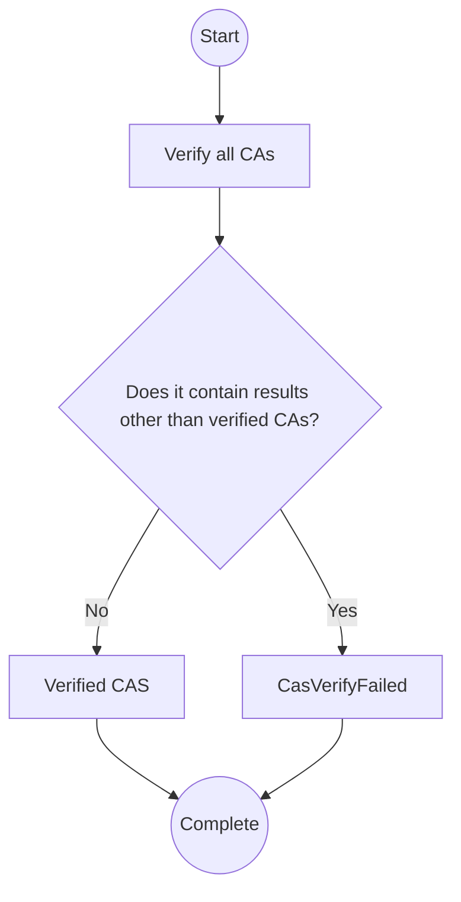

# Content Attestation Set

## Terminology

For any terms not explained in this document, please see [Terminology](./terminology.md).

- Content Attestation (CA)
- Content Attestation Set (CAS)

## Content Attestation Set (CAS) Data Model

The data model is expressed in JSON.

CAS is an array of JSON Objects with the following properties:

- `attestation`: REQUIRED. The property of Content Attestation
- `main`: OPTIONAL. If Content Attestation is for the main content, state `true`, otherwise state `false`. The default value is `false`.

## JSON Serialization

Convert the above data model as follows, where the media type is `application/cas+json`:

```js
cas.map((e) =>
  e.main ? { attestation: e.attestation, main: true } : e.attestation,
);
```

Below is a non-normative example of the conversion:

```json
["eyJ...", "eyJ...", { "attestation": "eyJ...", "main": true }, "eyJ..."]
```

## Verification Process

CAS verifiers can verify the following:

- [CA verification](./ca.md#verification)

### Reporting verification results

_This section is non-normative._

After running the verification, you need to communicate the results to your users. The following is a recommended method for reporting verification results:

- Notify users of the results of CA verification included in the CAS
  - If the CA is successfully verified, it will be displayed to the user as a verified CA.
  - If CA verification fails, inform the user with a brief explanation of the type and reason.

OP Extension may return the following error when verifying the CA:

- CasVerifyFailed
  - CaInvalid
  - CoreProfileNotFound
  - CaVerifyFailed
- Verified CAS

For details, see "CA Verification" and the OP extension source code.

Input:

- Content Attestation Set (CAS)
- URL of the web page that presented the CAS
- Verified Originator Profile Set (OPS)


