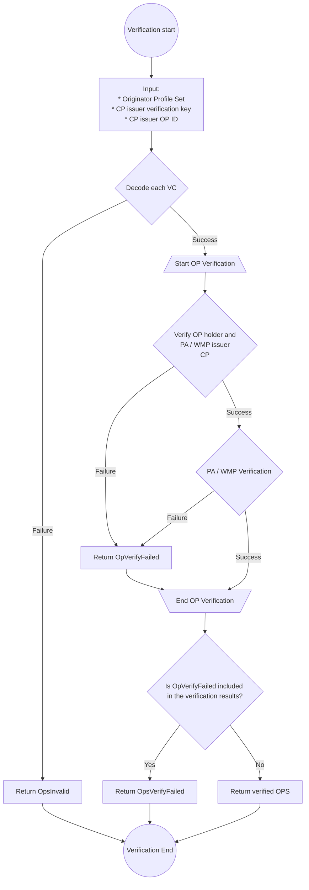

# Originator Profile Set

## Summary

This document defines a data format that can be used to aggregate and distribute VC about an organization.

## Terminology

For terms not explained in this document, please see the [Terminology](./terminology.md).

- Core Profile (CP)
- Profile Annotation (PA)
- Web Media Profile (WMP)
- Originator Profile (OP)
- Originator Profile Set (OPS)

## Originator Profile Set (OPS) Data Model

The data model of OPS is expressed in JSON.

OPS MUST be an array of JSON objects.

Each JSON object has the following properties:

- `core`: Core Profile (REQUIRED)
- `annotations`: An array of Profile Annotation (OPTIONAL)
- `media`: An array of Web Media Profile (OPTIONAL)

### `core`

REQUIRED. Core Profile

### `annotations`

OPTIONAL. An array of Profile Annotation. If this property is included, then for each element, the Core Profile in `core` and `credentialSubject.id` MUST be equal.
This property SHOULD be included if the OPS recipient has an interest in the trustworthiness of the OP ID holding organization in `credentialSubject.id`.

### `media`

OPTIONAL. An array of Web Media Profile. If this property is included, the `credentialSubject.id` of each element and the `credentialSubject.id` of the Core Profile in `core` MUST be equal.

## JSON Serialization for OPS

The JSON of the data model is the JSON representation of OPS. The media type is `application/ops+json`.

### Examples

_This section is non-normative._

Below is an example of an OPS that contains only VCs from a single organization:

```json
[
  {
    "core": "eyJ...",
    "annotations": ["eyJ..."],
    "media": ["eyJ..."]
  }
]
```

Below is an example of an OPS that includes VCs from multiple organizations.

```json
[
  {
    "core": "eyJ...",
    "annotations": ["eyJ...", "eyJ..."],
    "media": ["eyJ..."]
  },
  {
    "core": "eyJ...",
    "annotations": ["eyJ..."],
    "media": ["eyJ..."]
  }
]
```

## Internationalization {#internationalization}

Originator Profile Set distributors MAY include two or more VCs with different languages specified in their respective `annotations` and `media` properties, to allow applications to extract VCs based on locale.

The method for specifying the language(s) in VCs conforms to the [internationalization section of the OP VC Data Model](/opb/op-vc-data-model.md#internationalization).

## Validation Process

_This section is non-normative._

The verification process implemented in @originator-profile/verify follows the following process.

Please refer to the following reference for the structure of the data handled in the verification process.

- OpsInvalid
- OpVerifyFailed
- OpsVerifyFailed
- Verified OPS

Details of the CP / PA / WMP verification process are in accordance with [Verification of VCs Compliant with the OP VC Data Model](./op-vc-data-model.md#verification). However, CP verification is performed using the validation key and OP ID of a pre-approved CP issuer, and does not require obtaining a verification key from the OPS.


