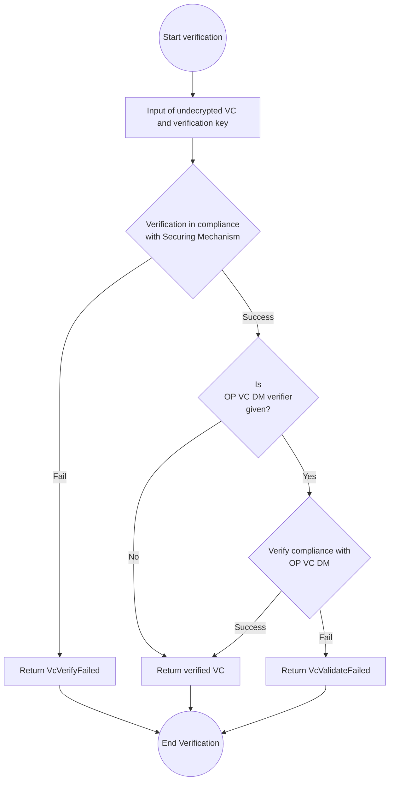

# OP VC Securing Mechanism

This document specifies the values of each claim and property of OP VC in accordance with [Securing Verifiable Credentials using JOSE and COSE](https://www.w3.org/TR/vc-jose-cose/).

:::note

Currently, OP VC's securing mechanism is limited to [Securing Verifiable Credentials using JOSE and COSE](https://www.w3.org/TR/vc-jose-cose/). Other methods may be adopted in the future.
:::

## Securing VC with JOSE

### Header

- `typ` The header parameter MUST be `vc+jwt`.
- `kid` The header parameter MUST be a [JWK Thumbprint](https://www.rfc-editor.org/rfc/rfc7638.html).
- `cty` The header parameter MUST be `vc`.

### Payload

Based on the following table, there is a one-to-one correspondence between data model properties and JWT claims, and specification developers MUST define the data model so that this is the case.

A JWT payload MAY contain both data model properties and JWT claims, but if it does, the values ​​of the data model properties and the JWT claims MUST NOT conflict.

:::note

In applications developed by the Originator Profile Collaborative Innovation Partnership (OP-CIP), both data model properties and JWT claims are included in the JWT payload and signed.

:::

|          Data Model           | JWT |
| :---------------------------: | :-: |
|        issuer (String)        | iss |
|           issuer.id           | iss |
|     credentialSubject.id      | sub |
| （Date and time of signing）  | iat |
| （Signature expiration date） | exp |

### Additional JWT claims

#### `iat`, `exp` {#iat-exp}

REQUIRED. Complies the [JWT (RFC 7519)](https://www.rfc-editor.org/rfc/rfc7519.html) specification.

#### Examples

##### Core Profile

Header:

```json
{
  "typ": "vc+jwt",
  "cty": "vc",
  "kid": "...",
  "alg": "ES256"
}
```

Payload:

```json
{
  "iss": "dns:example.org",
  "sub": "dns:example.jp",
  "@context": [
    "https://www.w3.org/ns/credentials/v2",
    "https://originator-profile.org/ns/credentials/v1"
  ],
  "type": ["VerifiableCredential", "CoreProfile"],
  "issuer": "dns:example.org",
  "credentialSubject": {
    "id": "dns:example.jp",
    "type": "Core",
    "jwks": {
      "keys": [
        {
          "x": "ypAlUjo5O5soUNHk3mlRyfw6ujxqjfD_HMQt7XH-rSg",
          "y": "1cmv9lmZvL0XAERNxvrT2kZkC4Uwu5i1Or1O-4ixJuE",
          "crv": "P-256",
          "kid": "jJYs5_ILgUc8180L-pBPxBpgA3QC7eZu9wKOkh9mYPU",
          "kty": "EC"
        }
      ]
    }
  },
  "iat": 1688623395,
  "exp": 1720245795
}
```

##### Content Attestation

Header:

```json
{
  "typ": "vc+jwt",
  "cty": "vc",
  "kid": "...",
  "alg": "ES256"
}
```

Payload

```json
{
  "iss": "dns:example.com",
  "sub": "urn:uuid:78550fa7-f846-4e0f-ad5c-8d34461cb95b",
  "@context": [
    "https://www.w3.org/ns/credentials/v2",
    "https://originator-profile.org/ns/credentials/v1",
    "https://originator-profile.org/ns/cip/v1",
    { "@language": "en" }
  ],
  "type": ["VerifiableCredential", "ContentAttestation"],
  "issuer": "dns:example.com",
  "credentialSubject": {
    "id": "urn:uuid:78550fa7-f846-4e0f-ad5c-8d34461cb95b",
    "type": "Article",
    "headline": "<Title of Web page>",
    "image": {
      "id": "https://media.example.com/image.png",
      "digestSRI": "sha256-2ntYAX8nslHxMv5h7Wdv5QDaWxHq6dIOVAdwB9VztrY="
    },
    "description": "<An explanation of Web page>",
    "author": ["Jane Smith"],
    "editor": ["John Smith"],
    "datePublished": "2023-07-04T19:14:00Z",
    "dateModified": "2023-07-04T19:14:00Z",
    "genre": "Arts & Entertainment"
  },
  "allowedUrl": ["https://media.example.com/articles/2024-06-30"],
  "target": [
    {
      "type": "VisibleTextTargetIntegrity",
      "cssSelector": "<CSS selector>",
      "integrity": "sha256-GYC9PqfIw0qWahU6OlReQfuurCI5VLJplslVdF7M95U="
    },
    {
      "type": "ExternalResourceTargetIntegrity",
      "integrity": "sha256-+M3dMZXeSIwAP8BsIAwxn5ofFWUtaoSoDfB+/J8uXMo="
    }
  ],
  "iat": 1688623395,
  "exp": 1720245795
}
```

##### Profile Annotation (Certificate)

Header:

```json
{
  "typ": "vc+jwt",
  "cty": "vc",
  "kid": "...",
  "alg": "ES256"
}
```

Payload:

```json
{
  "iss": "dns:pa-issuer.example.org",
  "sub": "dns:pa-holder.example.jp",
  "@context": [
    "https://www.w3.org/ns/credentials/v2",
    "https://originator-profile.org/ns/credentials/v1",
    "https://originator-profile.org/ns/cip/v1",
    { "@language": "en" }
  ],
  "type": ["VerifiableCredential", "Certificate"],
  "issuer": "dns:pa-issuer.example.org",
  "credentialSubject": {
    "id": "dns:pa-holder.example.jp",
    "type": "ECJP",
    "addressCountry": "JP",
    "name": "ABCD Newspaper (※Development Sample)",
    "corporateNumber": "0000000000000",
    "postalCode": "000-0000",
    "addressRegion": "Tokyo",
    "addressLocality": "Chiyoda",
    "streetAddress": "00-0",
    "certificationSystem": {
      "id": "urn:uuid:5374a35f-57ce-43fd-84c3-2c9b0163e3df",
      "type": "CertificationSystem",
      "name": "Corporate Number System Web-API",
      "ref": "https://www.houjin-bangou.nta.go.jp/"
    }
  },
  "iat": 1688623395,
  "exp": 1720245795
}
```

## Cryptographic algorithms {#cryptographic-algorithm}

The cryptographic algorithm conforms to "[cryptographic algorithm](./algorithm.md)".

## Validation Process {#verification}

VC validators can perform validation using a [VC DM 2.0 compliant validation implementation](https://www.w3.org/TR/vc-data-model-2.0/#verification).

:::note

In the future, we may define a [ProblemDetails object](https://www.w3.org/TR/vc-data-model-2.0/#problem-details) that corresponds to each validation failure.

:::

The validation process implemented in [@originator-profile/securing-mechanism](https://github.com/originator-profile/profile-share/tree/main/packages/securing-mechanism) follows this process:

Please refer to the following reference for the structure of the data handled in the verification process.

- Undecrypted VC
- VcVerifyFailed
- VcValidateFailed
- OP VC DM verifier
- Verified VC



## Security {#security}

TODO

Please review the security considerations in [Verifiable Credentials Data Model 2.0 Section 9](https://www.w3.org/TR/vc-data-model-2.0/#security-considerations).
