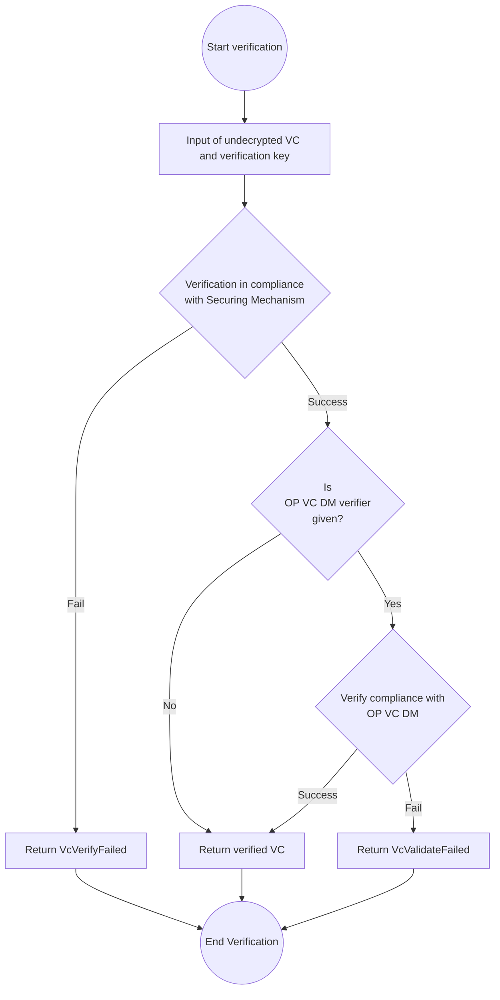

# OP VC Securing Mechanism

This document specifies the values of each claim and property of OP VC in accordance with [Securing Verifiable Credentials using JOSE and COSE](https://www.w3.org/TR/vc-jose-cose/).

:::note

Currently, OP VC's securing mechanism is limited to [Securing Verifiable Credentials using JOSE and COSE](https://www.w3.org/TR/vc-jose-cose/). Other methods may be adopted in the future.
Although VC-JOSE-COSE specifies both JOSE and COSE methods, currently many use cases and tool chains developed by the Originator Profile Collaborative Innovation Partnership (OP-CIP) only support JOSE.
:::

## Securing VC with JOSE

### Header

- `typ` The header parameter MUST be `vc+jwt`.
- `kid` The header parameter MUST be the [Key Identifier](#kid) of the key used for signing.
- `cty` The header parameter MUST be `vc`.

#### `kid` {#kid}

The value of the `kid` header parameter is a Key Identifier. A Key Identifier is computed from the public key used to verify the signature as follows.

1. Encode the public key as a DER-encoded SubjectPublicKeyInfo (SPKI) as defined in [RFC 5280](https://www.rfc-editor.org/rfc/rfc5280.html#section-4.1.2.7). The SPKI MUST be in the form standardized for the key type: for an elliptic curve key, `id-ecPublicKey` with the `namedCurve` parameter and the uncompressed point encoding, as specified in [RFC 5480](https://www.rfc-editor.org/rfc/rfc5480.html); for an RSA key, `rsaEncryption`, as specified in [RFC 3279](https://www.rfc-editor.org/rfc/rfc3279.html).
2. Compute the SHA-256 digest of the octets from step 1.
3. Encode the digest from step 2 (32 octets) with base64url as defined in [RFC 4648 Section 5](https://www.rfc-editor.org/rfc/rfc4648.html#section-5), and remove the trailing padding characters `=`. The result is a string of 43 characters.

A Key Identifier carries no prefix or other indication of the digest algorithm.

A public key held as a JWK MUST be converted to its SPKI form before its Key Identifier is computed. A [JWK Thumbprint](https://www.rfc-editor.org/rfc/rfc7638.html) MUST NOT be used as a Key Identifier.

The `kid` member of a JWK in the `jwks` of an OP MUST be the Key Identifier of that key, except during the [migration](#kid-migration).

:::note

A Key Identifier is determined by the key alone, and is the same whatever form the key is represented in. The same procedure yields the same value from the public key in an X.509 certificate.

:::

##### Example {#kid-example}

_This section is non-normative._

Below is an example of computing a Key Identifier from a Web Crypto API `CryptoKey` (public key):

```ts
const spki = await crypto.subtle.exportKey("spki", key);
const kid = new Uint8Array(
  await crypto.subtle.digest("SHA-256", spki),
).toBase64({ alphabet: "base64url", omitPadding: true });
```

#### Migration of `kid` {#kid-migration}

Previous versions of this specification defined the `kid` header parameter as a JWK Thumbprint. The migration to Key Identifiers is performed as follows.

- The issuer of an OP MAY include the same public key in the `jwks` of the OP as two JWKs, one whose `kid` member is the Key Identifier and the other whose `kid` member is the JWK Thumbprint. The two JWKs MUST have the same members other than the `kid` member.
- While the key is included in the `jwks` and any VC signed with the JWK Thumbprint as its `kid` header parameter is within its validity period, the JWK whose `kid` member is the JWK Thumbprint SHOULD NOT be removed from the `jwks` alone. After no such VC remains, the JWK whose `kid` member is the JWK Thumbprint MAY still be included until the key is revoked or compromised.
- In a VC signed after the `kid` header parameter is switched to Key Identifiers, the `kid` header parameter MUST be the Key Identifier. A VC signed earlier with a JWK Thumbprint as its `kid` header parameter can be verified as long as the `jwks` of the OP includes the JWK whose `kid` member is the JWK Thumbprint.

:::note

A verifier does not interpret the format of the `kid` header parameter value, and selects the verification key by an exact string match with the `kid` member of a JWK in the `jwks` of the OP. Migration in the manner above therefore requires no change to verifiers. Note that a verifier that selects the verification key by computing the Key Identifier of each JWK in the `jwks` and comparing it with the `kid` header parameter will not find the verification key for a VC whose `kid` header parameter is a JWK Thumbprint during the migration.

:::

### Payload

Based on the following table, there is a one-to-one correspondence between data model properties and JWT claims, and specification developers MUST define the data model so that this is the case.

A JWT payload MAY contain both data model properties and JWT claims, but if it does, the values ​​of the data model properties and the JWT claims MUST NOT conflict.

:::note

In applications developed by the Originator Profile Collaborative Innovation Partnership (OP-CIP), both data model properties and JWT claims are included in the JWT payload and signed.

:::

|          Data Model           | JWT |
| :---------------------------: | :-: |
|        issuer (String)        | iss |
|           issuer.id           | iss |
|     credentialSubject.id      | sub |
| （Date and time of signing）  | iat |
| （Signature expiration date） | exp |

### Additional JWT claims

#### `iat`, `exp` {#iat-exp}

REQUIRED. Complies the [JWT (RFC 7519)](https://www.rfc-editor.org/rfc/rfc7519.html) specification.

#### Examples

##### Core Profile

Header:

```json
{
  "typ": "vc+jwt",
  "cty": "vc",
  "kid": "...",
  "alg": "ES256"
}
```

Payload:

```json
{
  "iss": "dns:example.org",
  "sub": "dns:example.jp",
  "@context": [
    "https://www.w3.org/ns/credentials/v2",
    "https://originator-profile.org/ns/credentials/v1"
  ],
  "type": ["VerifiableCredential", "CoreProfile"],
  "issuer": "dns:example.org",
  "credentialSubject": {
    "id": "dns:example.jp",
    "type": "Core",
    "jwks": {
      "keys": [
        {
          "x": "ypAlUjo5O5soUNHk3mlRyfw6ujxqjfD_HMQt7XH-rSg",
          "y": "1cmv9lmZvL0XAERNxvrT2kZkC4Uwu5i1Or1O-4ixJuE",
          "crv": "P-256",
          "kid": "Tty_QC0BP0mBl9J4Dt1RKw8DxfrdCSwri_AriBTuSvw",
          "kty": "EC"
        }
      ]
    }
  },
  "iat": 1688623395,
  "exp": 1720245795
}
```

##### Content Attestation

Header:

```json
{
  "typ": "vc+jwt",
  "cty": "vc",
  "kid": "...",
  "alg": "ES256"
}
```

Payload

```json
{
  "iss": "dns:example.com",
  "sub": "urn:uuid:78550fa7-f846-4e0f-ad5c-8d34461cb95b",
  "@context": [
    "https://www.w3.org/ns/credentials/v2",
    "https://originator-profile.org/ns/credentials/v1",
    "https://originator-profile.org/ns/cip/v1",
    { "@language": "en" }
  ],
  "type": ["VerifiableCredential", "ContentAttestation"],
  "issuer": "dns:example.com",
  "credentialSubject": {
    "id": "urn:uuid:78550fa7-f846-4e0f-ad5c-8d34461cb95b",
    "type": "Article",
    "headline": "<Title of Web page>",
    "image": {
      "id": "https://media.example.com/image.png",
      "digestSRI": "sha256-2ntYAX8nslHxMv5h7Wdv5QDaWxHq6dIOVAdwB9VztrY="
    },
    "description": "<An explanation of Web page>",
    "author": ["Jane Smith"],
    "editor": ["John Smith"],
    "datePublished": "2023-07-04T19:14:00Z",
    "dateModified": "2023-07-04T19:14:00Z",
    "genre": "Arts & Entertainment"
  },
  "allowedUrl": ["https://media.example.com/articles/2024-06-30"],
  "target": [
    {
      "type": "VisibleTextTargetIntegrity",
      "cssSelector": "<CSS selector>",
      "integrity": "sha256-GYC9PqfIw0qWahU6OlReQfuurCI5VLJplslVdF7M95U="
    },
    {
      "type": "ExternalResourceTargetIntegrity",
      "integrity": "sha256-+M3dMZXeSIwAP8BsIAwxn5ofFWUtaoSoDfB+/J8uXMo="
    }
  ],
  "iat": 1688623395,
  "exp": 1720245795
}
```

##### Profile Annotation

Header:

```json
{
  "typ": "vc+jwt",
  "cty": "vc",
  "kid": "...",
  "alg": "ES256"
}
```

Payload:

```json
{
  "iss": "dns:profile-annotation-issuer.example.org",
  "sub": "dns:pa-holder.example.jp",
  "@context": [
    "https://www.w3.org/ns/credentials/v2",
    "https://originator-profile.org/ns/credentials/v1",
    "https://originator-profile.org/ns/cip/v1",
    { "@language": "en" }
  ],
  "type": ["VerifiableCredential", "ProfileAnnotation"],
  "issuer": "dns:profile-annotation-issuer.example.org",
  "credentialSubject": {
    "id": "dns:pa-holder.example.jp",
    "type": "JP-OrganizationExistenceCertificate",
    "addressCountry": "JP",
    "corporateName": "ABCD Newspaper (※Development Sample)",
    "corporateNumber": "0000000000000",
    "postalCode": "000-0000",
    "addressRegion": "Tokyo",
    "addressLocality": "Chiyoda",
    "streetAddress": "00-0",
    "annotation": {
      "id": "urn:uuid:def09cbd-6e8e-4c73-856d-5e00dffde643",
      "type": "ProfileAnnotationPolicy",
      "name": "Fictitious Organization Verification Authority Existence Certification",
      "description": "This organization has been verified to exist through corporate registration inquiry and other means.",
      "ref": "https://ovac.exp.originator-profile.org/"
    }
  },
  "iat": 1688623395,
  "exp": 1720245795
}
```

## Cryptographic algorithms {#cryptographic-algorithm}

The cryptographic algorithm conforms to "[cryptographic algorithm](./algorithm.md)".

## Validation Process {#verification}

VC validators can perform validation using a [VC DM 2.0 compliant validation implementation](https://www.w3.org/TR/vc-data-model-2.0/#verification).

:::note

In the future, we may define a [ProblemDetails object](https://www.w3.org/TR/vc-data-model-2.0/#problem-details) that corresponds to each validation failure.

:::

The validation process implemented in @originator-profile/securing-mechanism follows this process:

Please refer to the following reference for the structure of the data handled in the verification process.

- Undecrypted VC
- VcVerifyFailed
- VcValidateFailed
- OP VC DM verifier
- Verified VC


```mermaid
    flowchart TD
    Start((Start verification)) --> Input[Input of undecrypted VC and verification key]
    Input --> Verify{Verification in compliance <br>with Securing Mechanism}
    Verify -- Fail --> VcVerifyFailed[Return VcVerifyFailed]
    VcVerifyFailed --> End((End Verification))
    Verify -- Success --> IfValidatorSupplied{Is <br>OP VC DM verifier<br> given? }
    IfValidatorSupplied -- No --> OutputVerifiedVc[Return verified VC]
    OutputVerifiedVc --> End
    IfValidatorSupplied -- Yes --> ValidateDM{Verify compliance with<br> OP VC DM}
    ValidateDM -- Fail --> VcValidateFailed[Return VcValidateFailed]
    VcValidateFailed --> End
    ValidateDM -- Success --> OutputVerifiedVc
```

## Security {#security}

_This section is non-normative._

Please also refer to the security considerations outlined in [Section 9 of the Verifiable Credentials Data Model 2.0](https://www.w3.org/TR/vc-data-model-2.0/#security-considerations).

### Revocation

Originator Profile does not employ a mechanism equivalent to a Certificate Revocation List (CRL). When verifying the VC's [proof](https://www.w3.org/TR/vc-data-model-2.0/#proofs-signatures), the verifier checks only the signing key's validity in real time.

Consequently, OP VCs do not support a mechanism for extending the validity period. To maintain validity, re-issuance and re-installation must be performed repeatedly within the validity period.

### Signing Key Protection

For requirements regarding the protection of signing keys, please refer to [Cryptographic Key Protection and Assurance Requirements](./algorithm.md#cryptographic-key-protection-and-assurance-requirements).
