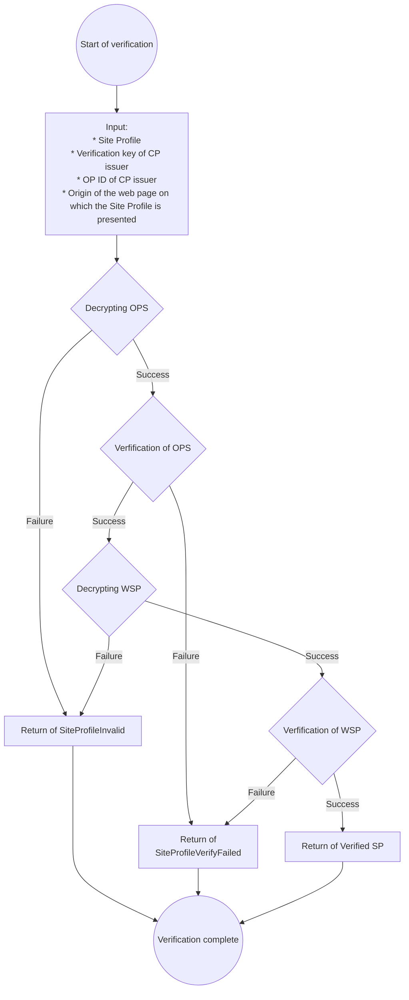

# Site Profile

A Site Profile is data used to associate a Website Profile with a specific domain.

## Terminology

For terms not explained in this document, please see [Terminology](./terminology.md).

- Originator Profile Set (OPS)
- Core Profile (CP)
- Profile Annotation (PA)
- Web Media Profile (WMP)
- Website Profile (WSP)
- Site Profile (SP)

## Site Profile

The Site Profile is the following JSON that summarizes the OPS and WSP.

- `originators`: REQUIRED. This is OPS.
- `sites`: REQUIRED. This is an array of WSP.

:::note

The `sites` property should contain WSPs for the same subject. That is, the array has two or more WSP, it should be for the purpose of [internationalization](#internationalization).

:::

Below is non-normative example.

```json
{
  "originators": [
    {
      "core": "eyJ...",
      "annotations": ["eyJ...", "eyJ..."],
      "media": ["eyJ..."]
    },
    {
      "core": "eyJ...",
      "annotations": ["eyJ..."],
      "media": ["eyJ..."]
    }
  ],
  "sites": ["eyJ..."]
}
```

## Method

Make sure that the site profile is available when the client accesses `/.well-known/sp.json` on the origin.

### Request

To get the WSP for a domain, send an HTTP GET request to `/.well-known/sp.json` for that domain.

The following example is a request to get the Site Profile for example.com:

```http
GET /.well-known/sp.json HTTP/1.1
Host: example.com
```

The following example shows the response:

```http
HTTP/1.1 200 OK
Content-Type: application/json
...: ...

...
```

:::note

Implementers must take into consideration privacy considerations when implementing the `Accept-Language` request header, taking into account that it may reveal information that the user considers to be private (such as the user's ethnicity). Specifically, implementers should not include `Accept-Language` in the scope of logs collected, should specify the period for which logs are to be retained, and should clearly state how `Accept-Language` will be handled in a privacy policy.

:::

### Response

If a Site Profile is returned in response to a GET request to the Site Profile's well-known path, the status code MUST be 200 and the body MUST be the Site Profile.
If the request includes an `Accept-Language` header, the server MUST select the language for the WSP and OPS according to [RFC 4647 Section 3](https://www.rfc-editor.org/rfc/rfc4647.html#section-3).

## Internationalization {#internationalization}

Site Profile distributors MAY include two or more VCs with different languages specified in `sites` property, to allow applications to extract VCs based on locale.

The method for specifying the language(s) in VCs conforms to the [internationalization section of the OP VC Data Model](/opb/op-vc-data-model.md#internationalization).

The internationalization method for the `originators` property conforms to the [internationalization section of the Originator Profile Set](/opb/originator-profile-set.md#internationalization).

## Verification Process

_This section is non-normative_

The verification process implemented in [@originator-profile/verify](https://github.com/originator-profile/profile-share/tree/main/packages/verify) follows this process:

Please see the following reference for the data structure handled in the verification process.

- [SiteProfileInvalid](https://reference.originator-profile.org/ts/classes/_originator-profile_verify.SiteProfileInvalid)
- [SiteProfileVerifyFailed](https://reference.originator-profile.org/ts/classes/_originator-profile_verify.SiteProfileVerifyFailed)
- [Verified SP](https://reference.originator-profile.org/ts/types/_originator-profile_verify.VerifiedSp)

Details of OPS verification process are as follows: [OPS verification](./originator-profile-set.md#verification), and details of WSP verification process are as follows: [WSP verification](./website-profile.md#verification).


