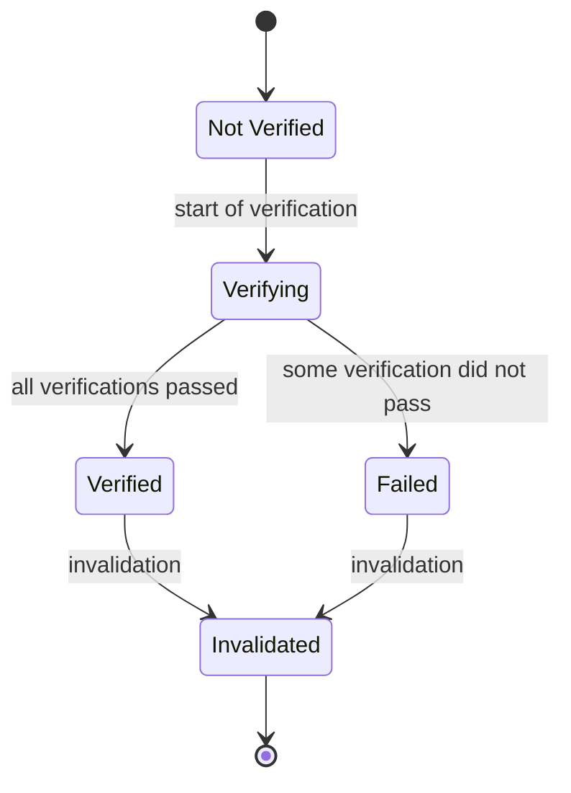

# Verifier Processing Model

## Scope

Each document defines verification procedures, but none of them defines when verification starts, how long its outcome remains effective, or how the outcome is presented.

This document defines the following:

- Which stages verification consists of
- What the input of each stage is, and how its identity is handled
- What a verification outcome contains, and which states it can take
- How long an outcome remains effective, and when it may be reused
- What constraints apply when presenting an outcome

This document does not depend on any particular data format. The concrete verification processing in HTML documents is defined by the following documents:

- [Site Profile Verifier Processing in HTML Documents](./site-profile.mdx)
- [Content Attestation Set and Originator Profile Set Verifier Processing in HTML Documents](./credentials.mdx)

### Semantic Scope of Verification in This Document {/* #semantic-scope */}

Verification in OPB includes all of the following:

- Signature verification (confirming the integrity of signed data with a verification key)
- Condition checks (such as [`allowedUrl` validation](../ca.md#allowed-url-validation))
- Content integrity checks (such as verification of a [Content Integrity Descriptor](../content-integrity-descriptor/index.mdx))

:::note

The Architectural Overview (hereafter AOV) limits Verify to confirming integrity by signature, and defines Validate as evaluating authenticity by referring to the actual state of affairs or trusted sources. "Verification" in OPB has a broader meaning than either. The AOV lists as a terminology issue that both Verify and Validate can be translated as "検証" in Japanese, and the two are expected to be aligned when the documents are consolidated in the future. This document follows the existing usage in OPB and states the semantic scope of verification explicitly as above.

:::

## Conformance Classes

Unless otherwise stated, the requirements in this document apply to verifiers. The presentation requirements apply to verifiers that present verification outcomes to users. Not all verifiers present outcomes. For example, command-line verification tools and verifiers on delivery paths do not present outcomes, and are therefore not subject to the presentation requirements.

A Verifier Processing Document may impose requirements on parties other than verifiers, such as distributors. In that case, the Verifier Processing Document states to whom each requirement applies.

No requirement in this document applies to users.

In this document, content refers to what a user is viewing or otherwise using, and is distinguished from the verification target. The two do not necessarily coincide. For example, the verification target of a Site Profile is the Site Profile of the origin, whereas the content the user is using is a document of that origin.

## Verification Stages {/* #verification-stages */}

Verification consists of the following five stages:

1. Discovery: find the verification target
2. Resolution: prepare the materials needed for verification
3. Verification: apply verification to the target and the materials
4. Retention: keep the verification outcome and track its effectiveness
5. Presentation: present the verification outcome to the user

The stages depend on one another, but proceed independently for each verification target. While one verification target is in the Verification stage, another verification target MAY be in the Discovery stage.

## Verification Input {/* #verification-input */}

Verification Input: the whole of the materials used for verification. It includes the target itself and the materials prepared in the Resolution stage.

### Input Identity {/* #input-identity */}

A verification input can be mutable. When the target changes over time, verification is performed on its state at a certain point in time.

Input Snapshot: the state of a mutable verification input at a certain point in time.

The verification input of a single verification outcome MUST be a single input snapshot. A single outcome MUST NOT be derived from input that spans multiple points in time.

Input Identity: the determination of whether two verification inputs can be regarded as identical.

A verifier MUST retain a means of determining input identity. Retaining the verification input itself is not required.

### Input Scope {/* #input-scope */}

Input Scope: the range of materials that may be used for verification.

A verifier MUST NOT use materials outside the input scope for verification. The concrete scope is defined by each Verifier Processing Document.

The input scope MUST be recorded in the verification outcome, because the meaning of an outcome differs if different materials are used, even for the same target.

### Input Provenance

Even the same artifact may be handled differently depending on how it was obtained. Materials obtained through one route cannot necessarily be treated as equivalent to materials obtained through another.

A Verifier Processing Document MUST state the routes through which the artifacts it handles are obtained, and MUST define the input scope and the method of determining input identity for each route.

## Verification Outcome {/* #verification-outcome */}

Verification Outcome: the output of verification.

### Contents of an Outcome

A verification outcome MUST contain at least the following:

- Identification of the verification target: information that uniquely identifies the verification target
- [Verification scope](#verification-scope): information on which verifications were applied
- [Input scope](#input-scope): information on which materials were used for verification
- [Outcome state](#outcome-state): information on the state the verification outcome is in
- Means of determining [input identity](#input-identity): information on how input identity was determined
- [Verification time](#verification-time): the time at which verification started
- [Time boundary](#verification-time): the time at which the verification outcome loses its effectiveness through the passage of time (if any)

The verification scope and the verification time are fixed when verification starts. While the outcome state is Not Verified, a verification outcome has no values for them. The time boundary is fixed when the outcome state transitions to Verified or Failed.

Including the verification input itself is NOT REQUIRED.

### Outcome State {/* #outcome-state */}

Outcome State: a state that a verification outcome can take.

An outcome state is one of the following:

- Not Verified: verification has not started
- Verifying: verification has started but the outcome has not been settled
- Verified: all verifications included in the verification scope passed
- Failed: some verification included in the verification scope did not pass
- Invalidated: an outcome once settled is no longer effective for the current verification target, due to a change in the verification input or the passage of time

:::note

These names are for describing the specification and are not expressions to be presented to users.

:::

### State Transitions {/* #state-transition */}

- The transition from Not Verified to Verifying is triggered by the start of verification
- The transition from Verifying to Verified or Failed is triggered by the completion of all verifications included in the verification scope
- The transition from Verified or Failed to Invalidated is triggered by the conditions of [invalidation](#invalidation)
- There is no direct transition from Failed to Verified (MUST NOT). Verifying again a target that did not pass verification produces a new verification outcome
- There is no transition from Invalidated to any other state. Verifying again an outcome that has been invalidated produces a new verification outcome

### Verification Scope {/* #verification-scope */}

Verification Scope: the set of verifications applied to derive a verification outcome. Each verification is identified by its kind and the part of the verification target to which it was applied.

Applicable Verifications: the set of verifications that can be applied to a verification target. They are defined by the Verifier Processing Document.

Which verifications are applied is determined by the verifier's policy. The verification scope records which of the applicable verifications the verifier actually applied.

The verification scope is fixed at the time verification starts and MUST NOT change within that verification outcome. If a verification included in the verification scope cannot be completed, it is treated as not having passed.

The meaning of an outcome differs depending on whether the verification scope includes all of the applicable verifications or only some of them. A verifier MUST record the verification scope in a way that distinguishes the two. When the verification scope includes only some of the applicable verifications, Verified does not mean that all of the applicable verifications passed.

:::note

For example, signature verification is identified as one verification per VC, and verification of a Content Integrity Descriptor as one verification per `target` of a Content Attestation.

:::

## Effectiveness of an Outcome {/* #outcome-effectiveness */}

Effectiveness: the property that a verification outcome holds at a certain point in time.

:::note

This is a different concept from the Validity Period of a Verifiable Credential. The validity period of a VC is something to be verified, whereas the effectiveness in this section describes a property of the verification outcome.

:::

### Verification Time {/* #verification-time */}

Verification Time: the time at which verification started. Among the verifications included in the verification scope, those that depend on time (such as verification of the [validity period](/tech/validity-period) of a VC) are evaluated at the verification time.

Time Boundary: the earliest time after the verification time among the following:

- Times referenced by the time-dependent verifications included in the verification scope. Examples are the start and end of the validity period of a VC's signature (`iat`, `exp`) and the start and end of the validity period of the information a VC contains (`validFrom`, `validUntil`)
- The expiry of materials in the verification input that have a freshness lifetime. Which materials have a freshness lifetime is defined by the Verifier Processing Document

A verification outcome is effective until the time boundary is reached. If there is no time boundary, a verification outcome does not lose its effectiveness through the passage of time.

If a verifier allows leeway for clock skew in time-dependent verifications (such as the leeway for `exp` permitted by [RFC 7519 Section 4.1.4](https://www.rfc-editor.org/rfc/rfc7519.html#section-4.1.4)), the time boundary is the time that reflects that leeway. How much leeway to allow is determined by the verifier's policy.

### Invalidation {/* #invalidation */}

Invalidation: the event in which a verification outcome loses its effectiveness while its verification scope remains unchanged, and its outcome state transitions to Invalidated.

Invalidated is not Failed. Invalidated means that the outcome cannot be confirmed for the current target; it does not mean that a verification did not pass, as Failed does. The two MUST NOT be treated as the same.

A verification outcome MUST be invalidated when either of the following occurs:

- The verification input has changed. What counts as a change in the verification input is defined by each Verifier Processing Document
- The current time has reached the [time boundary](#verification-time)

Not only Verified outcomes but also Failed outcomes are invalidated. If a Failed outcome were kept after its input changed, it would continue to wrongly indicate that the current target did not pass verification.

### Reuse

A verifier MAY reuse a verification outcome only if all of the following are satisfied:

- The [verification scope](#verification-scope) is the same
- [Input identity](#input-identity) is maintained
- The current time is before the [time boundary](#verification-time)

If any of these is not satisfied, the verifier MUST NOT reuse the outcome. The concrete method of determining identity is defined by the Verifier Processing Document.

## Presentation {/* #presentation */}

The requirements in this section apply to verifiers that present verification outcomes to users.

- The Not Verified and Verifying states MUST NOT be presented as Verified
- A transition from Verified or Failed to Invalidated MUST be reflected in the presentation
- Invalidated MUST NOT be presented with the same expression as Failed
- When the verification scope includes only some of the applicable verifications, the verifier MUST present, in a way the user can identify, which categories of the [semantic scope of verification](#semantic-scope) contain verifications not included in the verification scope
- When only part of the content corresponds to the verification target, the verifier MUST present the outcome in a way that does not lead the user to believe that the Verified presentation covers the entire content

## Non-blocking {/* #non-blocking */}

Verification processing MUST NOT block the retrieval or processing of the content the user uses, or its presentation to the user.

## Verifier Processing Documents {/* #verifier-processing-document */}

A Verifier Processing Document that concretizes this document MUST define all of the following:

- Discovery: how targets are identified, and the discovery trigger
- Resolution: the routes through which the [verification input](#verification-input) is obtained, and the [input scope](#input-scope)
- Verification: the [applicable verifications](#verification-scope) and the unit by which each is identified, the order of verification processing, and when verification starts
- Retention: how [input identity](#input-identity) is determined, how [invalidation](#invalidation) is determined, any materials that have a freshness lifetime, and concrete reuse conditions
- Presentation: any specific constraints

In addition, a Verifier Processing Document MUST define, in a separate section, the network accesses caused by the verification processing at each stage and the scope of the [disclosure](#privacy-considerations) they cause.

## Security Considerations {/* #security-considerations */}

### Ignoring Invalidation

If the presentation is not updated even though the verification outcome has been invalidated, an attacker can make users believe that the content is verified. For example, the attacker can replace the content after legitimate content and its verification outcome have been presented. The requirements on [invalidation](#invalidation) and [presentation](#presentation) are defined to prevent such attacks.

### Misperceiving the Verification Scope

When the verification scope includes only some of the applicable verifications and this is not presented, users may believe that more verifications passed than actually did. For example, suppose the verification outcome of a Content Attestation that passed signature and `allowedUrl` verification, but to which verification of the Content Integrity Descriptor was not applied, is presented simply as Verified. Users may then take tampered content to have been confirmed as untampered. The [presentation](#presentation) requirements are defined to prevent such misperceptions.

### Misperceiving the Correspondence Between Content and Verification Targets

When only part of the content corresponds to a verification target and this correspondence is not presented, users may believe that even the parts not corresponding to any verification target are verified. For example, suppose a Content Attestation is placed for the main text of a page, but not for the comment section or related links on the same page. If the indication of the originator is made per page, users may believe that the entire page is verified and is content of that originator. The [presentation](#presentation) requirements are defined to prevent such misperceptions.

### Input Contamination

If the input scope is not appropriately limited, an attacker can contaminate the verification input with materials under the attacker's control, and pass a verification that should have failed. Conversely, materials controlled by others can contaminate the verification input and cause legitimate content to fail verification. The [input scope](#input-scope) requirements are defined to prevent such contamination.

## Privacy Considerations {/* #privacy-considerations */}

### Disclosure Caused by Verification Processing

Verification processing may cause network accesses in addition to the retrieval of the content the user uses. Such an access discloses to the accessed origin that the user is using that content. Disclosure can occur in the Resolution stage through the retrieval of Verifiable Credentials, and in the Verification and Presentation stages through the retrieval of external resources referenced by Verifiable Credentials.

### Verification Before the Use of Content Is Settled

If verification processing starts before the user decides to use the content, disclosure also occurs for content the user ends up not using. When defining the [scope of disclosure](#verifier-processing-document), a Verifier Processing Document SHOULD consider when verification starts and the disclosure that occurs at that time.
