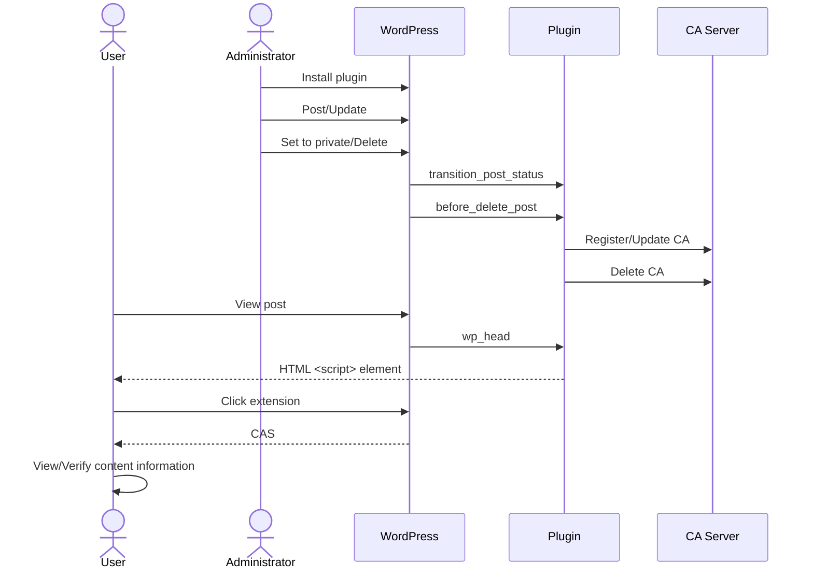

# WordPress Plugin (CA Manager)

## Objective

Install CA Manager on a WordPress site and enable the automatic issuance of CAs.

## Prerequisites

- WordPress administrator privileges

## Procedure

### 1. Plugin Installation {#plugin-installation}


1. Download the plugin:
   Visit the "[Releases](https://github.com/originator-profile/originator-profile/releases)" page and download the WordPress plugin (`wordpress-ca-manager.zip`) from the Assets section.
2. Upload the plugin:
   Refer to the "Upload Plugin" section on the WordPress "[Add Plugins](https://ja.wordpress.org/support/article/plugins-add-new-screen/)" screen.
3. Activate the plugin.
4. Configure the plugin:
   Go to "Settings > CA Manager" in the WordPress admin dashboard and enter the required information as described in the next section, "Plugin Configuration."

### 2. Plugin Settings {#plugin-settings}


After activating the plugin, you must configure it by entering the following required fields.
Settings can be configured via the WordPress dashboard under **Settings > CA Manager**.

**[CA issuer's Originator Profile ID]: Specify your Originator Profile ID**

Example:

```
dns:media.example.com
```

**[CA Server Hostname]: Specify the hostname of the CA server to use**

Example:

```
dprexpt.originator-profile.org
```

**[Authentication Information]: Specify the information required to access the CA server**

Example:

```
cfbff0d1-9375-5685-968c-48ce8b15ae17:GVWoXikZIqzdxzB3CieDHL-FefBT31IfpjdbtAJtBcU
```

**Verification Target Type**

Example:

```
TextTargetIntegrity
```

**CSS Selector for Verification Target Element**

Example:

```
h1.wp-block-post-title, .wp-block-post-content>*:not(.post-nav-links)
```

**HTML Containing the Verification Target Element**

Example:

```html
<!DOCTYPE html>
<html>
  <head>
    <meta charset="UTF-8" />
  </head>
  <body>
    <h1 class="wp-block-post-title">%TITLE%</h1>
    <div class="wp-block-post-content">%CONTENT%</div>
  </body>
</html>
```

`%TITLE%` is replaced by the post title, and `%CONTENT%` is replaced by the WordPress post content after `apply_filters()` has been applied; these are then sent to the CA server as the `target[0].content` property of the request.

**[CA Presentation Type]: Specify whether the CAS is embedded or linked**

The default is "Embedded".

- Embedded: Posts the article with the CAS in embedded format.

Example of the HTML output when "Embedded" is selected:

```html
<script type="application/cas+json">
  ["eyJ..."]
</script>
```

- External: Generates the CAS as a static file and posts the article using the link format (External). For details on the generated files, please refer to "[File generation for the External CA Presentation Type](#ca-presentation-type-external)."

**Log Output Settings**

This is disabled by default.

If enabled, logs related to the CA Manager plugin will be generated, and you will be able to download the log files. For details on the generated log files, please refer to "[Log file generation](#log-output)."

The Content Attestation issuance function will not operate correctly unless these settings are configured.
Once the settings are correctly applied, any posts updated or created thereafter will be automatically sent to the CA server.

## How to Check {#how-to-check}

Once configuration is complete, create a new post or update (re-save) an existing post.
You can verify whether the CA has been correctly issued using the following two methods:

- Check using Developer Tools
  Open your browser's developer tools and check if a `<script>` tag with the type `cas+json` is embedded in the page.
  If an element like the one below exists, the CA has been issued and configured correctly.

Example:

```html
<script type="application/cas+json">
  ["eyJ..."]
</script>
```

- Note: This method does not show validation results; use it only for a quick check to see if the CA has been issued.

* Check using [OP Inspector](/inspector) or [Debugger](/debugger)
  Use OP Inspector or Debugger for a more detailed check.
* Does the CA exist on the target page?
* Was the CA verification successful?

You can verify these points.
Please refer to the [OP Inspector](/inspector) documentation and [Debugger](/debugger) documentation for instructions on how to use each tool.

**If the CA does not exist**

- The plugin settings may be incorrect.
- Enable the log output setting, save the page, and check the logs. For log output settings, please refer to [Plugin Settings](#plugin-settings).

**If verification fails**

- The cause depends on the error code.
- Please refer to the [Error Code List](/error-reference/) for details.

## Features and Reference Information

### Features

The main features of this plugin are as follows:

1. Processing post content upon posting or updating in WordPress

- Triggered by posting or updating content in WordPress
- Processes the post content based on this trigger and sends it to the CA server's CA registration/update endpoint

2. CAS delivery on WordPress post pages

### Processing Flow

The processing flow for the WordPress integration plugin is as follows.
It is assumed here that the user is utilizing a web browser and the extension.



Processing is executed in accordance with [Hooks](https://developer.wordpress.org/plugins/hooks/).

- `transition_post_status`: Triggered when a post is created or updated; it converts the content and sends it to the CA server's registration or update endpoint.<br />
  It is also triggered when a post changes from a published state to a non-published state (such as private or draft), using the content's CA ID to send a request to the CA server's deletion endpoint.
- `before_delete_post`: Triggered when a post is deleted; it uses the content's CA ID to send a request to the CA server's deletion endpoint.
- `wp_head`: Triggered when a post is viewed; it allows the user to retrieve the CAS via an embedded `<script>` element.

Through these processes, published content is automatically managed, enabling users to verify its authenticity.

### File Structure

#### config.php

The `config.php` file, located in the `includes` directory, contains the configuration settings for this plugin.

| Setting Name                              | Description                                                                                                                                                                                                                                                     |
| ----------------------------------------- | --------------------------------------------------------------------------------------------------------------------------------------------------------------------------------------------------------------------------------------------------------------- |
| PROFILE_DEFAULT_CA_SERVER_HOSTNAME        | The default value for the Content Attestation server hostname. Registration, updates, and retrieval of Content Attestation data are performed via endpoints on this host. If the setting is modified via the configuration screen, this value is ignored.       |
| PROFILE_DEFAULT_CA_SERVER_REQUEST_TIMEOUT | The default value for the Content Attestation server request timeout (in seconds).                                                                                                                                                                              |
| PROFILE_DEFAULT_CA_TARGET_TYPE            | The default value for the type of element to be verified.                                                                                                                                                                                                       |
| PROFILE_DEFAULT_CA_TARGET_CSS_SELECTOR    | The default value for the CSS selector identifying the elements to be verified. By default, both the article title (`h1.wp-block-post-title`) and the direct child elements of the article body (`.wp-block-post-content>*:not(.post-nav-links)`) are targeted. |
| PROFILE_DEFAULT_CA_TARGET_HTML            | The default HTML structure containing the elements to be verified. `%TITLE%` is replaced by the post title, and `%CONTENT%` is replaced by the post body after `apply_filters()` has been applied.                                                              |

### CA Server API Authentication

Basic authentication for the CA server API is supported.
Customization is required if you wish to use authentication methods other than Basic authentication (e.g., OAuth, JWT, API keys).
For details on customization, please refer to the implementation of `issue_ca()` in [includes/issue.php](https://github.com/originator-profile/originator-profile/blob/main/packages/wordpress/includes/issue.php).

### OP Support

#### Placing `/.well-known/sp.json` {#well-known-sp-json}

Placement location:

If the document root is `/var/www/html`, place the file at the following path:

```
/var/www/html/.well-known/sp.json
```

Depending on your web server configuration, access to the `.well-known` directory may be restricted. Configure your server to allow access to `.well-known` as shown below:

Apache:

```.htaccess
<Directory "/var/www/html/.well-known">
AllowOverride None
Require all granted
</Directory>
```

Verification:

```
$ curl -sSf https://example.com/.well-known/sp.json
```

Configuration is complete if the SP containing the OP information is successfully retrieved.

#### Alternative Method: Embedding the OP

It is possible to embed the OP directly into the HTML using a `script` element.

Example:

```html
<script type="application/ops+json">
  [
    {
      "core": "eyJ...",
      "annotations": ["eyJ..."],
      "media": ["eyJ..."]
    }
  ]
</script>
```

For details, please refer to "[Enabling OP Support on Your Site](/tutorial/sp-setup-guide/)" or "[Linking Content Attestation Set and Originator Profile Set to A HTML Document](https://docs.originator-profile.org/opb/link-to-html/)."

### File Generation When CA Presentation Type is Set to "External" Link Format {#ca-presentation-type-external}

When the CA Presentation Type is set to "External," the directory for generating static files is defined as follows:

```
const PROFILE_DEFAULT_CA_EXTERNAL_DIR = 'cas';
```

If the document root is `/var/www/html`, the static file will be placed at the following path:

```
/var/www/html/cas/<post-id>_cas.json
```

Example of the HTML output when "External" is selected:

```html
<script
  src="https://example.com/cas/1_cas.json"
  type="application/cas+json"
></script>
```

If the `cas` directory does not exist under the document root, it will be created.
Additionally, if the post ID is the same, the static file will be overwritten.

Verification method:

```
$ curl -sSf https://example.com/cas/1_cas.json
```

### Log File Generation {#log-output}

The directory for generating log files is defined as follows:

```
const PROFILE_DEFAULT_CA_LOG_DIR = 'ca-manager-log';
```

If the document root is `/var/www/html`, logs are output to the following path.
If the log file does not exist, it will be created.

```
/var/www/html/wp-content/uploads/ca-manager-log/ca-manager-debug.log
```

Additionally, when the CA Manager plugin is activated, files for access control are automatically generated at the following paths with the specified contents:

```
/var/www/html/wp-content/uploads/ca-manager-log/.htaccess
/var/www/html/wp-content/uploads/ca-manager-log/index.php
```

Apache:

```.htaccess
<FilesMatch "\.(log|txt)$">
Require all denied
</FilesMatch>
```

Access control files for environments other than Apache are not automatically generated; please implement appropriate access control measures yourself (recommended).

Disabling the feature stops log output and deletes the log file.

### Demo

A test environment with the plugin installed is available:

- https://op.cms.am/ (Latest main test environment)

Please contact the development team if you require editing privileges for the demo site.

### Usage with Playground

If you are unable to perform OP registration, you can use Playground to test the automatic issuance of Content Attestations (CAs).
For details, please refer to the [Playground guide](/playground/#use-wordpress-plugin).

## Known Issues

### Impact of Changing Permalink Settings

Changing WordPress permalink settings alters the URLs of individual posts; consequently, previously issued Content Attestations (CAs) become invalid due to an `allowedUrl` mismatch.

**Affected Actions**:

- Settings > Permalinks
- Changing settings
- Modifying the custom structure

If you change permalink settings, updating (editing and saving) all affected posts will trigger the re-issuance of CAs corresponding to the new URLs.

### HTML Modification by Plugins, Filters, or Themes

In WordPress, you can split a post into multiple pages by inserting `<!--nextpage-->` into the post body. However, due to the influence of plugins, themes, or filter hooks, this may sometimes be output with incorrect markup, such as `<p><!--nextpage--></p>`. Such output can cause unintended line breaks or blank lines.

**Workaround**: You can correct the improper markup by applying a replacement process as follows:

```php
// includes/issue.php

/**
 * Create a list of unsigned Content Attestations
 *
 * @param \WP_Post $post Post object.
 * @param string   $issuer_id CA issuer ID
 * @return list<Uca> List of unsigned Content Attestations
 */
function create_uca_list( \WP_Post $post, string $issuer_id ): array {
	// ... Omitted ...

	// Add replacement logic
	$post->post_content = str_replace('<p><!--nextpage--></p>', '<!--nextpage-->', $post->post_content);

	$postdata = \generate_postdata( $post );

	// ... Omitted ...
}
```

### Conflict with the Autoptimize Plugin

[Autoptimize](https://ja.wordpress.org/plugins/autoptimize/) (including the [Pro version](https://autoptimize.com/pro/)) is a plugin that optimizes (minifies) HTML and images. This may cause the following problems:

#### Inconsistency with the Signed HTML

When the HTML before minification by Autoptimize is sent to the CA Server, it may not match the HTML that is actually displayed, potentially causing signature verification to fail.

**Solution**: Adjust the HTML after Autoptimize's minification process and send it to the CA Server.

#### Image URL Transformation via CDN in the Pro Version

In the Pro version, images are transformed via CDN, which may change their URLs. This can result in discrepancies between the signed HTML and the actual displayed content.

**Response Plan**: Obtain the image URL after CDN conversion and send the HTML reflecting it to the CA Server.

### Data Deletion on the CA Server

If the CAS is stored in the metadata `_profile_post_cas` and the data on the CA server is manually deleted, an attempt will be made to register a new post specifying the UUID when updating the article. This may result in an error on the server side.

**Workaround**: Make the article private once to remove the metadata.
